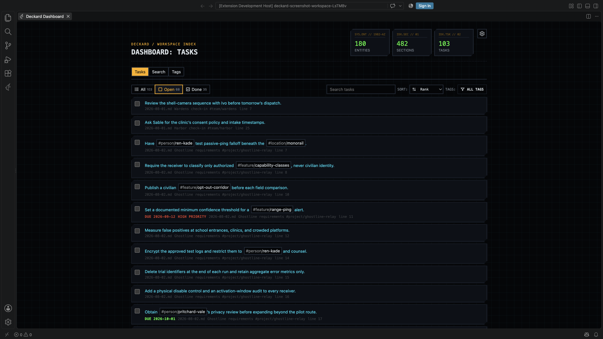
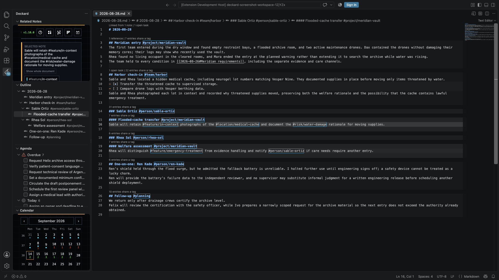
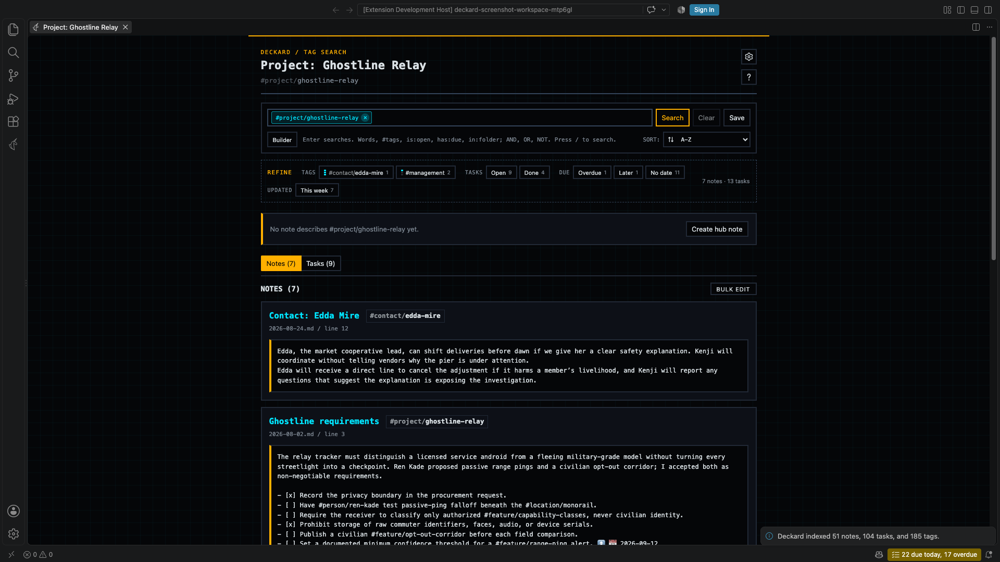
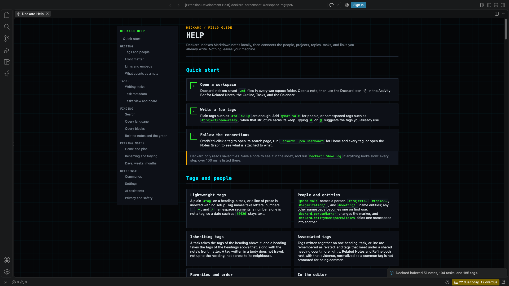
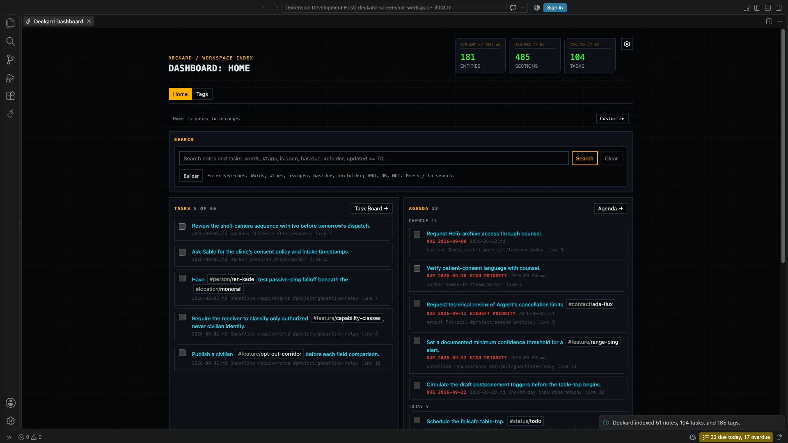
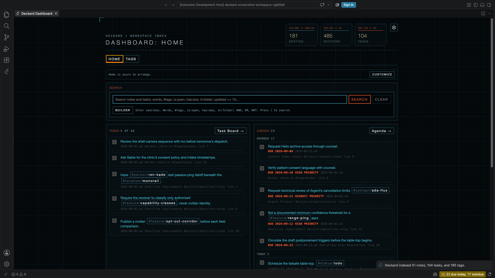
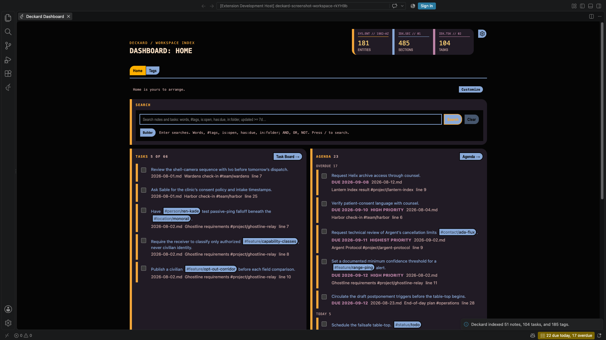
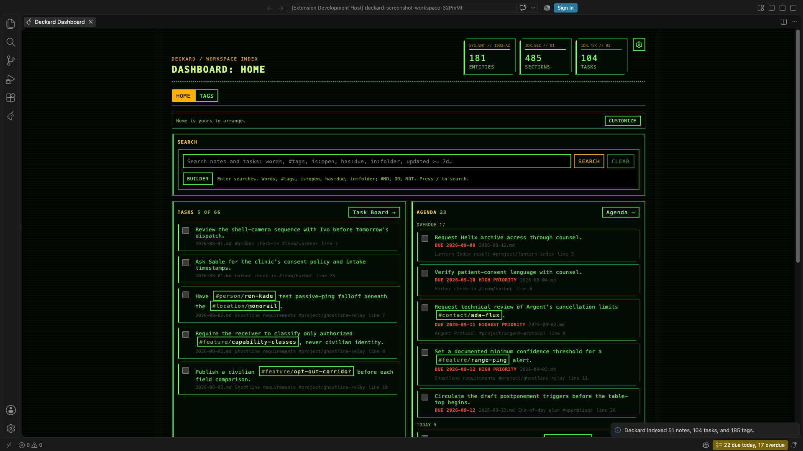
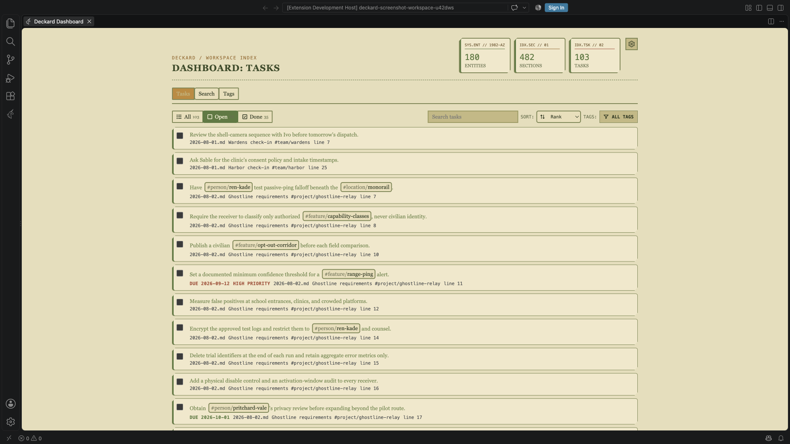
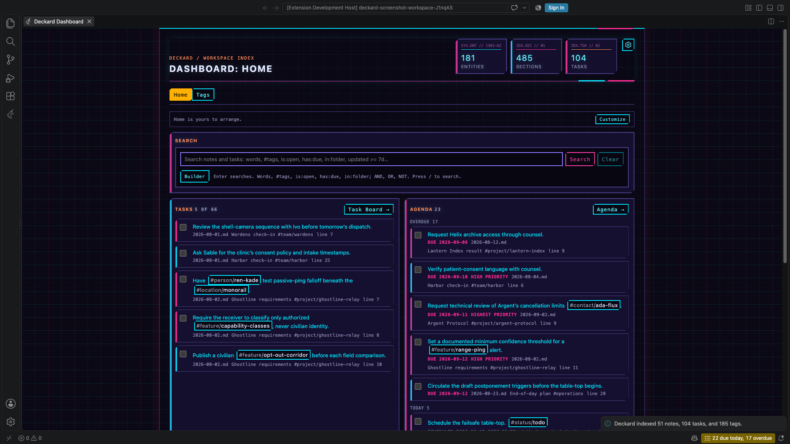

<p align="center">
	
</p>

# Deckard

Deckard is a local-first second brain for Markdown notes in your VS Code workspace. It connects people, projects, topics, organizations, meetings, links, and checklist tasks while keeping your notes readable and portable.

## Requirements

- VS Code 1.134.0 or newer.
- An open folder or workspace containing Markdown notes.

Deckard scans every `*.md` file in each workspace folder by default. Set a notes folder only when you want to restrict the index.

## Install

Download the VSIX attached to a GitHub release and run `Extensions: Install from VSIX...` in VS Code.

## Screenshots

| Dashboard | Related Notes |
|---|---|
|  |  |
| **Tag Overview** | **Help** |
|  |  |

## Themes

Set `deckard.theme` to choose the visual style used by Deckard webviews. The default is `replicant`.

| **Replicant** | **Oblivion** | **LCARS** |
| --- | --- | --- |
|  |  |  |
| **Tomcat** | **Fellowship** | **Synthwave** |
|  |  |  |

## Get started

1. Open a folder or workspace in VS Code.
2. Open any Markdown note in the workspace, or [restrict indexing to a folder](#settings).
3. Open the Command Palette and run `Deckard: Open Dashboard`.
4. Select the Deckard icon in the Activity Bar to open **Related Notes** while editing a Markdown note.

Deckard scans the workspace Markdown scope automatically and refreshes when saved notes are added, edited, or deleted.
Run `Deckard: Reindex Workspace` from the Command Palette to trigger a full scan manually.

## Commands

| Command | Description |
| --- | --- |
| **Deckard: Open Dashboard** | Opens workspace totals, tags, and tasks. |
| **Deckard: Show Stats** | Opens index totals and local view-count statistics. |
| **Deckard: Open Help** | Opens the quick-start and advanced feature guide. |
| **Deckard: Reindex Workspace** | Performs a full scan of the workspace Markdown scope. |
| **Deckard: Create Daily Note** | Creates or opens today's note. |
| **Deckard: Extract Tagged Heading** | Moves a tagged heading section into a newly named note. |
| **Deckard: Show Tag Overview** | Opens a tag overview, or shows a tag picker when no tag is supplied. |
| **Deckard: Search Workspace Knowledge** | Searches saved notes, entities, and tasks from the Command Palette. |
| **Deckard: Link Current Heading to Entity** | Adds a user-approved canonical person, project, topic, organization, or meeting tag to the current heading. |
| **Deckard: Move Inline Tags to Front Matter** | Moves explicit tags from the active note into merged note-level front matter. |
| **Deckard: Rename Tag** | Searches indexed tags and replaces the selected tag in its source notes. |

## Markdown format

Deckard recognizes ATX headings, unordered checklist items, `#` tags, `@` people, and `[[Wiki links]]`. Tag matching is case-insensitive. A tagged non-heading, non-task line is indexed as its own entry when `deckard.parseInlineTags` is enabled; consecutive tagged prose lines are grouped so wrapped explanations do not become truncated duplicate entries.

By default, use `@` for people and namespaced `#` tags for workspace entities:

```markdown
# Project Atlas #project/atlas
Met with @alex-smith about [[Q3 planning]].

- [ ] Send the proposal by 2026-09-12 #project/atlas
```

`#project/atlas`, `#topic/leadership`, `#org/acme`, and `#meeting/q3-planning` appear as entity hubs. Any other namespaced tag, such as `#management/performance`, creates a new namespace automatically and appears as `Management: Performance` in its overview. Simple unnamespaced `#follow-up` tags remain supported; all tags appear together in the Dashboard's **Tags** catalog. Deckard distinguishes `@alex` from `#alex`. You can configure namespace aliases to map a custom namespace to any built-in or custom target namespace, and you can move the people marker; when the people marker is changed from `@`, `@name` becomes a lightweight tag.

Frontmatter can add portable entity context to every heading and task in a note:

```yaml
---
project: atlas
people: [alex-smith]
topics:
  - leadership
---
```

Supported front-matter values are highlighted in the editor and Cmd/Ctrl-clickable just like inline tags: `people`/`person` maps to `@person`, while `projects`, `topics`, `organizations`, and `meetings` map to their typed `#` tags. These metadata tags remain indexed and openable even when the note has no heading or task.

Run `Deckard: Move Inline Tags to Front Matter` to collect explicit tags from the current note into plural front-matter fields. Existing values are merged, unrelated YAML fields are preserved, and source tag tokens are removed. Because the resulting metadata applies to the entire note, use the command only for context that belongs to every heading and task in that note.

Run `Deckard: Rename Tag` to search the indexed tag list, choose a replacement, and update every matching source occurrence without changing ordinary prose or fenced code. In the Dashboard, Tag Overview, or Related Notes sidebar, right-click a tag and choose **Rename tag**. In a Markdown editor, hover a tag and choose the clickable **Rename** action. Enter a complete tag such as `#management/new-name`, or enter only a new name to keep the selected tag's marker and namespace.

- Headings use the ATX form `# Heading` through `###### Heading`. Optional closing hashes are removed from the heading title.
- **Associated tags** are Deckard's practical "these belong together" suggestion. If you write `#project/atlas` and `#risk/vendor` together on one heading, task, or tagged line, Deckard retains that raw evidence. Related Notes normalizes it by the distinct source-unit support and both tags' prevalence, so a common tag is not promoted merely by occurring often. Tags in a heading and its nested headings get a lighter connection. Front-matter and inherited tags give note context but never create associations on their own.
- Tasks use `-`, `*`, or `+` followed by `[ ]` for open items or `[x]`/`[X]` for completed items.
- A task inherits tags from its nearest heading and combines them with tags written on the task line.
- Tag names start with a letter or number and can contain letters, numbers, `_`, `-`, and `/` namespace segments.
- Fenced code blocks using backticks or tildes are ignored by indexing, decorations, and completion.
- Numeric-only hash tokens such as `#2026` are ignored as tags so that ordinary Markdown headings and dates do not become tags. Numeric `@` tags such as `@2026` remain valid.

For example:

```markdown
# Launch plan #project/atlas

## Next steps #topic/planning

- [ ] Review the brief #topic/writing
- [x] Send the update @alex-smith
```

Use `- [ ]`, `* [ ]`, or `+ [ ]` for an open task. Use `- [x]` for a completed task. A task inherits tags from its heading and can also have its own tags.

## Editor assistance

- Tags in Markdown editors receive clickable decorations. Cmd/Ctrl-click opens its tag overview, and hovering a tag provides a separate clickable **Rename** action. Heading tags are always handled; tags on other lines follow `deckard.parseInlineTags`.
- Typing `#` or `@` offers matching tags already in the index, with each tag's current entry count. `#atl` can complete to `#project/atlas`; `@al` can complete to `@alex-smith`. Partial tag tokens are replaced correctly, fenced code is ignored, and numeric-only hash tags are excluded from `#` completion.

## Dashboard

Run `Deckard: Open Dashboard` to see compact workspace totals and switch between the **Tasks** and **Tags** tabs. The Dashboard opens on **Tasks**; use Left/Right Arrow while the tab control is focused to switch modes.

- **Saved tag views** appear above the Dashboard's Tasks/Tags tabs, so they remain available in either mode. In a combined Tag Overview, use **Save filter** to name its active tags; select a saved view to reopen that exact intersection, or use **Remove** to delete it.
- The Dashboard title identifies the active mode as **Dashboard: Tasks** or **Dashboard: Tags**. Use the View options gear to choose independent one-through-four column limits for task and tag cards; Deckard saves both choices for future Dashboard sessions.
- **Task controls** provide visible **All**, **Open**, and **Done** counts, text search, plus **Sort: Rank/Created/Updated**. Open the labeled searchable tag picker to select task tags; selected tags appear as removable chips, with **Clear filters** available when tags are selected. A task appears when it matches any selected tag. Rank is the default; date sorting uses the source file's filesystem timestamps.
- **Tags** shows namespaced and unnamespaced tags together. Search tags, then sort alphabetically, by entry count, by most accessed, or by custom rank. Favorite important items; in Rank mode, drag a row or use its context menu to move it to the top or bottom. Wherever a namespaced tag is shown inline, its `#namespace/` prefix is muted while the tag value keeps the surrounding view's normal color.
- Select a tag to open its [tag overview](#tag-overviews).
- Select a task to jump to its exact source line.
- Use a task checkbox to update the checklist marker in the original note.
- Right-click any tag or entity row to choose **Rename tag**. When tags use custom rank or tasks use Rank, drag rows or right-click a row to move it to the top or bottom. Date-sorted tasks cannot be dragged. Display order changes do not reorder text in your Markdown files.

## Stats

Run `Deckard: Show Stats` to see the current Markdown file, note entry, task, tag, namespaced entity, and Wiki-link totals from the index. It also shows the most-viewed tags, namespaced entities, and note entries from Deckard's local access counters. These counters are collected when you open a tag overview or select a note entry in an overview, and are stored only in VS Code preferences.

## Related Notes

Open **Related Notes** from the Deckard Activity Bar while editing a saved Markdown note. It suggests other note entries that may concern the same work.

### What makes a note related?

| Signal | Example | Importance |
|---|---|---|
| Shared tag | Both entries contain `#project/atlas` | Strongest |
| Parent-heading context | Your selected task sits under a `#project/atlas` heading | Useful, but lighter |
| Associated tag | `#project/atlas` and `#risk/vendor` are often written together | Supporting evidence |
| Entry Wiki link or lexical similarity | An entry links to `[[Launch plan#Decision]]` or shares distinctive section wording | Small supporting evidence |

For example, if you select `#project/atlas #follow-up`, a note with both tags ranks ahead of a note that only contains an associated `#risk/vendor` tag. Associations retain their raw source evidence but are normalized for support and tag prevalence before diminishing returns are applied, so generic tags cannot dominate and indirect connections cannot overtake a complete direct match.

### Focus one note entry

Tagged headings highlight their full section; tagged lines and tasks highlight their line. Hover one to choose **Show related notes for [entry]**. The sidebar identifies the scope as a **Selected entry**, shows the source note, and uses that entry's tags first before adding tagged parent headings as lighter context. Choose **Show whole document** in the sidebar to return to the normal document view.

Each result shows its compact heading path and a concise primary reason for the match. Daily notes also show their inferred `YYYY-MM-DD` date, making a result such as `2026-09-10 > Project Atlas > Check-in` understandable before opening it. When both a broad heading and a nested child use the same tags, the child appears first because it is the more specific match. The Related Notes list includes its result count, and the **Sort by** control keeps the selected ordering visible.

### Understand a score

Select a result percentage to open its explanation with the matching signals and weights; it also works from the keyboard. For the complete calculation, hover a tagged entry and choose **Debug related notes for [entry]**. The debug page shows heading paths, daily-note context, selected-tag weights, raw and normalized association support/prevalence, entry and file link evidence, lexical terms, optional recency, and specificity adjustments.

Use the sort control to choose **Relevance**, **Newest**, **Oldest**, or **Most accessed**. Select a related note to open its matching line, or select a tag to open its overview.

When a Tag Overview is the active editor tab, the sidebar identifies itself as **Tag Overview**, shows the focus tag and matching-note count, and switches from related notes to one compact **Associated tags** list. Associations are sorted by strength and show a percentage; hover or focus one to learn whether the connection came from tags written together or from heading context. Expand the list to navigate without leaving the narrow sidebar. Selecting an association carries the current tag as a second filter. Active filters appear as removable chips with **Clear filters**, and the matching notes remain visible below. The notes in a Tag Overview already match that tag, so they do not show a redundant 100% relevance score. Returning to a Markdown editor restores the related-notes projection.

Select the question-mark button in the Related Notes toolbar to open the Help page. It includes a quick start, advanced configuration guidance, and in-page navigation by feature category.

## Tag overviews

Open an entity or tag overview by selecting it in the editor, Dashboard, Related Notes, or by running `Deckard: Show Tag Overview` from the Command Palette.

Each overview collects the matching sections from your notes. You can:

- see the active tag intersection, each removable tag condition, and the matching note and task totals at a glance;
- sort entries alphabetically, by creation date, by update date, or by most accessed;
- search Notes and Tasks independently within the active tag intersection;
- use **Save filter** beside the Tag Overview label to name a combined view, then open the **View options** gear to switch between the original Markdown source and a rendered view or choose **Tabs** or **Side by side**;
- see the matching saved view name above the entity title whenever the active tag intersection corresponds to a saved view; and
- filter overview tasks with the grouped **All**, **Open**, and **Done** controls (which default to **Open**), then use a checkbox to safely update the original Markdown task; and
- switch **Associated tags** between a namespace-collapsible **Tree** view and a layered **Graph** view on lightweight tag overviews; all remain clickable, show their connection percentage, and repeated source references show a compact count; and
- follow an association into the target overview with the current tag applied as a second filter, so only the exact sources that supplied the association are shown; active relationship filters are folded into the page title as **[filter tag] AND [focus tag]**; remove individual tags or reopen the focus tag to return to the full overview; and
- save any combined overview with two or more active tags as a named filter, then reopen or remove it from the Dashboard; and
- select a section to jump to its heading in the source note.

Opening a tag overview records tag access. Opening a section records section access, which powers the access sort. Tag links inside an overview open the next overview without leaving the workflow.

Set `deckard.enableHeadingTagRelationships` to `false` when you want to hide Associated tags suggestions, including the sidebar list, while keeping ordinary tag indexing and note content unchanged.

## Extracting headings

Run `Deckard: Extract Tagged Heading` with the cursor inside a tagged heading section. Deckard moves the complete section, including nested headings and the original heading tags, into a new Markdown note in the configured notes folder or workspace root. The extracted heading and its content are removed from the source note. If the cursor is not inside a tagged section, Deckard offers a picker of tagged headings from the workspace.

The note name is used as a single Markdown filename. Existing notes are never overwritten; choose a different name when a conflict is reported.

## Daily notes

Run `Deckard: Create Daily Note` from the Command Palette, or use the shortcut in Related Notes. Deckard creates a note named with the local date, such as `2026-08-30.md`, in your configured notes folder or workspace root and opens it. If today's note already exists, Deckard opens it without replacing its contents.

## Settings

Open **Settings** and search for `Deckard`, or add these options to your workspace settings:

```json
{
	"deckard.theme": "replicant",
	"deckard.notesFolder": "notes",
	"deckard.dailyNoteTemplate": "# {date}\n\n",
	"deckard.parseInlineTags": true,
	"deckard.highlightNoteSections": true,
	"deckard.autoSelectNoteSections": true,
	"deckard.enableHeadingTagRelationships": true,
	"deckard.enableTagAutocomplete": true,
	"deckard.enableKeywordLinks": true,
	"deckard.relatedNotesAssociationMinimumSupport": 1,
	"deckard.relatedNotesRecencyHalfLifeDays": 0,
	"deckard.entityNamespaceAliases": {
		"org": "organization"
	},
	"deckard.personMarker": "@"
}
```

| Setting | Default | Description |
| --- | --- | --- |
| `deckard.notesFolder` | Empty | Optional workspace-relative folder Deckard scans. An empty value indexes all workspace Markdown files. |
| `deckard.theme` | `replicant` | Selects the Replicant, Oblivion, or LCARS visual style for Deckard webviews. |
| `deckard.dailyNoteTemplate` | `# {date}\n\n` | Used when a new daily note is created. `{date}` becomes the local date in `YYYY-MM-DD` format. |
| `deckard.parseInlineTags` | `true` | Indexes tags on non-heading, non-task Markdown lines as standalone entries and decorates them in the editor. Consecutive tagged prose lines are grouped into one entry, while a tagged unordered or numbered list item includes its indented child bullets. Heading and task-line tags remain available when `false`. |
| `deckard.highlightNoteSections` | `true` | Highlights tagged note sections in Markdown editors. Disable it to keep entry-level Related Notes cursor behavior without the editor highlight. |
| `deckard.autoSelectNoteSections` | `true` | Automatically focuses Related Notes on the tagged entry under the cursor. Disable it to keep Related Notes scoped to the whole document unless you choose an entry manually. |
| `deckard.tagTitleDisplayMode` | `inline` | Keeps tags in related-note and tag-overview note and task titles as clickable buttons by default. Dashboard task titles also expose their source tags as clickable buttons. Set to `separate` to remove overview tags from titles and show them as separate tag controls. |
| `deckard.enableHeadingTagRelationships` | `true` | Shows **Associated tags** suggestions in Tag Overview, with Tree and Graph views. Disable it to hide those suggestions without changing indexed tags or note content. |
| `deckard.enableTagAutocomplete` | `true` | Shows indexed tag and people suggestions after a marker. Disable it without changing tag indexing, highlighting, or navigation. |
| `deckard.enableKeywordLinks` | `true` | Includes capped BM25-style lexical similarity scoped to each section or task. Disable it to show shared tags and intentional Wiki links only. |
| `deckard.relatedNotesAssociationMinimumSupport` | `1` | Minimum distinct headings, tagged lines, tasks, or heading relationships needed before a learned association affects Related Notes. Raise it to suppress one-off associations; `1` preserves intentional one-offs. |
| `deckard.relatedNotesRecencyHalfLifeDays` | `0` | Optional low-impact recency tie-breaker; `0` disables it. Deckard prefers front-matter and daily-note dates before filesystem timestamps. |
| `deckard.entityNamespaceAliases` | `{ "org": "organization" }` | Maps one `#namespace` to another. Targets can be built-in or custom; for example, `{ "proj": "project", "leadership": "management" }` treats `#proj/atlas` as a project and collapses `#leadership/performance` into `#management/performance`. Other namespaced tags become entities automatically without configuration. |
| `deckard.personMarker` | `@` | Selects the single punctuation character that identifies people. Set it to `~` to use `~mara-vale` for people and reserve `@inbox` for a lightweight tag. |

## Source safety and persistence

Markdown files remain the source of truth. Deckard changes note content only when you use a task checkbox, explicitly extract a tagged heading, or approve an entity tag from `Deckard: Link Current Heading to Entity`. Before applying a task edit, Deckard compares the complete source line and checkbox value with the indexed version. Before an extraction, Deckard verifies the source section is unchanged, then removes it only after the new note is created.

Deckard stores a workspace-scoped SQLite full-text cache locally for fast saved-note search. It does not send note content to an AI model or external service. Favorites, sorting choices, custom display order, access counts, and source/rendered view preference are stored separately in VS Code and do not add metadata to your notes.

## Limitations and troubleshooting

- **The Dashboard is empty:** make sure a workspace is open, its Markdown files are within the configured scope, and they use the Markdown patterns shown above.
- **Related Notes shows no results:** open a saved Markdown note containing a tag, then check that another saved note uses the same tag.
- **A task or section is missing:** confirm the task is an unordered checklist item, the heading is an ATX heading such as `## Heading`, and `deckard.parseInlineTags` is enabled for tagged non-heading lines.
- **Content in a code block appears ignored:** this is intentional. Fenced code is excluded from indexing, tag links, and completion.
- **A numeric hash is missing:** numeric-only `#` tokens are intentionally not tags. Use an `@` marker or include a non-numeric character.
- **Date sorting looks unexpected:** task and section dates come from source file creation and modification timestamps, not dates written in note content.

Deckard does not support ordered-list tasks or arbitrary checklist syntaxes, and it scans only Markdown files within the configured workspace scope.
