<p align="center">
	
</p>

# Deckard

Deckard is a local-first second brain for Markdown notes in your VS Code workspace. It connects people, projects, topics, organizations, meetings, links, and checklist tasks while keeping your notes readable and portable.

## Features

| Feature | What it does |
| --- | --- |
| [Tags and entities](#markdown-format) | `#tags`, `@people`, and namespaced entities such as `#project/atlas` on headings, tasks, and lines become one workspace-wide index. |
| [Front matter](#markdown-format) | Fields such as `project:` and `people:` tag a whole note, and a command moves a note's inline tags there. |
| [Dashboard](#dashboard) | Workspace totals of notes, tasks, and tags, a Home of widgets you arrange, and every tag, with sorting, favorites, and saved searches. |
| [Search pages](#search-pages) | Opening a tag collects every note section and task that uses it, along with the tags it is most often written with. Any other search opens the same kind of page, and [one bulk edit](#editing-a-searchs-results) can be made to everything it found. |
| [Search](#search) | `Deckard: Search Notes` searches notes, tasks, and tags as you type. The same search, with a builder and counts to narrow by, runs on search pages, a tag's overview among them, and on the Task board. |
| [Query blocks](#query-blocks) | A `deckard` code fence keeps a live list of a query's results inside a note, drawn in the Markdown preview. |
| [Related Notes](#related-notes) | A sidebar ranks the notes most related to the one you are editing and explains each score. |
| [Notes Graph](#notes-graph) | An interactive map of every note, task, and tag connection in the workspace, or of one note's neighbourhood. |
| [Outline](#outline) | A sidebar tree of the current file's headings, with each heading's tags beside it. |
| [Tasks view](#tasks-view) | Open tasks grouped by due status, priority, status, or person, which you can complete from their checkboxes. |
| [Status bar](#status-bar-and-reminders) | How many tasks are due today, beside VS Code's other status items, with an optional reminder at an hour you pick. |
| [Task board](#task-board) | Your open tasks as a Kanban board by status, priority, due date, or person, where dragging a card rewrites the task in its note, or as a ranked list. |
| [Task metadata](#task-metadata) | Due, scheduled, and start dates, priorities, repeat rules, dependencies, and a 👤 field for who a task is for, written in either Obsidian Tasks format. |
| [Task editor](#editing-a-whole-task) | One command builds or edits a whole task — dates in plain words, priority, repeat rule, what it waits for — and writes the line. |
| [AI assistants](#ai-assistants) | Assistants in VS Code, such as Copilot in agent mode, can search your notes and tasks with Deckard queries and list your tags. |
| [Editor assistance](#editor-assistance) | Clickable tags, completion after `#`, `@`, and `/`, backlink and task counts above headings, and previews when hovering links and tags. |
| [Tag renaming](#commands) | Renames a tag everywhere it is written without touching ordinary prose or fenced code. |
| [Renaming notes and headings](#renaming-notes-and-headings) | Renaming a note carries every `[[link]]` that named it along, in the same step, and one command does the same for a heading. |
| [Previewing and undoing](#previewing-and-undoing-a-write) | A write that reaches several notes is shown in VS Code's refactor preview first, and one command takes the last one back. |
| [Wiki links](#markdown-format) | `[[Note]]` links complete note titles and aliases and open the note they name. `[[Note#Heading]]` and `[[Note#^line-marker]]` open a heading or one line. |
| [Embeds](#embeds) | `![[Note#Heading]]` on a line of its own reads that note, section, or marked line in place, in the Markdown preview. |
| [Daily notes](#daily-notes) | One command creates or opens today's note from your template, and can carry yesterday's unfinished tasks in. |
| [Reviews](#writing-a-review) | A weekly or monthly note opens with a review written into it: what was finished, what slipped, what was written, and which tags are new. |
| [Calendar](#calendar) | A month in the sidebar, Sunday to Saturday, marking days with a daily note or tasks due. |
| [Quick capture](#quick-capture) | Add a task to today's note from anywhere, with tag completion. |
| [Templates](#templates) | New notes from your own templates, with the date, title, and your answers filled in. |
| [Heading extraction](#extracting-headings) | Moves a tagged section, including its nested headings, into a note of its own. |
| [Stats](#stats) | Index totals, the notes nothing links to, tags that look like one idea spelled twice, and your most-viewed tags, entities, and notes. |
| [Themes](#themes) | Eight visual styles for Deckard's pages, from the plain default, Corpo, to Replicant, LCARS, and Synthwave. |
| [Local-first](#source-safety-and-persistence) | Your Markdown stays the source of truth, and the index never leaves your machine. |

## Requirements

- VS Code 1.134.0 or newer.
- An open folder or workspace containing Markdown notes.

Deckard scans every `*.md` file in each workspace folder by default. Set a notes folder only when you want to restrict the index.

## Install

Download the VSIX attached to a GitHub release and run `Extensions: Install from VSIX...` in VS Code.

## Themes

Set `deckard.theme` to choose the visual style used by Deckard webviews. The default is `corpo`, a plain style that takes its colors and fonts from your VS Code theme, light or dark, without the grid, glows, and uppercase readouts of the others. The rest are Deckard's film-inspired styles; `replicant` was the default before Corpo.

| **Corpo** | **Corpo, in a light VS Code theme** | |
| --- | --- | --- |
| 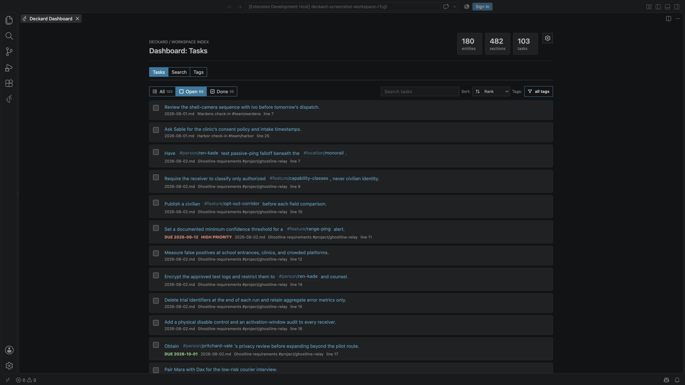 | 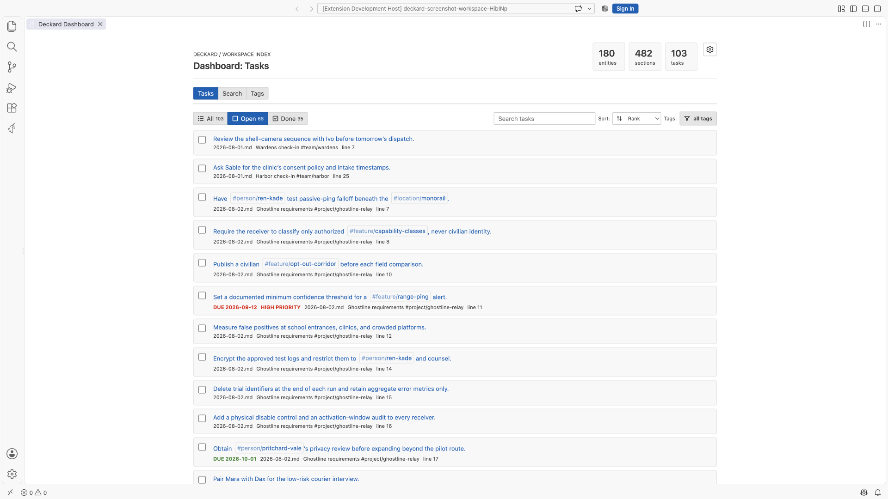 | |
| **Replicant** | **Oblivion** | **LCARS** |
|  |  |  |
| **Tomcat** | **Fellowship** | **Synthwave** |
|  |  |  |
| **Cooper** | | |
| 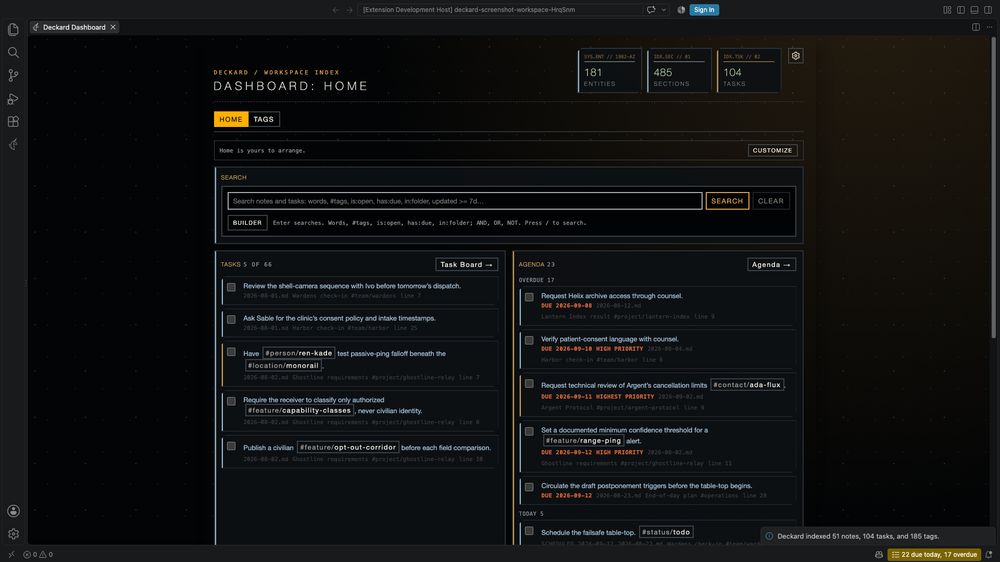 | | |

## Zen mode

Set `deckard.zenMode` to `true`, pick **Zen** in the gear on the Dashboard, a search page, or the Task board, or run `Deckard: Zen Mode`, to turn Deckard's own chrome down.

Zen mode is not a theme, and it does not replace one. A theme picks the colours; zen picks how much frame is drawn around them, so the two compose — any of the eight themes above can be read in zen.

**What it changes.** Decorative labels such as `DECKARD / WORKSPACE INDEX` and the invented telemetry codes on the Dashboard's totals are hidden, along with the dotted grid backdrop and the permanent line of query syntax under the search box. Page headings shrink and stop shouting, borders go from 2px to 1px, and the padding in cards, tasks, and board columns tightens. Each row's file name, heading, and line number fold away, and come back when you hover the row or tab to it.

**What it does not change.** Every button, filter, tab, count, checkbox, and tag stays exactly where it was — zen hides ornament and folds provenance, and removes no functionality. The folded text is moved off-screen rather than out of the page, so a screen reader still announces it and find-in-page still finds it. A task's due date, priority, and overdue marker never fold: they are the point of a task row. Nor does a search that Deckard could not parse stop saying so.

**What you give up.** The hint under the search box that lists `AND, OR, NOT` and the `/` shortcut is hidden with the rest of the chrome. The full [query language](#query-language) reference is in this README and on the Help page.

## Get started

The fastest way to see what Deckard does is to let it show you: `Deckard: Create a Sample Workspace` copies seven small notes — three daily notes, two project hubs, a person, a team — into a folder you choose and offers to open it. They are written the way Deckard reads them, and the README beside them says what each one shows and what to try first. Delete the folder when you are done; nothing else refers to it.


1. Open a folder or workspace in VS Code.
2. Open any Markdown note in the workspace, or [restrict indexing to a folder](#settings).
3. Open the Command Palette and run `Deckard: Open Dashboard`.
4. Select the Deckard icon in the Activity Bar to open **Related Notes** while editing a Markdown note.

Deckard scans the workspace Markdown scope automatically and refreshes when saved notes are added, edited, or deleted.
Run `Deckard: Reindex Workspace` from the Command Palette to trigger a full scan manually.

Run `Deckard: Open Help`, or select the question-mark button in the Related Notes toolbar, to open the Help page. It includes a quick start, advanced configuration guidance, and in-page navigation by feature category.


## Commands

| Command | Description |
| --- | --- |
| **Deckard: Open Dashboard** | Opens workspace totals, Home, and tags. |
| **Deckard: Open Notes Graph** | Opens an interactive force-directed map of every note, task, and tag connection. |
| **Deckard: Open Task Board** | Opens tasks as a Kanban board grouped by status, priority, due date, or the person each task is for. |
| **Deckard: Show Stats** | Opens index totals and local view-count statistics. |
| **Deckard: Open Help** | Opens the quick-start and advanced feature guide. |
| **Deckard: Show Log** | Opens Deckard's log, which records how long indexing, ranking, and editor features take. |
| **Deckard: Reindex Workspace** | Performs a full scan of the workspace Markdown scope. |
| **Deckard: Create Daily Note** | <kbd>Cmd</kbd>+<kbd>Shift</kbd>+<kbd>Alt</kbd>+<kbd>D</kbd> on macOS, <kbd>Ctrl</kbd>+<kbd>Shift</kbd>+<kbd>Alt</kbd>+<kbd>D</kbd> elsewhere. Creates or opens today's note. |
| **Deckard: Pin Note to Home** | Pins the note the cursor is in — the heading and what is written under it — to Home's Pinned notes. **Deckard: Unpin Note from Home** removes it. |
| **Deckard: Tidy Favorites, Pins, and Saved Searches** | Lists the favorites, pins, and tag-set searches that point at nothing in this workspace any more, and removes them only if you say so. Deckard never removes one of these on its own. |
| **Deckard: Export Favorites, Pins, and Searches** | Writes what Deckard remembers about this workspace to a JSON file you choose. |
| **Deckard: Import Favorites, Pins, and Searches** | Reads one back and, after asking, replaces what this workspace remembers with it. |
| **Deckard: Restore Favorites, Pins, and Searches from a Copy** | Offers the copies Deckard keeps on its own, newest first, and restores the one you pick after asking. |
| **Deckard: Check My Setup** | Writes up, as a Markdown document, what your settings resolve to in this workspace, what the last scan found and kept out, what the index holds, and whether `deckard.me` names anyone — with what to do about each thing that is off. |
| **Deckard: Create a Sample Workspace** | Copies seven small notes, written the way Deckard reads them, into a `deckard-sample` folder inside a folder you choose, and offers to open it. Its README says what each note shows and what to try first. |
| **Deckard: Open Previous Daily Note** | Opens the nearest daily note before the one in the editor, or before today. |
| **Deckard: Open Next Daily Note** | Opens the nearest daily note after the one in the editor, or after today. |
| **Deckard: Open Weekly Note** | Creates or opens this week's note, `week-2026-09-13-2026-09-19.md`, with [its review](#writing-a-review) written in. |
| **Deckard: Open Monthly Note** | Creates or opens this month's note, `month-september-2026.md`, with its review written in. |
| **Deckard: Write a Review** | Writes, or brings up to date, the review in this week's or this month's note. |
| **Deckard: Edit Task** | <kbd>Cmd</kbd>+<kbd>Shift</kbd>+<kbd>Alt</kbd>+<kbd>T</kbd> on macOS, <kbd>Ctrl</kbd>+<kbd>Shift</kbd>+<kbd>Alt</kbd>+<kbd>T</kbd> elsewhere. Edits the task on the cursor's line, field by field; see [Editing a whole task](#editing-a-whole-task). |
| **Deckard: Add Task** | The same editor, under the name it goes by when the cursor is not on a task: the same shortcut writes a new one where you are. |
| **Deckard: Capture** | <kbd>Cmd</kbd>+<kbd>Shift</kbd>+<kbd>Alt</kbd>+<kbd>C</kbd> on macOS, <kbd>Ctrl</kbd>+<kbd>Shift</kbd>+<kbd>Alt</kbd>+<kbd>C</kbd> elsewhere. Adds a task to today's note without leaving the current editor, completing tags as you type. |
| **Deckard: Capture Under a Heading** | Adds a task under a heading you choose in any note. |
| **Deckard: Roll Unfinished Tasks Forward** | Carries the unfinished tasks of the last daily note into today's, creating today's note if it is not there yet. |
| **Deckard: New Note from Template** | Creates a note from a template in your templates folder, asking for its title and anything the template asks. |
| **Deckard: Copy MCP Server Setup** | Copies the command that adds Deckard's [MCP server](#claude-code-and-other-mcp-clients) to Claude Code, offering to turn the server on first. |
| **Deckard: Reset MCP Server Token** | Makes a new MCP server token, so every copied setup stops working. |
| **Deckard: Extract Tagged Heading** | Moves a tagged heading section into a newly named note and leaves a `[[link]]` to it. |
| **Deckard: Open a Tag's Search Page** | Opens a tag's search page, or shows a tag picker when no tag is supplied. |
| **Deckard: Open Search Page** | Opens a search page listing every note, ready for a search. |
| **Deckard: Search Notes (find as you type)** | <kbd>Cmd</kbd>+<kbd>Shift</kbd>+<kbd>Alt</kbd>+<kbd>F</kbd> on macOS, <kbd>Ctrl</kbd>+<kbd>Shift</kbd>+<kbd>Alt</kbd>+<kbd>F</kbd> elsewhere. Searches notes, tasks, tags, and saved searches as you type; see [Find](#find). |
| **Deckard: Search Notes and Tasks** | Opens a search page on a Deckard query, such as `(tag = #project/atlas AND task = open) OR text ~ "vendor"`. |
| **Deckard: Link Current Heading to Entity** | Adds a user-approved canonical person, project, topic, organization, or meeting tag to the current heading. |
| **Deckard: Move Inline Tags to Front Matter** | Moves explicit tags from the active note into merged note-level front matter. |
| **Deckard: Rename Tag** | Searches indexed tags and replaces the selected tag in its source notes. |
| **Deckard: Merge Tag…** | Merges one indexed tag into another that already exists, after showing what the merge will change. |
| **Deckard: Rename Heading** | Renames the heading the cursor is in and rewrites every `[[Note#Heading]]` link that named it. |
| **Deckard: Undo Last Change** | Puts every note back as it was before Deckard's last workspace-wide write, such as a tag rename or merge. |
| **Deckard: Follow Cursor in Outline** | Selects the Outline heading containing the editor cursor. The Outline title has the same control. |
| **Deckard: Stop Following Cursor in Outline** | Leaves the Outline selection where you put it. |

## Markdown format

Deckard recognizes ATX headings, unordered checklist items, `#` tags, `@` people, and `[[Wiki links]]`. Tag matching is case-insensitive.

`deckard.noteBoundaries` decides where one note ends and the next begins:

| Setting | A tagged line is | A search for a tag written in prose returns |
| --- | --- | --- |
| `line` *(default)* | a note of its own | that line |
| `heading` | part of the heading above it | the heading holding the line |
| `marked` | part of the heading above it, unless it carries a `^marker` | the heading, or the marked line itself |

Under `heading`, a tag written in a note's prose is **not moved onto the heading**. It stays on the line it was written on, and the heading answers a search for it because it contains that line — so a heading still shows only the tags its author wrote on it, and the match knows which line it came from. A tag written on a heading goes on being inherited by everything nested under it, as it always has; a tag written in a body does not travel at all, neither up to the headings above nor across to the lines beside.

A tagged line with no heading above it stays a note whatever the setting says, because folding it would drop its tags. Consecutive tagged prose lines are grouped so wrapped explanations do not become truncated duplicate entries, and under `marked` a marker on any line of such a group marks the whole of it.

Tasks are outside all of this. A task is its own entry wherever it is written, under every setting.

Changing the setting reindexes the workspace by itself — nothing is written to your notes, and you do not need to run `Deckard: Reindex Workspace`. The search cache remembers how the notes in it were parsed, so it is rebuilt even when the setting was changed while VS Code was closed, which no file's modified time would have revealed.

A `[[link]]` names a note by its file name without `.md`, or by any name in the note's `aliases:` front matter, such as `aliases: [Atlas Program, AP]`. A name two notes share opens neither.

After `#`, a link can name a heading, as `[[Check-in#Vendor review]]` does, or one line, as `[[Check-in#^lift-slip]]` does. A line is named by the `^marker` written at its end, the way the [Obsidian](https://obsidian.md) block-reference convention writes it:

```markdown
## Vendor review
The lift survey slipped because the contractor never confirmed. ^lift-slip
- [ ] Chase the contract @dana ^chase
```

- A marker is the last thing on its line, separated from the text, so a caret written in prose is never mistaken for one. Markers inside fenced code are ignored, and when a note repeats one the first line wins.
- Typing `[[Check-in#^` completes the markers that note carries, each shown with the line it marks, so a link is written by picking the line rather than by remembering its name.
- Following the link opens the note at that line, and hovering it previews the line under the headings it sits beneath. A link to a marker the note no longer carries still opens the note, and says the line is gone.
- Deckard reads markers; it never writes them. Your prose stays as marked up as you made it, which is why there is no command to mint one.

### Embeds

Write `![[Note]]` on a line of its own and VS Code's Markdown preview draws that note where the line is. The same reference a link uses, read in place:

| Written | Draws |
| --- | --- |
| `![[Check-in]]` | the whole note, without its front matter |
| `![[Check-in#Vendor review]]` | that heading, and everything nested under it |
| `![[Check-in#^lift-slip]]` | the one line that marker names, without the marker |
| `![[#Vendor review]]` | a heading of the note the embed is written in |

- Each embed is headed by what it read, which links to its source line; selecting it opens the note there.
- An embed names its note the way a link does: the file name without `.md`, or an alias. A name two notes share reads neither, and a name no note has says so rather than drawing nothing.
- `![[…]]` inside a sentence stays the text you typed, since an embed is a block. `![[diagram.png]]` and other attachments are left alone too: Deckard indexes Markdown, and your image syntax is yours.
- An embed inside an embed is drawn up to three deep, so a pair of notes embedding each other stops rather than spinning.
- An embed of the note being previewed reads the editor's own text, so it keeps up as you type. An embed of another note reads the index, which is up to date as of that note's last save.
- The Markdown stays portable: outside Deckard the line reads as the `![[…]]` other tools already understand, and, like any link, an embed written inside fenced code is left as code.

By default, use `@` for people and namespaced `#` tags for workspace entities:

```markdown
# Project Atlas #project/atlas
Met with @alex-smith about [[Q3 planning]].

- [ ] Send the proposal by 2026-09-12 #project/atlas
```

`#project/atlas`, `#topic/leadership`, `#org/acme`, and `#meeting/q3-planning` appear as entity hubs. Any other namespaced tag, such as `#management/performance`, creates a new namespace automatically and appears as `Management: Performance` in its overview. Simple unnamespaced `#follow-up` tags remain supported; all tags appear together in the Dashboard's **Tags** catalog. Deckard distinguishes `@alex` from `#alex`. You can configure namespace aliases to map a custom namespace to any built-in or custom target namespace, and you can move the people marker; when the people marker is changed from `@`, `@name` becomes a lightweight tag.

Frontmatter can add portable entity context to every heading and task in a note:

```yaml
---
project: atlas
people: [alex-smith]
topics:
  - leadership
---
```

Supported front-matter values are highlighted in the editor and Cmd/Ctrl-clickable just like inline tags: `people`/`person` maps to `@person`, while `projects`, `topics`, `organizations`, and `meetings` map to their typed `#` tags. These metadata tags remain indexed and openable even when the note has no heading or task.

Run `Deckard: Move Inline Tags to Front Matter` to collect explicit tags from the current note into plural front-matter fields. Existing values are merged, unrelated YAML fields are preserved, and source tag tokens are removed. Because the resulting metadata applies to the entire note, use the command only for context that belongs to every heading and task in that note.

Run `Deckard: Rename Tag` to search the indexed tag list, choose a replacement, and update every matching source occurrence without changing ordinary prose or fenced code. Renaming to a tag that already exists merges the two; see [Merging tags](#merging-tags). On the Dashboard, a search page, or Related Notes, right-click a tag and choose **Rename tag**. In a Markdown editor, hover a tag and choose the clickable **Rename** action. Enter a complete tag such as `#management/new-name`, or enter only a new name to keep the selected tag's marker and namespace.

- Headings use the ATX form `# Heading` through `###### Heading`. Optional closing hashes are removed from the heading title.
- **Associated tags** are Deckard's practical "these belong together" suggestion. If you write `#project/atlas` and `#risk/vendor` together on one heading, task, or tagged line, Deckard retains that raw evidence. Related Notes normalizes it by the distinct source-unit support and both tags' prevalence, so a common tag is not promoted merely by occurring often. Tags in a heading and its nested headings get a lighter connection. Front-matter and inherited tags give note context but never create associations on their own.
- Tasks use `-`, `*`, or `+` followed by `[ ]` for open items or `[x]`/`[X]` for completed items.
- A task inherits tags from its nearest heading and combines them with tags written on the task line.
- Tag names start with a letter or number and can contain letters, numbers, `_`, `-`, and `/` namespace segments.
- Fenced code blocks using backticks or tildes are ignored by indexing, decorations, and completion.
- Numeric-only hash tokens such as `#2026` are ignored as tags so that ordinary Markdown headings and dates do not become tags. Numeric `@` tags such as `@2026` remain valid.

For example:

```markdown
# Launch plan #project/atlas

## Next steps #topic/planning

- [ ] Review the brief #topic/writing
- [x] Send the update @alex-smith
```

Use `- [ ]`, `* [ ]`, or `+ [ ]` for an open task. Use `- [x]` for a completed task. A task inherits tags from its heading and can also have its own tags.

## Task metadata

Deckard reads both formats of the [Obsidian Tasks](https://publish.obsidian.md/tasks/) plugin, so tasks written for Obsidian keep their dates, priorities, and repeat rules. The emoji format looks like this, and the [Dataview format](#dataview-format) spells the same fields out in brackets:

```markdown
- [ ] Send the proposal 📅 2026-09-20 ⏳ 2026-09-18 ⏫ 🔁 every week
```

| Marker | Meaning |
| --- | --- |
| 📅 | Due date. 📆 and 🗓 also work. |
| ⏳ | Scheduled date: the day you plan to work on the task. ⌛ also works. |
| 🛫 | Start date: the task is not actionable before this day. |
| ✅ | Completion date. |
| ➕ ❌ | Created and cancelled dates. They are removed from titles and kept in the note. |
| 🔺 ⏫ 🔼 🔽 ⏬ | Priority, from highest to lowest. |
| 🔁 | Repeat rule, such as `every week`. |
| 🆔 ⛔ | A task's id, and the ids of the tasks it waits for. |

- Markers are removed from task titles wherever Deckard shows them, and appear as details instead. A trailing Obsidian block id such as `^a1b2` is left out of the title too. Deckard reads a marker anywhere on the line, while Tasks expects them at the end.
- A 📅 date wins over a date written in the sentence. Without one, Deckard still reads `2026-09-12`, `Sep 12`, or `next Friday` from the task text. `Sep 12` and `next Friday` count from the day the note is about: a daily note's date from its file name or top heading, else a `date:`, `created:`, or `updated:` front-matter date, and only then when the file was last saved. A ✅ date is never taken for a due date.
- Completing a task from Deckard adds ✅ with today's date, and reopening it removes the date. Set `deckard.tasks.addDoneDate` to `false` to change only the checkbox.
- Completing a task with a 🔁 rule writes its next occurrence on the line above, as Tasks does. The due date, or else the scheduled or start date, moves forward by the rule, and the other dates keep their distance from it; a rule ending in `when done` counts from today instead. The new task drops the ✅ date, the 🆔, and any block id.
- Deckard understands `every day`, `every 3 weeks`, `every month`, `every year`, `every weekday`, `every Monday`, `every week on Tuesday, Friday`, `every month on the 15th`, and `every month on the last`, each optionally followed by `when done`. For any other rule it completes the task, adds no next occurrence, and tells you so.
- Only `[ ]`, `[x]`, and `[X]` checkboxes are tasks, so a Tasks `[-]` cancelled task is not indexed.

### Who a task is for

A `👤` field says who a task is for. Notes name people for all sorts of reasons — a task can be *about* someone without being *theirs* — so being asked to do something is written down rather than inferred from the sentence:

```markdown
- [ ] Chase the contractor @ren-kade 👤 @dana     <!-- Dana's task; Ren is mentioned -->
- [ ] Send the proposal [assignee:: #person/ren-kade]  <!-- Ren's task -->
- [ ] Write up what @dana said                    <!-- about Dana, nobody's task -->
- [ ] Book the room                               <!-- nobody's yet -->
```

- `👤` and `[assignee:: …]` are the same field in the two [task metadata](#task-metadata) formats, and Deckard writes whichever one the line already uses. `🧑` is read too.
- The person is named as their tag is written, so `@dana` in the field is the same `@dana` the rest of your notes and the [people](#people) views already know. `@dana` and `#person/dana` name the same person, whichever way either side writes it.
- Search for them with `assignee = @dana`, `assignee = none`, `is:assigned`, or `is:unassigned`.
- `is:mine` finds what is yours: the tasks whose `👤` names you, once `deckard.me` says who you are — `@ren-kade`, say — and the tasks for nobody in particular, which fall to whoever is reading. `assignee = none` is the second kind alone.
- The [Task board](#task-board) groups by **Person**, a column each, busiest first, with **Nobody named** at the end — the waiting-on view. Dropping a card on a person writes the field, and dropping it on **Nobody named** clears it; the words of the task are never touched.
- Deckard read the first person in a task's words as its owner before this field existed. `deckard.tasks.assigneeFromPersonTag` turns that reading back on for lines that carry no `👤`.

### Dataview format

Tasks can also be written in the plugin's text-only Dataview format, and Deckard reads it the same way:

```markdown
- [ ] Send the proposal [due:: 2026-09-20] [scheduled:: 2026-09-18] [priority:: high] [repeat:: every week]
```

The fields are `due`, `scheduled`, `start`, `created`, `completion`, `cancelled`, `priority`, `repeat`, `id`, `dependsOn`, and Deckard's own `assignee`, in square or round brackets. Other Dataview fields, such as `[owner:: Ren]`, stay part of the title. When Deckard writes a date, such as a completion date or a repeating task's next dates, it uses the format the task already uses. For a task with no metadata yet, `deckard.tasks.metadataFormat` chooses.

### Editing a whole task

One command opens the task on the cursor's line as a list of its fields, so a whole task can be built or changed in one place rather than typed marker by marker. It goes by the name that fits where the cursor is: **Deckard: Edit Task** on a task line, and **Deckard: Add Task** anywhere else, with the same shortcut for both. On a line that is not a task yet, whatever is written on it becomes the description; on an empty line, you start from nothing.

The pick lists every field with what the task says now, headed by the line as it will be written, so the Markdown is in front of you the whole way through. Choosing a field opens its own step and comes back:

| Field | What it takes |
| --- | --- |
| **Description** | The words, tags and people included |
| **Status** | Open or done — completing writes the ✅ date a checkbox would, and reopening takes it away |
| **Due**, **Scheduled**, **Start** | A date in plain words |
| **Priority** | Highest to lowest, or none |
| **Repeats** | A common rule, or any rule you write |
| **Assignee** | Who the task is for — its `👤` field; see [Who a task is for](#who-a-task-is-for) |
| **Blocked by** | The `🆔` ids of the tasks that come first |
| **Add a tag** | A tag from your workspace, or a new one, written at the end of the description |

Dates are written the way people write them — `2026-09-25`, `today`, `tomorrow`, `friday`, `next monday`, `in 3 days`, `+2w`, `1 month` — and the box says which day it read as you type, such as *Friday 2026-09-25*. An empty answer clears the date, and words Deckard cannot read as a day are refused rather than guessed at.

- **Assignee** offers the people your notes already name, or takes a new one — `dana` and `@dana` both read as the person. It writes the `👤` field and leaves the words alone, so a person the task mentions stays mentioned. **Nobody** takes the field off.
- **Nothing is written until you choose Write the task.** Escape leaves the line as it was.
- The line is written in the format it already uses, or `deckard.tasks.metadataFormat` for a task with no metadata yet, and in the order [Tasks](https://publish.obsidian.md/tasks) writes it.
- Everything Deckard does not offer to edit is kept: a `^block-id` stays at the end of the line, an `🏁` on-completion marker stays where it was, and a `➕` created date is left alone.
- The editor works on the line in the editor, not on the index, so an unsaved note edits like any other.
- It is also on the lightbulb: put the cursor in a task line and **Edit task…** is offered as a refactoring.

### Typing metadata

Type `/` after a space in a task to pick metadata instead of typing it:

- **due today**, **due tomorrow**, **due in a week**, and **due on a date**, with the same choices for scheduled and start dates;
- the five priorities, from **highest priority** to **lowest priority**;
- common repeat rules, or **repeats on a rule** to write your own;
- **for @dana** for each person your notes name often, and **for a person** to write one;
- **task id**, and **depends on** each open task's id.

Keep typing to narrow the list, as in `/prio` or `/every`. Suggestions use the format the task already uses, or `deckard.tasks.metadataFormat` for a task without metadata. Set `deckard.tasks.metadataSuggestions` to `false` to turn them off.

## Editor assistance

- Tags in Markdown editors receive clickable decorations. Cmd/Ctrl-click opens its page, and hovering a tag provides a separate clickable **Rename** action. Heading tags are always handled; tags on other lines follow `deckard.parseInlineTags`.
- Typing `#` or `@` offers matching tags already in the index, with each tag's current entry count. `#atl` can complete to `#project/atlas`; `@al` can complete to `@alex-smith`. Partial tag tokens are replaced correctly, fenced code is ignored except inside a `deckard` [query block](#query-blocks), and numeric-only hash tags are excluded from `#` completion.
- Typing `/` after a space in a task offers due dates, priorities, repeat rules, and dependencies. See [Typing metadata](#typing-metadata).
- **Reference counts** sit above a note's lines. The first line says **Linked from N notes** when other notes link to it, and each heading shows **N references** for links that name it, such as `[[Launch plan#Decision]]` or `[[#Decision]]`, and **N open tasks** for the open tasks beneath it. Select a count to list those links or tasks in VS Code's references peek. A tagged heading also shows **N entries share a tag**: the note sections, tasks, and front-matter-only notes elsewhere that carry one of the tags written on that heading. Tags inherited from a parent heading or the note's front matter do not count, and neither do entries in the same note. Select it to open [Related Notes](#related-notes) focused on the heading, which lists those entries along with weaker matches such as associated tags and shared keywords. Set `deckard.editor.referenceCounts` to `false` to hide them.
- **Hovering a `[[Wiki link]]`** previews the note, or the section its `#Heading` names, and says how many other notes link to it. A link to a note that does not exist yet, or to a name several notes share, says so instead.
- **Link problems** are marked in open notes. A `[[link]]` to a note that does not exist yet gets a **Create note** quick fix, which creates the note in your notes folder, and a name several notes share is a warning. `deckard.editor.linkDiagnostics` turns this off.
- A note with such links also says so on its first line: **N links open no note** lists them in the references peek, and **Create N missing notes** creates, in your notes folder, a note for each name no note has yet, leaving any note already there alone. A name several notes share is counted but not created, since another note would not settle which one it means. `deckard.editor.linkProblems` turns these off.
- **Task dependencies** sit above a task that uses `⛔` or `🆔`: **Waiting on N open tasks** for the tasks its `⛔` names that are still open, and **Blocks N open tasks** for the open tasks whose `⛔` names its `🆔`. Select either to list those tasks in the references peek. A `⛔` name no task carries, a typo or a task since deleted, reads **No task has 🆔 name**. A task with nothing still open on either side, and a done task, shows nothing. `deckard.editor.taskDependencies` turns these off.
- **Daily notes** carry **‹ 2026-09-21** and **2026-09-23 ›** on their first line, which open the daily notes before and after, skipping days without one; a side with no note has no arrow. Today's note also offers **Carry in N unfinished tasks** while earlier daily notes still hold open tasks it does not, which runs **Deckard: Roll Unfinished Tasks Forward**. See [Daily notes](#daily-notes). `deckard.editor.dailyNoteActions` turns these off.
- **An [embed](#embeds) the preview cannot draw** says why above its line, as the preview does in its place: **Embed: Atlas has no heading "Decision"**, or **Embed: Nothing in Atlas is marked ^choice**. Select it to open the note the embed names, where the heading or marker was renamed or removed. An embed whose note name opens no note is left to the link problems above. `deckard.editor.embedProblems` turns these off.
- **Unlinked mentions** are counted on a note's first line: **Mentioned in N notes without a link** when other notes write its title, or one of its `aliases:`, as plain text. Select it to list them in the references peek, or select **Link N mentions** to turn each into a `[[link]]`, keeping the name as written — `atlas` becomes `[[atlas]]`, which opens `Atlas.md` because links ignore letter case. The write is [previewed and undone](#previewing-and-undoing-a-write) like Deckard's other multi-note writes. Only whole words in prose count: not links, code, tags, Markdown links, headings, or front matter. Names shorter than three characters, and names another note also goes by, are not looked for. `deckard.editor.unlinkedMentions` turns these off.
- **Hovering a tag** shows how many notes and tasks use it, its [hub note](#hub-notes) when it has one, and its five most recently updated entries, each a link to its line, with **Open overview**. Set `deckard.editor.hoverPreviews` to `false` to turn previews off. The tag's **Rename** action stays in the same hover.

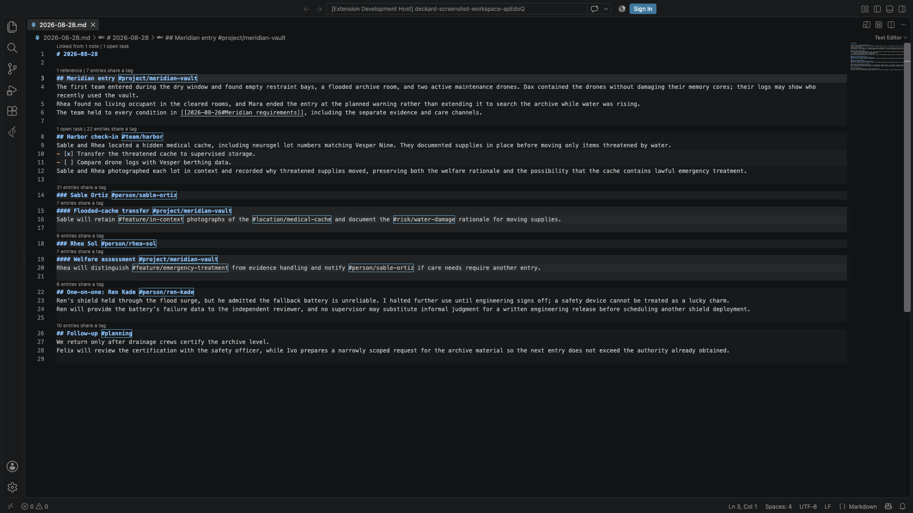

## Renaming notes and headings

A `[[link]]` names its target by text, so renaming a note would break every link to it. Deckard rewrites them as part of the rename:

- **Renaming or moving a note in the Explorer** rewrites every `[[link]]` that named it by its old title, across the workspace. The links and the rename land together, so one Undo takes back both, and Deckard says how many links it changed in how many notes.
- Only links that resolved to the note being renamed are touched. A link written through an `aliases:` name the note keeps is left as it is, since it still opens the note, and so is a link to a different note that happens to share the name. Moving a note to another folder changes no links, because a link names a note by its title and not by its path.
- A link's heading, `^marker`, and `|display text` are kept exactly as they were written: `[[Vendor review#Terms|the terms]]` becomes `[[Supplier review#Terms|the terms]]`.
- `deckard.updateLinksOnRename` turns this off.
- **Deckard: Rename Heading** renames the heading the cursor is in and carries the links into it along: `[[Check-in#Vendor review]]` elsewhere, and `[[#Vendor review]]` in the same note, follow the new text. Tags written on the heading stay on it. Save the note first — Deckard rewrites the links from what is on disk, so it asks you to save rather than work from a draft it cannot see.

Links inside fenced code are left alone, as everywhere else in Deckard.

## Dashboard

Run `Deckard: Open Dashboard` to see compact workspace totals and switch between the **Home** and **Tags** tabs. The Dashboard opens on **Home**; use Left/Right Arrow while the tab control is focused to switch tabs. The Dashboard's tab and tag search are restored when you close and reopen it. Searches open [search pages](#search-pages), and tasks have their own page, the [Task board](#task-board).


### Home

**Home** is made of widgets you choose:

| Widget | Shows | Leads to |
|---|---|---|
| **Search** | The [search box](#the-search-box); <kbd>Enter</kbd> opens a search page | The search page |
| **Tasks** | The first tasks a search finds, `is:open` unless you set another, ranked as on the Task board | The Task board, on that search |
| **Agenda** | Overdue, today's, and upcoming tasks | The Tasks view |
| **Favorite tags** | The tags you favorited, with what searching for each finds | The Tags tab |
| **Frequent tags** | The tags you open most, lately | The Tags tab |
| **Saved searches** | Your saved searches, each removable | Where each was saved |
| **Saved search results** | What one saved search finds | Its search page, or the Task board |
| **Recent searches** | The searches you ran lately | Their search pages |
| **Recently opened** | The notes you opened from Deckard lately | The notes |
| **Workspace** | Note, file, task, tag, and entity totals | The Stats page |
| **Today** | Today's daily note and its open tasks, or **Create today's note** | Today's note |
| **Quick add** | A field that adds an open task to today's daily note, creating the note if needed | — |
| **Stale tasks** | Open tasks in notes left unchanged for 7, 14, 30, or 90 days, oldest first | The Task board |
| **Related notes** | Notes related to the note you had open last, ranked as [Related Notes](#related-notes) ranks them | That note |
| **Tags written together** | The tag pairs carried together by the most notes and tasks, counted as a search for both counts, with how much of the rarer tag's entries they share; a pair searches for both | The Tags tab |
| **Tags without a hub** | Tags used at least three times with no [hub note](#hub-notes), each with **Create hub** | The Tags tab |
| **New tags** | Tags first seen in the last 7, 14, 30, or 90 days, newest first, each with **Rename**, so a typo is caught early | The Tags tab |
| **People gone quiet** | The people you have not written about for 30, 60, 90, or 180 days, longest ago first, each with how long it has been and what is still open with them | The Tags tab |
| **Pinned notes** | The notes you pinned, each with **×** to let go of it | The note, at the heading you pinned |

A tag is new from the first time Deckard indexes it; the tags in use when Deckard first kept track are not new.

**Pinning happens where the note is**, since a note in Deckard is an entry — a heading and what is written under it — and Home is the one place where the note being pinned is not in front of you. Three ways, all pinning the entry rather than the file:

- `Deckard: Pin Note to Home` pins the entry the cursor is in, and `Deckard: Unpin Note from Home` lets it go.
- **Hovering a tagged entry** in the editor offers **Pin … to Home** beside **Show related notes for …**, and **Unpin** once it is pinned.
- **Right-clicking a result** on a search page offers the same for that result.

Each says what it did with **Undo** beside it. A pin is kept as the heading's text, its level, and which heading of that text it is, and is found again each time Home draws — so writing above a pinned heading, or promoting it, does not lose the pin. A heading that is gone leaves the pin on its note, saying the heading was not found, rather than disappearing. A note with no heading above the cursor, such as a front-matter-only note, is pinned whole, which is what pins were before they could name an entry: pins kept from earlier versions still point where they did.

**People gone quiet** reads `@` tags and `#person/…` tags together, so one person written both ways is counted as the two tags they are — [Stats](#tags-that-look-alike) says when that is what has happened. A name was last written on the day of the newest note carrying it, dated the way Deckard dates every note: a `updated:` field first, then a daily note's day, then the file. Someone whose notes carry no date at all is left out rather than guessed at. Selecting a person opens their search page, where the entries themselves are.

**Paging**, in a widget's gear, turns it from the first few entries into all of them a page at a time: the widget grows a line of its own with **Per page**, the entries it is showing, such as *6–10 of 601*, and a chevron either way. The Agenda widget and a saved search's results are not paged, because each lists more than one thing and a single page number could not say which. A widget's page is kept with the rest of its settings, so Home opens where you left it.

Until Home has been arranged, a line above the widgets says it can be, with **Customize** and **Dismiss** beside it; once it has been arranged, or dismissed, the line is gone for good. Choose **Customize** in the View options gear to arrange Home. Drag a widget to move it, or right-click it to move it first or last; switch it between half and full width; open its own gear to choose how many entries it lists, whether it pages through the rest, which search a tasks widget runs, which saved search a results widget shows, or how many days Stale tasks, New tags, and People gone quiet look back; remove it with **×**; and add more from **+ Add widget**. **Reset** restores the widgets Home started with, and **Done** finishes. Widgets side by side share their row's height. Home's arrangement is kept in VS Code's preferences, never in your notes.

### Tags

- **Tags** shows namespaced and unnamespaced tags together. Search tags, narrow them to one namespace, or to tags without one, with **Namespace**, where a person's `@` tag counts as **Person**, then sort alphabetically, by entry count, by most accessed, or by custom rank. Favorite important items; in Rank mode, drag a row or use its context menu to move it to the top or bottom. Wherever a namespaced tag is shown inline, its `#namespace/` prefix is muted while the tag value keeps the surrounding view's normal color.
- **Searches are kept** between visits. When a search is narrowing the Tags list, a line above the list says so, such as *Showing 3 of 42 tags matching “vendor”*, with **Clear search**, and the search box is outlined. A **Namespace** filter counts too, such as *Showing 12 of 90 tags, in Person*, and **Clear search** clears it along with the text. A dot on the **Tags** tab marks it while a search is narrowing it.
- **Saved searches** are listed below the tags. Select one to reopen it where it was saved, or use **Remove** to delete it.
- Use the View options gear to choose one through four tag columns.
- Select a tag to open its [page](#search-pages).
- Right-click any tag or entity row, or press <kbd>Shift</kbd>+<kbd>F10</kbd> or the menu key on it, to choose **Rename tag**. Every right-click menu in Deckard opens from the keyboard the same way. When tags use custom rank, drag rows or right-click a row to move it to the top or bottom. Display order changes do not reorder text in your Markdown files.

## Stats

Run `Deckard: Show Stats` to see the current file, note, task, tag, namespaced tag, and Wiki-link totals from the index. Deckard counts the same things under the same names everywhere: a **note** is a headed entry, and a **file** holds one or more of them. It lists the notes nothing links to, leaving out daily, weekly, and monthly notes, which are found by their date; select one to open it. It also shows the most-viewed tags, namespaced entities, and note entries from Deckard's local access counters. These counters are collected when you open a tag's page or select a note entry on a search page, and are stored only in VS Code preferences. Select a most-viewed tag or canonical tag to open its page, or a note entry to open its note at that line.

If a note in the workspace could not be read — a permissions error, an encoding Deckard cannot decode — it is not in the index, and no search finds it. Deckard says so the moment it happens, once per note, and Stats lists every such note with the reason, so a search that comes back short does not just look like a bad search. Select one to open it; fix the cause, then reindex.

### Tags that look alike

Stats lists pairs of tags that look like one idea spelled twice, clearest first, each pointing from the rarer spelling to the one your notes already use. **Merge** on a row merges them through the usual [merge](#merging-tags): the same confirmation, the same preview, and the same [Undo](#previewing-and-undoing-a-write). Select either tag to open its search page and read the entries first.

| A pair reads | Because |
| --- | --- |
| `@ren-kade → #person/ren-kade` | the same name written two ways |
| `#org/acme → #organization/acme` | the same name in two namespaces |
| `#vendorrisk → #vendor-risk` | the same name punctuated two ways |
| `#topic/reports → #topic/report` | one is the plural of the other |
| `#project/atals → #project/atlas` | one or two letters apart, counting two letters written the wrong way round as one |

Spelling pairs are only ever compared inside one namespace, so `#project/relay` and `#risk/relay` are not a pair, and neither are two tags that merely sit in the same namespace. Setting `deckard.entityNamespaceAliases` is the other way to settle a namespace pair: it collapses one namespace into another for good, without touching your notes.

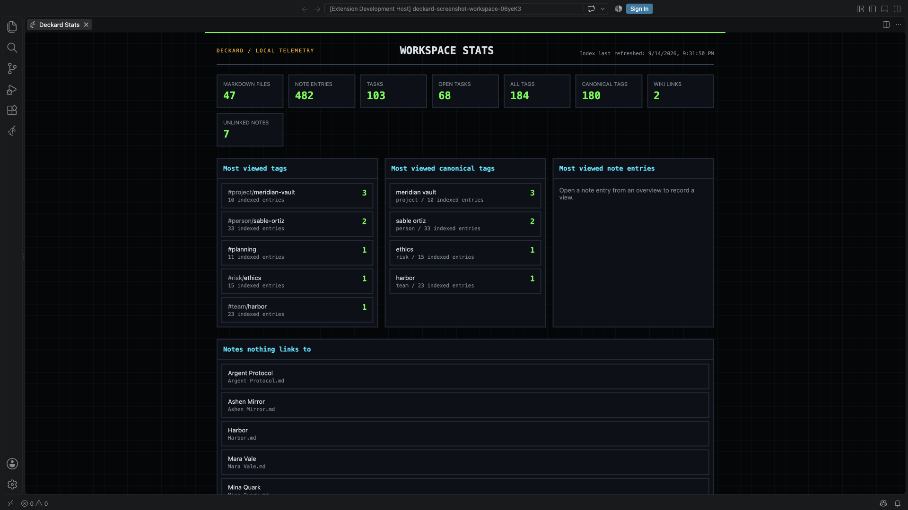

## Notes Graph

Run `Deckard: Open Notes Graph`, or select the graph icon next to the Dashboard icon in Related Notes, to see the whole workspace as a zoomable force-directed map. Notes and tasks appear as dots sized by connection count. The visual layout detects weighted communities from structural links and prevalence-adjusted tag evidence, then positions each community around a virtual anchor; hidden tag nodes no longer act as high-mass particles. Secondary tags and associations still provide lighter bridges without drawing a dense web between every pair of notes. The view starts zoomed out over the full graph and stays smooth with thousands of nodes.

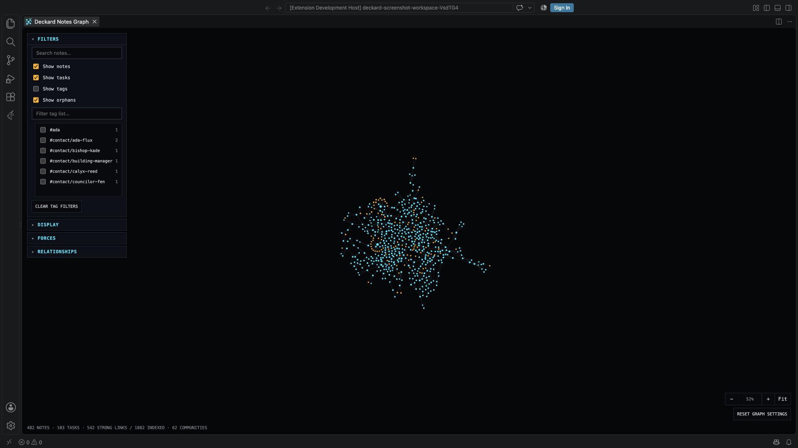

- Scroll to zoom toward the cursor, drag empty space to pan, and drag a dot to rearrange its cluster; **Fit** reframes the whole graph.
- Hover a dot to highlight its direct graph neighbors and see its source location. Select any note, task, or tag dot to list those connected nodes in the sidebar using the same note-card and tag styling as the rest of Deckard. Select the current node at the top of the sidebar to open its note/task source or tag page. Select a connected sidebar item to move the graph selection; Cmd/Ctrl-click it to open that item instead. Cmd/Ctrl-clicking a graph dot opens the same destination, and selecting empty space clears the selection.
- **Focus** draws the graph around the note in the editor rather than the whole workspace. **Around this note** turns it on, and **Hops out** chooses how far it reaches: one hop is the note, the tags it carries, and the notes it links to; two adds what those touch. The line beneath says which note it is drawn around and how many of the workspace's nodes are on screen.
  - It follows the editor: open another note and the graph is redrawn around that one. The graph is itself a tab, so the note it is about is the last one you had open.
  - A tag association is a hop like any other, so two hops out reaches the tags your tags are usually written with, and the notes carrying them.
  - Only the neighbourhood is sent to the page, so a local graph costs a screenful whatever the workspace holds. The tag checklist narrows to the tags that neighbourhood actually holds.
- **Filters** searches titles and paths, restricts the view to selected tags, and independently toggles notes, tasks, tag nodes (off by default), and orphan nodes.
- **Display** adjusts node size, link thickness, and the zoom level at which labels appear. **Connection density** sets the local edge budget; **Tag prevalence bias** controls how strongly rare/common tag populations affect salience; **Secondary bridge strength** controls weaker cross-community tag and association links. **Show all links** disables the backbone filter for comparison. **Reset graph settings** restores these controls, clears graph filters, and reframes the view.
- **Forces** tunes the layout with cluster centering, cluster cohesion, community spacing, repel strength, link strength, and link distance; changes re-run the simulation live. The graph's default layout uses a prevalence-aware local backbone: direct Wiki links and headings seed visual communities, tag memberships are scored against a target community size, and each node retains only its strongest connections. The underlying Connected Nodes sidebar still uses every indexed relationship.
- The graph is read-only: it never changes tags, associations, or your Markdown sources, and control choices persist per panel.
- The sidebar switches to **Connected nodes** only while the Notes Graph tab is active. Returning to a Markdown editor restores the normal Related Notes ranking.

## Outline

Open **Outline** from the Deckard Activity Bar to see the active Markdown file's headings as a tree. It is a view like any other, so it can be dragged into either the primary or the secondary sidebar and VS Code remembers where you put it.

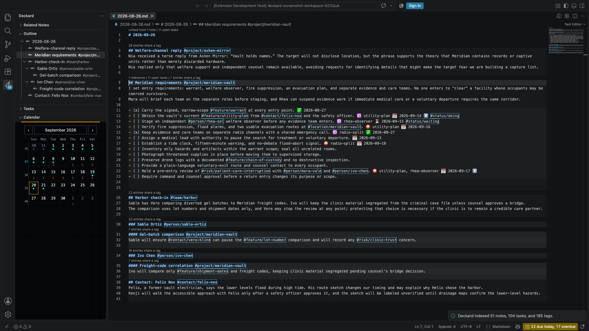

- Heading markers and tags are taken out of each title, and the heading's own tags are shown beside it, so structure and labels read as two columns.
- Untagged headings are kept as structure, so a tagged heading stays where you wrote it. A heading written as nothing but tags shows those tags as its title.
- Headings inside fenced code blocks are ignored, and a numeric hash such as `Sprint #3` stays in the title because it is not a tag.
- The tree is built from editor text, so it follows the file as you type rather than waiting for a save.
- Select a heading to jump to its line. Right-click a heading that carries tags for **Open the Tag's Search Page** and **Rename Tag**.
- The eye control in the view title switches whether the Outline follows the cursor, and **Collapse all** is beside it.

Headings written in the underlined `Title`/`===` style are not shown, matching how Deckard indexes notes everywhere else.

## Tasks view

Open **Tasks** from the Deckard Activity Bar to see your open tasks, grouped by when they are wanted. Like the Outline, it can be dragged into either sidebar.

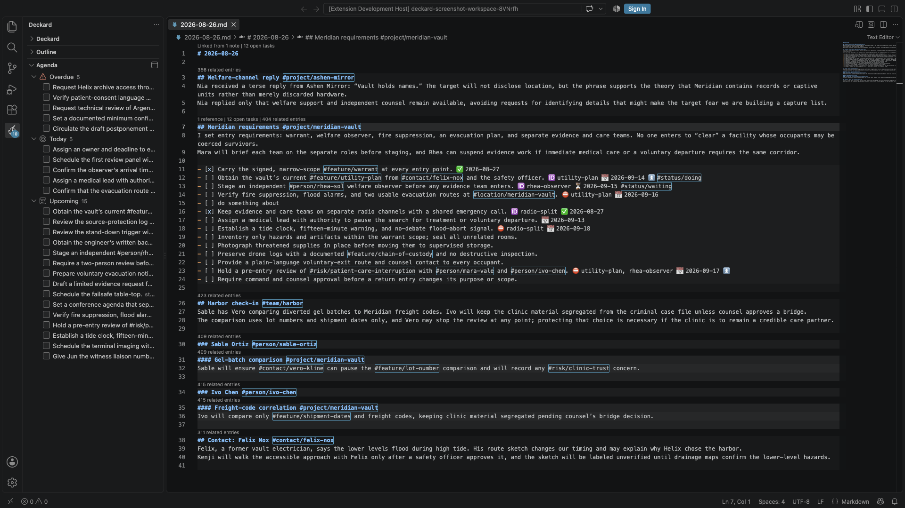

- **Overdue** lists tasks whose due date has passed, oldest first.
- **Today** lists tasks due today, and tasks scheduled for today or earlier that have started, most important first.
- **Upcoming** lists tasks due, scheduled, or starting in the next seven days, soonest first. `deckard.agenda.upcomingDays` sets how far that reaches.
- **Later** holds the dated tasks past that, by the date each waits for, and **No date** the open tasks carrying no due, scheduled, or start date at all, most important first. Both start folded, out of the way of what cannot wait.
- **What the view lists** is every open task, or the open tasks a search finds: set `deckard.agenda.query` to any [query](#query-language), such as `is:mine` for your own, `#project/atlas` for one project's, or `has:due OR has:scheduled OR has:start` to leave undated tasks out. Home's agenda widget and the [status bar](#status-bar-and-reminders) count the same list, so the view, the widget, and the number agree. A query that does not parse hides nothing and says so at the top of the view. The search icon in the view's title opens its search on the [Task board](#task-board), where it can be tried and changed with the results in view; the board's **Tasks view** button then keeps it. The view's title line shows the search it lists.
- **Group by** in the view's title chooses what its groups are: **Due status** (the three above), **Priority**, **Status**, or **Person**. The tasks are the same whichever you pick — the open ones `deckard.agenda.query` finds, or every open one — so grouping changes the axis rather than the list. `deckard.agenda.groupBy` keeps the choice.
  - **Priority** runs highest to lowest, each group marked with the same emoji the task lines use, and **No priority** last.
  - **Status** reads the `#status/…` tag written on each task line, busiest group first, with **No status** last. It follows `deckard.board.statusNamespace`.
  - **Person** groups by [who each task is for](#who-a-task-is-for), busiest first, with **Nobody named** last.
- Within a group, tasks you have ranked on the [Task board](#task-board) lead in the order you dragged them into; the rest follow by date, or by priority in **Today**.
- Each task shows why it is listed, its priority, and its file, plus `blocked by …` while a task it waits for with ⛔ is still open. Select a task to open its line.
- **Drag a task onto another** to rank it there, which writes nothing to your notes — it is the same rank the [Task board's](#task-board) list uses.
- **Drag a task onto a group** to make it belong to that group, written into the task through the same checked edit the board's drops make: a **priority**, a **status**, **Today** for a due date, or a **person**, which rewrites who the task is for and leaves anyone else named on the line as a mention. **Nobody named** takes the name off. **Overdue** and **Upcoming** cover a range of days rather than one, so they name no edit and say so.
- Check a task's box to complete it with the same source-safe edit the Dashboard uses, including its ✅ date and next occurrence.
- The view's badge counts the tasks that are overdue or due today, whatever it is grouped by.

## Status bar and reminders

Deckard puts one count in VS Code's status bar: **3 due today**, counting the same open tasks the Tasks view's Overdue and Today groups hold. Selecting it opens that view.

- The item is hidden while nothing is due, so a clear day is a quiet bar. When something is overdue it says so — **1 overdue, 3 due today** — and takes the editor's warning colour. Each number counts its own group; neither is the sum of the two.
- It follows the index, and catches up when the window regains focus, since what counts as today moves at midnight.
- `deckard.statusBar` turns it off.
- `deckard.taskReminderTime`, set to a time of day such as `09:00`, has Deckard say what is due once a day, with **Open Tasks** beside it. It is empty by default, which is no reminder, and a day with nothing due says nothing at all.

## Task board

Run `Deckard: Open Task Board`, or select the board icon in the Deckard sidebar's toolbar or in the Tasks view's title, to see tasks as a Kanban board. Drag a card to another column to change the task in its note, or choose a column from the card's **⋯** menu, which also works from the keyboard. The **View options** gear in the page's corner switches between the board and a list, and edits the status columns.

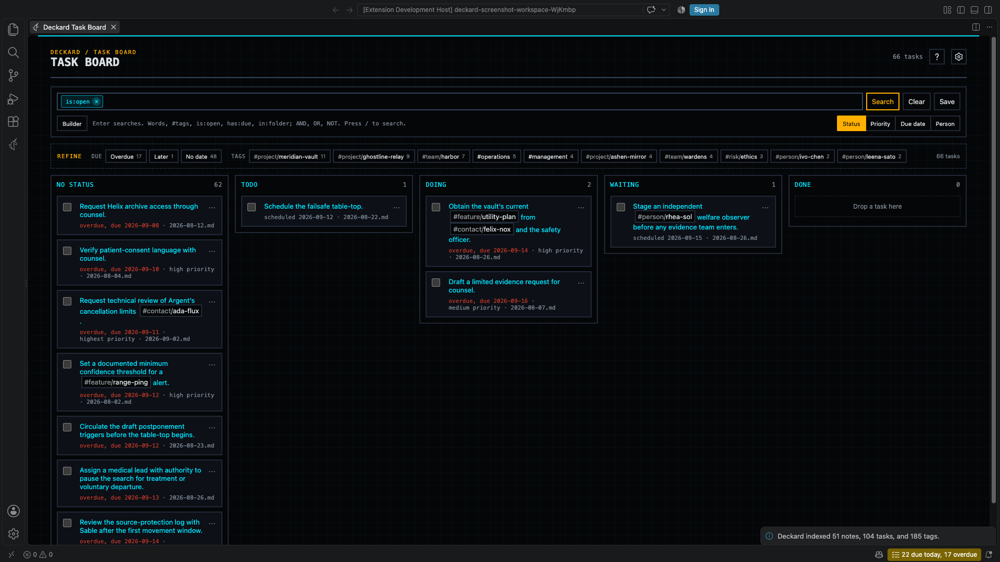

- **Status** gives each status tag written on a task line its own column, such as `#status/doing`. `deckard.board.statuses` sets the first columns and their order, `todo`, `doing`, and `waiting` by default; any other status found on a task gets a column after them, and tasks without one wait in **No status**. Dropping a card replaces its status tag, or removes it in **No status**. While fewer than a quarter of the open tasks carry a status, a line above the columns says how many have none, how to give a task one, and offers **Group by due date**, which works for any task. Set `deckard.board.statusNamespace` to use another namespace, such as `#stage/…`.
- **Priority** gives each priority a column. Dropping a card writes the new priority in the task's own format, such as ⏫ or `[priority:: high]`.
- **Due date** has columns for Overdue, Today, Tomorrow, Within a week, Later, and No due date. Drop a card on **Today** or **Tomorrow** to set its due date, or on **No due date** to remove it; the other columns cover a range of days, so they do not accept drops. A due date written in the task's sentence, such as `by Sep 16`, is left for you to edit.
- A due date is written by its distance from today with the date beside it — **Overdue 15 days · 2026-09-08**, **Due tomorrow · 2026-09-24** — on a board card, in the list and table, on Home and search pages, and in query blocks, so nothing has to be subtracted, and an overdue task says so in words rather than in colour alone. Beyond a month either way only the date is written, and a done task keeps its date as written.
- Every grouping ends with **Done**. Dropping a card there completes it, with its done date and next occurrence, and dragging it back out reopens it. Done shows the 20 most recently completed tasks.
- Search the tasks with the same [search box](#the-search-box) as search pages, such as `#project/atlas`, `priority >= high`, or plain words. **Refine** counts only tasks, and a search you run is added to your recent searches. The board opens on `is:open`, since a board is for what is still to do; clear the box for every task, or search `is:done` for the finished ones.
- **Save**, beside the search box, keeps the search as a saved search that reopens on the Task board. **Tasks view** makes the [Tasks view](#tasks-view) list the search instead; it is lit while the view lists the board's current one.
- **Table** shows the same tasks as rows and columns: the title, due date, priority, who it is for, and its note by default, and any of a task's other fields — scheduled, start, done, status, tags, created, updated, what it is blocked by, its id — chosen in the gear's **Columns**. A column header sorts by it, again turns the sort round, and **Rank order** under the search box goes back to the order you ranked; a task with nothing in the column comes last either way. The checkbox completes the task and the row opens it. A [query block](#query-blocks) draws the same table inside a note with `view=table`.
- **List** shows the same tasks as rows, with **Sort: Rank/Created/Updated**. In Rank, drag a row or right-click it to move it to the top or bottom; date sorting uses the source file's timestamps. The grouping switch sits under the search box while the board is shown, and the sort while the list is. Both show exactly what the search found: the page has no separate All/Open/Done filter, because the search box says the same thing for both.
- **Status columns** in the gear lists the status columns in order. Drag a column's row to reorder it, or right-click it to move it first or last; add one, remove one with its **×**, and set the tag namespace a status is written with. Deckard saves these to `deckard.board.statuses` and `deckard.board.statusNamespace`, in the workspace's settings when it already sets them and in your user settings otherwise.
- Select a card to open its line, or one of its tags to open that tag's overview. Only a status written on the task line counts, not one inherited from a heading, because moving the card could not change it.
- Every move is checked against the indexed line first, like a checkbox, so an edit made since the board last refreshed is never overwritten.

## Related Notes

Open **Related Notes** from the Deckard Activity Bar while editing a saved Markdown note. It suggests other note entries that may concern the same work.


### What makes a note related?

| Signal | Example | Importance |
|---|---|---|
| Shared tag | Both entries contain `#project/atlas` | Strongest |
| Parent or child-heading context | Your selected entry sits under a `#project/atlas` parent heading, or a selected heading contains one | Useful, but lighter |
| Associated tag | `#project/atlas` and `#risk/vendor` are often written together | Supporting evidence |
| Entry Wiki link | An entry links to `[[Launch plan#Decision]]` | Small supporting evidence |
| Shared wording | Both entries use distinctive section wording | Adjusts the score of an entry that qualifies another way; never makes an entry related on its own |

For example, if you select `#project/atlas #follow-up`, a note with both tags ranks ahead of a note that only contains an associated `#risk/vendor` tag. Associations retain their raw source evidence but are normalized for support and tag prevalence before diminishing returns are applied, so generic tags cannot dominate and indirect connections cannot overtake a complete direct match.

On the **Debug related notes** page, a **source unit** is one distinct tagged heading, tagged line, task, or heading relationship where Deckard can observe a tag; it is not necessarily a whole file. **Raw evidence** is the starting strength of an association, while **normalized relevance** adjusts that strength for repeated support and how common each tag is. **BM25 lexical similarity** (also written **BM-25**) is a capped search-style text match that gives more weight to distinctive shared words than to common words.

For the complete source-unit model, formulas, worked examples, configuration details, and external references, see the [Related Notes association and ranking reference](docs/related-notes-associations.md).

### Focus one note entry

Tagged headings highlight their full section; tagged lines and tasks highlight their line. Hover one to choose **Show related notes for [entry]**. The sidebar identifies the scope as a **Selected entry**, shows the source note, and uses that entry's tags first before adding tagged parent headings as lighter context. When the selected entry is a heading, tagged descendant child headings and tagged child items are also added as lighter context. Parent and child heading context decay by distance; child items use an additional level of decay, and the strongest occurrence wins when a tag appears more than once. The active tags are listed one per row, each with a segmented **Rail** marker for its contribution and a count of the notes and tasks carrying it; hover or focus a tag to see its exact Related Notes weight and that count split into notes and tasks. Choose **Show whole document** in the sidebar to return to the normal document view.

Each result shows its compact heading path and a concise primary reason for the match. Daily notes also show their inferred `YYYY-MM-DD` date, making a result such as `2026-09-10 > Project Atlas > Check-in` understandable before opening it. When both a broad heading and a nested child use the same tags, the child appears first because it is the more specific match. The Related Notes list includes its result count and shows 50 results at a time; **Show more** adds the next 50. The **Sort by** control keeps the selected ordering visible.

### Understand a score

Select a result percentage to open its explanation with the matching signals and weights; it also works from the keyboard. For the complete calculation, hover a tagged entry and choose **Debug related notes for [entry]**. The debug page shows whether each selected tag came from the entry, parent ancestry, a child heading, or a child item, along with heading paths, daily-note context, raw and normalized association support/prevalence, entry and file link evidence, lexical terms, optional recency, and specificity adjustments.

Use the sort control to choose **Relevance**, **Newest**, **Oldest**, or **Most accessed**. Select a related note to open its matching line, or select a tag to open its page.

Each result also carries a link button, beside its score, which writes a `[[Note#Heading]]` link to that entry at the cursor of the note you are editing, replacing the selection when there is one. The link names the heading the entry was written under, without its tags, and names the note alone when the heading only repeats the note's title. A tagged line or task is linked through the heading above it, since a link cannot name a line. When two notes share the name the link has to use, Deckard writes it and says which notes it could mean, because renaming one of them is the only way to make it resolve.

### Refine a search from the sidebar

While a [search page](#search-pages) or the Task board is the active editor, Related Notes shows that search's [Refine](#refine) options instead of related notes, so the page keeps its height for its results. It lists only the ways the results could be narrowed; the page keeps its search, terms, and counts, and terms are removed in its search box. Related tags are listed strongest first, each with a three-step rail, as Related Notes draws a tag's weight, showing its strength beside the strongest; hover one to see how often the tags were written together or shared a heading.

- Select a value to add it to the search.
- <kbd>Alt</kbd>-select it to leave those results out instead.
- <kbd>Shift</kbd>-select it to allow it beside the value of the same kind already chosen.
- Select the open icon beside a related tag to open that tag's page in a new tab.

The page shows a single Refine line while the sidebar holds its options, and its full Refine box again when you close the sidebar. Returning to a Markdown editor brings related notes back.

## Search pages

Every search opens a **search page** in its own editor tab, and a tag's overview is the search page for that one tag. Open one by Cmd/Ctrl-clicking a tag in the editor, selecting a tag on the Dashboard, in Related Notes, or anywhere else Deckard shows one, running a search from Home, [Find](#find), or `Deckard: Search Notes and Tasks (write a query)`, or running `Deckard: Open a Tag's Search Page` or `Deckard: Open Search Page`. Opening a search a page already shows brings that page forward rather than opening another.


- **One tag is its overview.** A search of exactly one tag shows the tag, or the entity it names, as the page's title, and the [hub note](#hub-notes) that describes it above its entries. The hub's own entries are not listed again below it.
- **Anything more is a search.** Add another tag, words, or a condition such as `is:open`, and the page becomes an ordinary search: its [search box](#the-search-box) and **Builder** show everything it is filtering by, and the title says **Search**. **Clear** returns the page to the tag it opened with.
- **Refine** narrows the results. On a page of one tag, or of several tags joined by AND, it offers related **Tags** first, strongest first, with a three-step rail for each one's strength; select one to add it to the search.
- Notes and Tasks are two tabs, or side by side. The Tasks list shows every task the search found — the search is the filter, so `is:open` or `is:done` in the box narrows it — with checkboxes that update the original Markdown task.
- Sort notes alphabetically, by creation date, by update date, or by most accessed, on the line under the search box.
- A broad search is shown a page at a time, with **Previous**, **Next**, and the page numbers under each list, and the range it is showing, such as *271–300 of 3,760*. Notes and tasks are paged separately. **Per page** chooses 10, 30, 50, 100, or 200 results to a page; it starts at 30 and is remembered, so every search page opens the way you left the last one. The counts beside Notes and Tasks, the Refine counts, and the filtering you do by typing in the search box are all of the whole search, never of the page. Changing the search, the page size, or the Open/Done filter returns to the first page, and a search that shortens while its last page is open moves you back to the last page it still has.
- The **View options** gear chooses **Tabs** or **Side by side**, the original Markdown source or a rendered view, and one through four columns for notes and for tasks.
- **Save** keeps the search as a saved search. A search of two or more tags is saved as that set of tags, and follows them when they are renamed; the saved search's name appears above the title whenever the page's search matches it.
- Select a note entry to jump to its heading in the source note.

Opening a tag's page records tag access. Opening a section records section access, which powers the access sort. A page that a search was saved from before search pages existed, or a tag overview left open, reopens as a search page with the same tag, tags, and words.

### Taking a search's results out

**Export**, beside **Bulk Edit** over a search page's notes or tasks and beside **Save** on the Task Board, takes everything the search found — not only the page on screen — as a Markdown table, a Markdown list with a link to each result, or CSV, and either copies it or saves it to a file you choose. Nothing else leaves the machine: the index stays where it is, and what goes is what you would have read on the page.

### Editing a search's results

**Bulk Edit**, beside a results pane's heading, makes one edit to everything the search found. A search page is where a set of notes and tasks is already gathered — refine it until the results are the ones you mean, then edit them together:

| Results | What can be done to them |
| --- | --- |
| Tasks | **Complete**, **Reopen**, **Set a due date**, **Add a tag** |
| Notes | **Add a tag**, written at the end of each heading line |

- Deckard asks what to do, then lists the results with every one chosen; unpick any you want left alone. The list is VS Code's own, so it is searchable and works from the keyboard.
- Completing tasks works exactly as a checkbox does, done date and next occurrence included, so a repeating task still leaves its next occurrence behind.
- A tag is written at the end of the line, and a line that already carries it is left as it is.
- Every line is compared with the line Deckard indexed before it is touched. A task or heading edited since is left alone and counted, so an edit made while the page was open is never overwritten.
- The whole edit is one write: [previewed](#previewing-and-undoing-a-write) when it reaches more than one note, and taken back by `Deckard: Undo Last Change`.
- The results are what the search found, not the page of it on screen. A page with no search of its own — every note — edits the results it is showing instead, since every note is not a set anyone means to edit at once.
- Moving notes into a folder is not one of these edits: the Explorer does that, and Deckard [carries their links along](#renaming-notes-and-headings).

### Hub notes

A hub note describes a tag, so the tag's overview opens with what the tag is rather than only where it is used. Add `describes:` to the note's front matter:

```markdown
---
describes: project/atlas
status: active
owner: "@dana"
---
# Atlas

Migration of billing onto the new ledger.
```

- The overview for `#project/atlas` then shows the note at the top, with its other front-matter fields as properties. Values that are tags, such as `@dana`, open their own overviews. The hub's own entries are not listed again below it.
- Write the tag without its `#`, or quote it, because YAML reads an unquoted `#` as the start of a comment. Quote people, as in `describes: "@dana"`. A list such as `describes: [project/atlas, proj/atlas]` describes several tags.
- An overview with no hub offers **Create hub note**, which writes one to the notes folder and opens it. An existing note is never overwritten. When the templates folder has a template named after the tag's namespace, such as `project.md`, the new hub starts from it; see [Templates](#templates).
- When several notes describe one tag, the first by path leads the overview and the others are listed beneath it.
- Hovering the tag in the editor names its hub note, and renaming the tag updates `describes:` too.
- Filtered and query views leave the hub out, so they show only their results.
- Select the hub's title row to collapse or expand it; the overview remembers your choice until it closes. `deckard.tagOverview.hubNoteExpanded` sets whether hubs start open, which they do by default.

### Merging tags

Rename a tag to one that already exists, or run `Deckard: Merge Tag…` and pick the tag to keep, to merge the two. Deckard first shows how many entries each tag has, how many carry both, and how many the kept tag will have, and asks before changing anything, because renaming back later cannot separate them again.

- Where the kept tag already sits beside the old one on a heading or task line, or in the same front-matter list, the old tag is removed rather than repeated. Inside a sentence it is replaced, so the sentence still reads.
- Favorites, access counts, Dashboard tag selections, and saved searches move to the kept tag. A plain rename moves them too.

### Previewing and undoing a write

Renaming a tag, merging two, and renaming a heading rewrite notes you never opened, which is further than an editor Undo reaches. Both ends of that are covered:

- **The changes are shown first.** A write that reaches more than one note opens in VS Code's own refactor preview, where each change sits under its note with the line it will become. Leave any of them out by unchecking it, then apply. Deckard reports what actually landed, so a change you left out is not counted and not undone later.
- `deckard.previewWorkspaceWrites` sets when this happens: `severalNotes` (the default), `always`, or `never`.
- **Deckard: Undo Last Change** puts the notes back as they were before that write, after saying how many it will restore. A note you have changed since — in the editor or on disk — is left exactly as you left it, and Deckard says how many it left alone. Favorites and saved searches that followed a renamed tag move back with it.
- One write is kept, and only the last: the way further back is your version control, which is why the notes stay plain Markdown.

Set `deckard.enableHeadingTagRelationships` to `false` to refine by the tags the results carry instead of by related tags, while keeping ordinary tag indexing and note content unchanged.

## Search

Deckard has one search language everywhere: `Deckard: Search Notes` for getting to something quickly, and the search box on [search pages](#search-pages), Home, and the Task board for seeing everything a search finds.

### Find

Run `Deckard: Search Notes`, or press <kbd>Cmd</kbd>+<kbd>Shift</kbd>+<kbd>Alt</kbd>+<kbd>F</kbd> (<kbd>Ctrl</kbd>+<kbd>Shift</kbd>+<kbd>Alt</kbd>+<kbd>F</kbd> on Windows and Linux), and start typing. Results appear as you type.

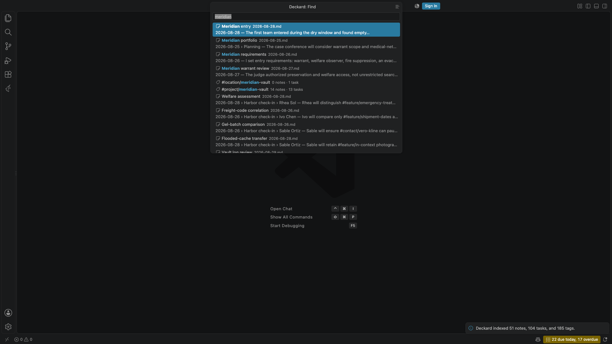

- Plain words are searched in every note section, task, and front-matter-only note. An entry titled with your words comes first, then titles that contain every word or match them loosely, such as `vcon` for *Vendor contract*, then entries whose text mentions them, ranked by relevance. The last word matches while you are still typing it.
- `#tags`, `@people`, and the rest of the [query language](#query-language), such as `is:open` or `in:notes/work`, narrow the results exactly as they would anywhere else.
- A word also finds tags by their last part, so `atlas` offers `#project/atlas`, and a value finds its condition, so `overd` offers `is:overdue`. <kbd>Tab</kbd> completes the highlighted tag or condition into the search, as does the **+** button beside a tag.
- <kbd>Enter</kbd> opens the note or task at its line, a tag's page, or a saved search. **Show all results**, or the list button in the title bar, opens the search on a search page.
- When no note has every word, Find says so and shows the notes with some of them. A misspelled word gets a **Search for … instead** row with the closest word your notes contain.
- With nothing typed, Find offers your recent searches, favorite and recently opened tags, saved searches, and the notes you opened last. A recent search has a button to save it as a view.

Ties are broken by how often and how recently you opened something, so a note you opened yesterday comes before one you opened often last year. This is kept in VS Code's preferences, beside the access counts, and never in your notes.

### The search box

Search pages, Home's search widget, and the Task board have the same search box. Press <kbd>/</kbd> anywhere on the page to type in it. The Task board's box searches tasks alone.

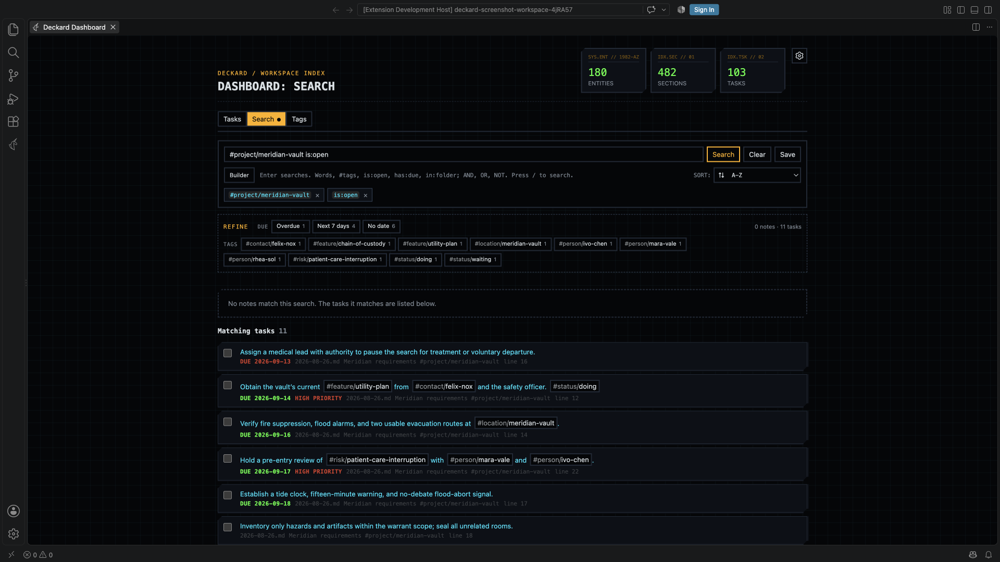

- The box is a field of chips, as a multi-select is. Each term of the search, whether a tag, a condition such as `is:open`, or words, which show as the `text ~` condition they run, is a chip with a **×**, joined to the next by **AND** or **OR**. A parenthesized group is a frame of its own chips with a **×** of its own at the end, nested as deep as the search goes, so a condition inside a group can be removed alone and the group removed whole, just as the builder shows it. Tags are drawn in blue, and anything turned around with `NOT` or `-` in red. Type the next term in the field after the chips.
- Plain words narrow the search as you type, across everything it found rather than the page of it on screen, so a match on the last page is found from the first. The counts, the pages, and Refine all follow. <kbd>Enter</kbd> adds the words to the search itself, which makes them chips, remembers the search, and lets you save it; until then they are a draft, and leaving the box lets them go.
- Completions appear as you type: field names, the values a field accepts once the caret is in one, tags, whole conditions such as `is:open`, and, in an empty box, your recent searches. Nothing is preselected, so <kbd>Enter</kbd> always runs what you typed; <kbd>Tab</kbd> completes, arrow keys move through the list, and <kbd>Escape</kbd> abandons the edit.
- Choosing a tag, a condition, or a field's value from the completions makes it a chip at once. Pressing a chip removes its term and keeps the rest as you wrote it, and <kbd>Backspace</kbd> in an empty field removes the last chip.
- Text you typed and did not add is let go when the box loses focus, unless you move to its own buttons, such as **Search**.
- **AND**, **OR**, and **NOT** are drawn in their own color. Two tags written side by side are joined with AND, and Refine adds its values with AND.
- On a tag's page the box holds the tag as a chip, so everything the page filters by is in one place.
- A parse error is reported under the box; the chips and results keep the last search that ran, and the field keeps what you typed so you can fix it.
- A search page that finds nothing offers a closer spelling, as Find does: **Nothing matched. Search for … instead?** replaces each misspelled word with the closest word your notes contain and leaves the rest of the search as you wrote it, so a tag or a folder is never corrected into something else. It is offered only when the corrected search finds something.
- **Save**, beside the box, stores the search under a name. Saved searches appear on Home and the Tags tab, reopen where they were saved, and survive tags being renamed or removed from the index.

**Builder**, under the search box, edits the same search as rows and groups, nested as deep as the search goes. Every group says whether it matches **all of** its rows or **any of** them, and **not** turns a group around, so anything the search box can say, the builder can build: three tags allowed and one left out — what Refine makes with three clicks and an Alt — is one group matching any of three rows, beside a row for the tag left out. **Add condition** starts a row from its value: type a tag, a word, or a value such as `open`, and choose a completion or press <kbd>Enter</kbd>, and the row fills in its field and operator. <kbd>Enter</kbd> then opens the next row, <kbd>Backspace</kbd> in an empty row removes it, and <kbd>Ctrl</kbd>+<kbd>Enter</kbd> (<kbd>Cmd</kbd>+<kbd>Enter</kbd> on macOS) adds a group beside the row, joined the other way. A finished row keeps its field, operator, and value dropdowns for editing. The operator list shows the operators themselves — `=`, `!=`, `~`, `!~`, `>`, `>=`, `<`, `<=` — with their meaning on hover, so there is no separate negate control to disagree with a row, and a hand-written `NOT tag = #a` opens in the builder as `tag != #a`. The search box remains the source of truth: a nested group is written back with its parentheses, and a negated one as `NOT (…)`.

### Refine

Under the search box, **Refine** counts what the results could still be narrowed by: open and done tasks, due dates (overdue, the next seven days, later, or none), the tags the results carry, when notes were last updated, and the folders they are in. Each value shows how many of the current results it keeps, and a value that would keep all of them, or none, is not offered.

- Select a value to add it to the search with **AND**, keeping only the results that match it.
- <kbd>Alt</kbd>-select it to add it with **AND NOT**, leaving those results out.
- <kbd>Shift</kbd>-select it to add it with **OR**, widening the value chosen before it so either matches — open *or* done tasks, say.
- Hovering a value says which of the three a click, Alt-click, and Shift-click writes, in the words of the query itself. From the keyboard, <kbd>Enter</kbd>, <kbd>Alt</kbd>+<kbd>Enter</kbd>, and <kbd>Shift</kbd>+<kbd>Enter</kbd> on a focused value do the same.

Every value adds ordinary query text, so a refined search can be saved, copied into a query block, or edited in the builder. A search of one tag, or of several tags joined by AND, lists related **Tags** instead of counting the tags the results carry, since associations are ranked better than a count can be: strongest first, with a three-step rail showing each one's strength beside the strongest, and kept even when every result carries them, since they still say how the tags relate. While the Related Notes sidebar is open beside the page, Refine is [shown there](#refine-a-search-from-the-sidebar).

### Query language

A Deckard query is what you type into Find, the search box, a [query block](#query-blocks), or an [AI assistant](#ai-assistants):

```
(tag = #project/atlas AND tag = @ren-kade) OR (tag = #risk/vendor AND text ~ "elevator")
```

Terms combine with `AND`, `OR`, `NOT`, and parentheses. `AND` binds tighter than `OR`, adjacent terms are joined by an implicit `AND`, and `-` or `!` in front of a term negates it. A bare `#tag` or `@person` is a tag condition and a bare or quoted word is a text condition, so `#project/atlas "vendor risk"` is a complete query.

Common filters have one-token shorthands, written the way GitHub writes them:

| Shorthand | Finds |
| --- | --- |
| `is:open`, `is:done` | Open or completed tasks. |
| `is:overdue` | Open tasks past their due date. |
| `is:due` | Open tasks due within the next seven days, overdue ones included. |
| `is:task`, `is:note` | Every task, or note sections without tasks. |
| `is:blocked`, `is:blocking` | Open tasks waiting for a task that is still open, and the open tasks they wait for. |
| `is:mine` | Tasks for the person `deckard.me` names, and tasks for nobody in particular. Without that setting, only the latter. |
| `is:assigned`, `is:unassigned` | Tasks that name a person, and tasks that name nobody. |
| `has:due`, `no:due` | Tasks with, or without, a due date. `scheduled`, `start`, `done`, `priority`, `id`, and `dependsOn` work the same way. |
| `in:notes/work` | Everything in a folder and the folders inside it. `*` and `?` are wildcards. |

Put `-` in front of a shorthand to negate it, as in `-is:done`. Deckard keeps a shorthand as you wrote it when it saves or formats a query.

`is:blocked` and `is:blocking` read the ⛔ and 🆔 markers as the edges between two open tasks: a task is blocked while a task it names in ⛔ is still open, and blocking while an open task names its 🆔. Completing the blocker frees both, so neither lists a task whose other end is done, and a ⛔ naming nothing in the workspace blocks nothing. `has:dependsOn` and `has:id` read the markers themselves whatever state the tasks are in.

The fields:

| Field | Matches | Example |
| --- | --- | --- |
| `tag` | A tag, including tags a section inherits from a parent heading and tags a note carries in its front matter. `*` and `?` are wildcards. | `tag = #project/atlas`, `tag = #risk/*` |
| `text` | Words in a note body, a task line, or a front-matter-only file. `:` and `~` match a substring; `=` and `!=` match a whole word. | `text ~ elevator`, `text = plan` |
| `task` | `open`, `done`, or `any`. Only tasks can satisfy it, so a query using it returns no notes. | `task = open` |
| `due`, `scheduled`, `start` | A task's 📅, ⏳, or 🛫 date: a date, `today`, `tomorrow`, a window such as `7d` counted forward from today, or `none` for a task without that date. Only tasks can satisfy them. | `due < today`, `scheduled <= today`, `due = none` |
| `done` | A task's ✅ date, with windows counted back from today. | `done = 7d` |
| `priority` | `highest`, `high`, `medium`, `none`, `low`, or `lowest`. A task without a priority counts as `none`, which ranks between `medium` and `low`. | `priority >= high` |
| `assignee` | The person a task is for: whoever its `👤` field names, or `none` for a task that carries none. `@ren-kade`, `#person/ren-kade`, and `ren-kade` all name the same person. Only tasks can satisfy it. | `assignee = @ren-kade` |
| `kind` | An entity namespace, including `person` for `@` tags. | `kind = project` |
| `file` | A file name, with `*` and `?` wildcards. | `file = 2026-09-*.md` |
| `path` | A workspace-relative path, with wildcards. | `path = notes/*` |
| `created`, `updated` | A date such as `2026-09-13`, a window such as `30d`, or `today`. A bare date means that whole day. | `updated > 7d`, `created = 2026-09-13` |

A note's created date is its `created:` or `date:` front matter. Without either, a daily note counts as created on its day, or earlier if its file is older, and any other note on its file's creation time. Its updated date is its `updated:` front matter, or its file's modified time. A git clone resets every file's times, so the dates a note states come first.

Operators are `=` for is, `!=` for is not, `~` for contains, `!~` for does not contain, and `>`, `>=`, `<`, `<=` for dates and priorities. A window such as `7d` is compared by its far end: `updated > 7d` means updated within the last seven days, and `due < 7d` means due within the next seven days, overdue tasks included. `:` is accepted everywhere `=` is, so queries written with `tag:#atlas` keep working, but Deckard writes `=` when it formats a query back. A comparison can follow the operator, so `updated:>2026-01-01` and `updated > 2026-01-01` mean the same thing. Every operator has an opposite, so any single condition can be negated without `NOT`; `NOT` is for negating a whole parenthesized group.

While a search page is the active editor, the Related Notes sidebar shows that search's **Refine** options in place of related notes, headed by the search's own title, and returns to related notes when a Markdown note is active again. A search naming exactly one tag keeps that tag's association suggestions.

## Query blocks

Put a Deckard query in a `deckard` code fence to keep a live list inside a note:

````markdown
```deckard sort=updated limit=10
tag = #project/atlas AND task = open
```
````

Or as a table of the tasks, with the columns you name:

````markdown
```deckard view=table columns=due,priority,for sort=due
tag = #project/atlas AND is:open
```
````

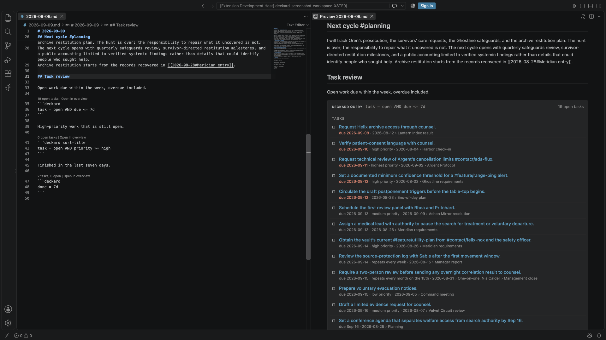

- The Markdown preview replaces the fence with what the query matches, notes first and then tasks. Each result is its own row: a title that links to its source line, and beneath it the headings above it and its file name. The file name is left out when the first heading already names it, as a daily note's date heading does. Tags written after a title are removed from it, while tags inside the sentence, such as the people in a task, are kept. Following a link behaves like any other link to a note, so `markdown.preview.openMarkdownLinks` decides whether it opens in the preview or the editor.
- Notes are listed alphabetically. Tasks are listed open first, soonest due date first, then in source order; completed tasks are struck through and overdue due dates are highlighted.
- After `deckard`, `sort=` reorders the results by any column a task has — `title`, `due`, `scheduled`, `start`, `done`, `priority`, `for`, `status`, `note`, `created`, or `updated` — with `dir=asc` or `dir=desc` to say which way; dates sort newest first unless told otherwise, and a task with nothing in the column comes last either way. Notes know only `title`, `created`, and `updated`. `limit=10` shows at most ten notes and ten tasks, while the header still reports the full totals.
- `view=table` draws the tasks as a table instead of a list, with `columns=due,priority,for,note` choosing the columns in order; the title is always first. The columns are the ones `sort=` accepts, plus `tags`, `blocked` (what a task waits for), and `id`. Without `columns=`, a table shows the title, due date, priority, who it is for, and its note. Notes stay a list above the table.
- In the editor, the line above the fence shows the totals and **Open in search**, which opens the same query on a search page, where you can refine it.
- Results refresh when any note in the workspace changes, not only the note that holds the block.
- A query that does not parse shows its error in place of results. An unknown option is reported as a warning, and the rest of the block still runs.

The fence is ordinary Markdown, so other editors and Git show the query text itself. Like any fenced code, a query block is not indexed, so tags written in a query are not counted as tag uses. Tag completion does run inside a query block, so typing `#` or `@` there suggests indexed tags.

## AI assistants

Deckard gives AI assistants in VS Code four tools through VS Code's language model tool API — two that read, so an assistant can answer questions about your notes from the index Deckard already keeps, and two that write, guarded the way Deckard's own writes are:

- **Search Deckard notes and tasks** (`deckard_query`, or `#deckardQuery` in a chat prompt) runs a [Deckard query](#query-language) and returns the matching note sections and tasks, each with its workspace-relative path, line, and headings. Tasks also show whether they are done, their due and scheduled dates, priority, and repeat rule. Asking "what are my open tasks for Atlas?" leads the assistant to run `tag = #project/atlas AND task = open`.
- **List Deckard tags** (`deckard_list_tags`, or `#deckardTags`) lists tags with how many entries use each, most used first, optionally narrowed by a search, so the assistant queries the exact tag rather than a guess.

A query returns at most 25 notes and 25 tasks unless the assistant asks for more, up to 200, and always reports the full totals. A query that does not parse returns its error with a short guide to the syntax, so the assistant can correct it and try again.

Any assistant that uses VS Code's language model tools can call them; in GitHub Copilot's agent mode they appear in the tools picker. An assistant that connects to tools only through MCP servers, rather than through VS Code, cannot see them.

Deckard itself sends nothing anywhere: the tools read the local index, and what they return goes to the assistant that asked, which may send it to its own model service. So the first time an assistant calls one of the tools in a session, VS Code asks you to allow it, saying that your notes will go to the assistant; later calls in that session go ahead. Set `deckard.assistantTools` to `false` to hide both tools. Each call is timed in [Deckard's log](#limitations-and-troubleshooting).

**Writing, guarded.** `deckard_add_task` adds a task to today's note, or to a note the assistant names; `deckard_change_task` completes, reopens, retitles, dates, prioritizes, or hands over one existing task, named by its note and line as `deckard_query` reports them. An assistant asks before either runs, every time, and nothing is written until you approve the exact line in the same refactor preview Deckard's own multi-note writes use — whatever `deckard.previewWorkspaceWrites` says. A change is refused if the line is no longer the task the index knows there, so an assistant working from a stale answer cannot rewrite whatever is on that line now. `Deckard: Undo Last Change` takes a write back afterwards, as it does any write. So "add a task for Dana due Friday" is an assistant asking, you looking at one line, and saying yes.

### Claude Code and other MCP clients

Deckard can offer the same four tools to Claude Code and other Model Context Protocol clients. Over MCP there is no dialog before a write; the refactor preview is where you see the line and can decline it. Set `deckard.mcpServer.enabled` to `true`, or run `Deckard: Copy MCP Server Setup`, which offers to turn the server on and copies the command that adds Deckard to Claude Code:

```bash
claude mcp add --transport http deckard http://127.0.0.1:39217/mcp --header "Authorization: Bearer <token>"
```

- The server listens on `127.0.0.1` only, at `deckard.mcpServer.port`, so nothing off this computer can reach it.
- Every request must carry the server's token, which Deckard keeps in VS Code's secret storage. `Deckard: Reset MCP Server Token` makes a new one, and every copied setup stops working.
- Requests from web pages on other sites are refused, token or not, so a page open in a browser cannot read your notes through the server.
- As with the tools in VS Code, Deckard sends nothing anywhere itself: what a tool returns goes to the client that asked, which may send it to its own model service. The server is off by default.

## Extracting headings

Run `Deckard: Extract Tagged Heading` with the cursor inside a tagged heading section. Deckard moves the complete section, including nested headings and the original heading tags, into a new Markdown note in the configured notes folder or workspace root. In the source note, the extracted heading and its content are replaced by a `[[link]]` to the new note, keeping the blank lines around it. If the cursor is not inside a tagged section, Deckard offers a picker of tagged headings from the workspace.

The note name is used as a single Markdown filename. Existing notes are never overwritten; choose a different name when a conflict is reported.

## Daily notes

Run `Deckard: Create Daily Note` from the Command Palette, press <kbd>Cmd</kbd>+<kbd>Shift</kbd>+<kbd>Alt</kbd>+<kbd>D</kbd> (<kbd>Ctrl</kbd>+<kbd>Shift</kbd>+<kbd>Alt</kbd>+<kbd>D</kbd> on Windows and Linux), or use the shortcut in Related Notes. Deckard creates a note named with the local date, such as `2026-08-30.md`, in your configured notes folder or workspace root and opens it. If today's note already exists, Deckard opens it without replacing its contents.

`Deckard: Open Previous Daily Note` and `Deckard: Open Next Daily Note` step to the nearest daily note before or after the one in the editor, skipping days without a note. From any other note they start from today.

`Deckard: Open Weekly Note` and `Deckard: Open Monthly Note` create or open the note for this week or this month, **named for the days it holds**: `week-2026-09-13-2026-09-19.md` and `month-september-2026.md`. A week runs Sunday to Saturday, as the [Calendar](#calendar) draws it.

Each has its own template, `deckard.weeklyNoteTemplate` and `deckard.monthlyNoteTemplate`. `{week}` becomes the days the period covers — *2026-09-13 to 2026-09-19* — `{month}` the month as *September 2026*, and `{date}` the first day: a week's Sunday, or a month's first.

Notes Deckard named before, `2026-W38.md` and `2026-09.md`, are still read and still opened for their period, so a workspace that has them goes on using them rather than gaining a second note for the same week. Rename one to the new form whenever you like; nothing needs migrating.

### Writing a review

A periodic note used to open from its template and say nothing. `Deckard: Open Weekly Note` and `Deckard: Open Monthly Note` now write a review into a note they create, and `Deckard: Write a Review` writes one, or brings it up to date, whenever you ask — for the period of the note you are in, or one you pick.

A review reads the index for that period and says:

| Section | What it lists |
| --- | --- |
| **Completed** | Tasks with a ✅ date in the period, oldest first |
| **Still open** | Tasks due by the end of the period that are still open: what slipped |
| **Notes written** | Notes created in the period |
| **Notes changed** | Notes written earlier and changed in it |
| **New tags** | Tags Deckard first saw in the period |

- A review is **named by the days it covers** — *Review of 2026-09-14 to 2026-09-20* — since a week number says little when you read it back. The note it is in still says which period it is.
- It is **ordinary Markdown**, not a live query, because a review should say what that week was rather than what this week is. Run it again and it is rewritten from the index as it stands.
- When one is written, Deckard says so with **Open** to read it — at the review itself — and **Undo** to take it back out of the note.
- It sits between `<!-- deckard:review -->` and `<!-- deckard:review:end -->`. Writing it again replaces what is between them and leaves everything you wrote around it exactly where it is.
- Each note and task links to its note with a `[[link]]`, so the review is a way back into the week.
- **The review carries no tags of its own.** Task and note titles are written without their tags, and new tags are listed in a fenced block, since fenced code is the one place Deckard does not read a tag. A review is about that work; it should not become an entry for every tag it mentions, nor list its tasks as tasks again.
- `deckard.periodicNote.review` turns off the review a newly created weekly or monthly note gets. The command writes one whatever the setting says.

### Carrying unfinished tasks forward

A daily note that starts from its template every morning leaves last night's open tasks behind in yesterday's note. `deckard.dailyNote.rollover` decides what a newly created daily note does about that:

| Setting | A new daily note |
| --- | --- |
| `off` *(default)* | starts from the template alone |
| `move` | takes the last daily note's unfinished tasks out of it and into today's |
| `copy` | writes them into today's and leaves them where they were |

- The tasks come from **every earlier daily note**, oldest first, not only yesterday's: a task left open on Friday still comes forward on Monday, and one left before a week away comes forward when you are back. Other notes are left alone: a task written under a project note stays there, where it was filed.
- `deckard.dailyNote.rolloverDays` bounds how far back it looks. The default, `0`, reaches as far as your daily notes go.
- Each task is written exactly as it was, its dates, priority, people, and tags included, and they keep their order and their indentation. They go at the end of today's note, under whatever your template put there.
- A task is carried only when its line still reads as Deckard indexed it, the same check every other Deckard task edit makes, and never when today's note already holds that line. Running it twice changes nothing.
- Only a note Deckard creates rolls tasks in, so opening today's note again later in the day carries nothing.
- `Deckard: Roll Unfinished Tasks Forward` does the same thing whenever you ask, whatever the setting says, creating today's note if it is not there yet. It moves the tasks unless the setting says `copy`.
- The whole rollover is one write. What it says when it is done offers **Open**, for the day's note it wrote into — which it may have just created — and **Undo**, which puts every note back without opening any of them. `Deckard: Undo Last Change` does the same thing later.

## Calendar

The **Calendar** view in the Deckard sidebar shows a month of whole weeks, Sunday to Saturday. Every day is drawn the same way — the date, then a dot for a daily note, then a count of the open tasks due that day, in orange once the day has passed — so a day that has something to mark keeps its date in the same place as one that does not. Select a day to open its daily note, the mark beside a row to open that week's note, or the month's name to open the month's note. When the note does not exist yet, Deckard offers to create it from its template rather than creating it straight away. The arrows step through months, and **Today** returns to this month.

## Quick capture

Run `Deckard: Capture` and type a task. Deckard adds it as `- [ ] …` to today's daily note, creating the note from your template if needed, and leaves you in the editor you were using. Typing `#` or `@` suggests tags, most used first: choose one to complete the word, and press Enter on the task itself to add it. The list button in the capture box, or `Deckard: Capture Under a Heading`, adds the task under a heading you pick from any note instead.

A capture goes after the last list item already there, or after a blank line below the last text. A note open in an editor keeps its unsaved changes, and the note is saved.

## Templates

Put Markdown files in a `templates` folder at the root of your workspace, or the folder `deckard.templatesFolder` names, and run `Deckard: New Note from Template`. Deckard asks which template to use and the new note's title, then creates the note in your notes folder and opens it. Deckard never indexes the templates folder, so a template's tags and tasks stay out of your notes.

| Placeholder | Becomes |
| --- | --- |
| `{title}` | The title you enter, which is also the file name. |
| `{date}` | Today's date, such as `2026-09-13`. |
| `{time}` | The current time, such as `09:05`. |
| `{ask:Question}` | Your answer when Deckard asks the question. A question used twice is asked once. |

Anything else in braces is left as written.

A template named after a tag namespace, such as `person.md` or `project.md`, starts every new [hub note](#hub-notes) for a tag in that namespace. It can also use `{tag}`, and Deckard adds the `describes:` front matter unless the template writes its own.

## Settings

Open **Settings** and search for `Deckard`, or add these options to your workspace settings:

```json
{
	"deckard.theme": "corpo",
	"deckard.dashboard.openOnStartup": false,
	"deckard.tagOverview.hubNoteExpanded": true,
	"deckard.notesFolder": "notes",
	"deckard.exclude": {
		"**/archive": true
	},
	"deckard.dailyNoteTemplate": "# {date}\n\n",
	"deckard.weeklyNoteTemplate": "# {week}\n\n",
	"deckard.monthlyNoteTemplate": "# {month}\n\n",
	"deckard.periodicNote.review": true,
	"deckard.dailyNote.rollover": "off",
	"deckard.dailyNote.rolloverDays": 0,
	"deckard.templatesFolder": "templates",
	"deckard.noteBoundaries": "line",
	"deckard.outline.showTags": true,
	"deckard.outline.followCursor": true,
	"deckard.outline.inheritedTags": false,
	"deckard.agenda.groupBy": "due",
	"deckard.agenda.upcomingDays": 7,
	"deckard.agenda.query": "",
	"deckard.tasks.addDoneDate": true,
	"deckard.tasks.metadataFormat": "emoji",
	"deckard.tasks.assigneeFromPersonTag": false,
	"deckard.tasks.metadataSuggestions": true,
	"deckard.me": "",
	"deckard.statusBar": true,
	"deckard.taskReminderTime": "",
	"deckard.board.statusNamespace": "status",
	"deckard.board.statuses": ["todo", "doing", "waiting"],
	"deckard.editor.referenceCounts": true,
	"deckard.editor.hoverPreviews": true,
	"deckard.editor.linkDiagnostics": true,
	"deckard.editor.taskDependencies": true,
	"deckard.editor.dailyNoteActions": true,
	"deckard.editor.linkProblems": true,
	"deckard.editor.embedProblems": true,
	"deckard.editor.unlinkedMentions": true,
	"deckard.updateLinksOnRename": true,
	"deckard.previewWorkspaceWrites": "severalNotes",
	"deckard.assistantTools": true,
	"deckard.mcpServer.enabled": false,
	"deckard.mcpServer.port": 39217,
	"deckard.highlightNoteSections": true,
	"deckard.autoSelectNoteSections": true,
	"deckard.enableHeadingTagRelationships": true,
	"deckard.enableTagAutocomplete": true,
	"deckard.enableKeywordLinks": true,
	"deckard.relatedNotesAssociationMinimumSupport": 1,
	"deckard.relatedNotesRecencyHalfLifeDays": 0,
	"deckard.entityNamespaceAliases": {
		"org": "organization"
	},
	"deckard.personMarker": "@"
}
```

| Setting | Default | Description |
| --- | --- | --- |
| `deckard.notesFolder` | Empty | Optional workspace-relative folder Deckard scans. An empty value indexes all workspace Markdown files. |
| `deckard.exclude` | `{}` | Glob patterns of files and folders Deckard leaves out of its index, written like VS Code's `files.exclude`. Each pattern is relative to the workspace folder and applies when set to `true`, and a pattern that matches a folder leaves out everything in it. For example, `{ "**/archive": true, "drafts/*.md": true }`. Deckard also leaves out what `files.exclude` hides. |
| `deckard.theme` | `corpo` | Selects the visual style for Deckard webviews: `corpo`, which follows your VS Code theme, or one of `replicant`, `oblivion`, `lcars`, `synthwave`, `tomcat`, `fellowship`, and `cooper`. |
| `deckard.zenMode` | `false` | Turns Deckard's own chrome down in every webview: decorative labels and the grid backdrop are hidden, borders and headings thin out, and each row's file and line fold away until the row is hovered or focused. No control, count, or tag is removed. See [Zen mode](#zen-mode). |
| `deckard.dashboard.openOnStartup` | `false` | Opens the Dashboard when VS Code starts in a workspace where Deckard has indexed notes. A Dashboard restored from the last session is left as it is. |
| `deckard.tagOverview.hubNoteExpanded` | `true` | Shows a tag's [hub note](#hub-notes) open at the top of its overview. Set it to `false` to start hubs collapsed to their title row. |
| `deckard.dailyNoteTemplate` | `# {date}\n\n` | Used when a new daily note is created. `{date}` becomes the local date in `YYYY-MM-DD` format. |
| `deckard.weeklyNoteTemplate` | `# {week}\n\n` | Used when a new weekly note is created. `{week}` becomes the days it covers, such as `2026-09-13 to 2026-09-19`, and `{date}` its Sunday. |
| `deckard.monthlyNoteTemplate` | `# {month}\n\n` | Used when a new monthly note is created. `{month}` becomes the month, such as `September 2026`, and `{date}` its first day. |
| `deckard.periodicNote.review` | `true` | Writes a review into a newly created weekly or monthly note. See [Writing a review](#writing-a-review). |
| `deckard.dailyNote.rollover` | `off` | What a newly created daily note does with the last one's unfinished tasks: `off`, `move`, or `copy`. See [Carrying unfinished tasks forward](#carrying-unfinished-tasks-forward). |
| `deckard.dailyNote.rolloverDays` | `0` | How many days back a rollover looks for unfinished tasks. `0` reaches as far as your daily notes go. |
| `deckard.templatesFolder` | `templates` | The folder of [note templates](#templates), relative to the workspace folder. Deckard does not index it. Leave it empty to turn templates off. |
| `deckard.noteBoundaries` | `line` | Where one note ends and the next begins; see [Markdown format](#markdown-format). `line` indexes a tagged non-heading, non-task line as its own entry. `heading` keeps the tag on its line and returns the heading holding it. `marked` is `heading` except for a line carrying a `^block-id`. Tasks are their own entry under all three. |
| `deckard.parseInlineTags` | `true` | Deprecated: use `deckard.noteBoundaries`. `false` is read as `heading`, which keeps a line's tags searchable through the heading that holds them rather than dropping them. |
| `deckard.outline.showTags` | `true` | Shows each heading's own tags beside it in the Outline. Disable it for titles only. |
| `deckard.outline.followCursor` | `true` | Selects the Outline heading containing the editor cursor. The eye control in the Outline title switches the same setting. |
| `deckard.outline.inheritedTags` | `false` | Also shows the front-matter tags every heading in the file inherits, after the tags written on the heading itself. |
| `deckard.agenda.groupBy` | `due` | What the [Tasks view's](#tasks-view) groups are: `due`, `priority`, `status`, or `assignee`. The group control in its title sets the same thing. |
| `deckard.agenda.upcomingDays` | `7` | How many days ahead the Tasks view's **Upcoming** group reaches; a dated task past that is in **Later**. |
| `deckard.agenda.query` | Empty | A [query](#query-language) that says which open tasks the Tasks view, Home's agenda, and the status bar's count are of, such as `is:mine`. Empty means every open task. |
| `deckard.tasks.addDoneDate` | `true` | Adds a completion date when Deckard completes a task, and removes it when the task is reopened. Disable it to change only the checkbox. |
| `deckard.tasks.metadataFormat` | `emoji` | The Tasks format Deckard writes for a task with no metadata yet: `emoji` (📅 2026-09-20) or `dataview` ([due:: 2026-09-20]). A task that already uses one keeps it. Deckard reads both either way. |
| `deckard.tasks.metadataSuggestions` | `true` | Suggests dates, priorities, repeat rules, people, and dependencies after typing `/` in a task. |
| `deckard.tasks.assigneeFromPersonTag` | `false` | Read the first person named in a task's words as the person it is for, as Deckard did before the `👤` field; see [Who a task is for](#who-a-task-is-for). |
| `deckard.me` | Empty | Who you are in your notes, such as `@ren-kade`, so `is:mine` finds the tasks that name you. See [Who a task is for](#who-a-task-is-for). |
| `deckard.statusBar` | `true` | Shows how many tasks are due today in the status bar, hidden while nothing is due. See [Status bar and reminders](#status-bar-and-reminders). |
| `deckard.taskReminderTime` | Empty | A time of day, such as `09:00`, at which Deckard says how many tasks are due. Empty means no reminder. |
| `deckard.board.statusNamespace` | `status` | The tag namespace that holds a task's status on the task board, so the default reads `#status/doing`. |
| `deckard.board.statuses` | `["todo", "doing", "waiting"]` | The task board's status columns, in order. A status found on a task but not listed gets a column after them. |
| `deckard.editor.referenceCounts` | `true` | Shows backlink, heading-reference, and open-task counts above a note's lines. |
| `deckard.editor.hoverPreviews` | `true` | Previews a `[[Wiki link]]`'s target and summarizes a tag's entries on hover. |
| `deckard.editor.linkDiagnostics` | `true` | Marks a `[[Wiki link]]` that opens no note and offers to create a missing one. |
| `deckard.editor.taskDependencies` | `true` | Shows, above a task with `⛔` or `🆔`, the open tasks it waits on and holds up. See [Editor assistance](#editor-assistance). |
| `deckard.editor.dailyNoteActions` | `true` | Shows the neighboring daily notes above a daily note, and on today's note, how many unfinished tasks it could carry in. |
| `deckard.editor.linkProblems` | `true` | Shows how many of a note's `[[Wiki links]]` open no note on its first line, with an action that creates the missing notes. |
| `deckard.editor.embedProblems` | `true` | Says above an `![[embed]]` the preview cannot draw which heading or `^marker` it is missing. |
| `deckard.editor.unlinkedMentions` | `true` | Counts, on a note's first line, the other notes that name it without a link, with an action that links them. |
| `deckard.updateLinksOnRename` | `true` | Rewrites every `[[Wiki link]]` that named a note by its old title when the note is renamed, in the same step as the rename. See [Renaming notes and headings](#renaming-notes-and-headings). |
| `deckard.previewWorkspaceWrites` | `severalNotes` | When a write reaches more than one note, shows it in VS Code's refactor preview first. `always` shows every write, `never` applies them straight away. See [Previewing and undoing a write](#previewing-and-undoing-a-write). |
| `deckard.assistantTools` | `true` | Lets AI assistants in VS Code, such as Copilot in agent mode, search notes and tasks with Deckard queries and list tags, after you allow the first call in each session. See [AI assistants](#ai-assistants). |
| `deckard.mcpServer.enabled` | `false` | Runs a Model Context Protocol server on 127.0.0.1 with the same tools, for Claude Code and other MCP clients that carry its token. See [Claude Code and other MCP clients](#claude-code-and-other-mcp-clients). |
| `deckard.mcpServer.port` | `39217` | The port the MCP server listens on, on 127.0.0.1. |
| `deckard.highlightNoteSections` | `true` | Highlights tagged note sections in Markdown editors. Disable it to keep entry-level Related Notes cursor behavior without the editor highlight. |
| `deckard.autoSelectNoteSections` | `true` | Automatically focuses Related Notes on the tagged entry under the cursor. Disable it to keep Related Notes scoped to the whole document unless you choose an entry manually. |
| `deckard.tagTitleDisplayMode` | `inline` | Keeps tags in Related Notes, search page, and Dashboard note/task titles as clickable buttons by default. Set to `separate` to remove tags from titles and show them as separate tag controls. |
| `deckard.enableHeadingTagRelationships` | `true` | Offers related **Tags** in a tag search's Refine, ranked by association. Disable it to refine by the tags the results carry instead, without changing indexed tags or note content. |
| `deckard.enableTagAutocomplete` | `true` | Shows indexed tag and people suggestions after a marker. Disable it without changing tag indexing, highlighting, or navigation. |
| `deckard.enableKeywordLinks` | `true` | Lets capped BM25-style similarity of each section's or task's wording adjust the score of an entry that already shares a tag, association, or Wiki link. Shared wording never makes an entry related on its own. Disable it to rank by tags and links alone. |
| `deckard.relatedNotesAssociationMinimumSupport` | `1` | Minimum distinct headings, tagged lines, tasks, or heading relationships needed before a learned association affects Related Notes. Raise it to suppress one-off associations; `1` preserves intentional one-offs. |
| `deckard.relatedNotesRecencyHalfLifeDays` | `0` | Optional low-impact recency tie-breaker; `0` disables it. Deckard prefers front-matter and daily-note dates before filesystem timestamps. |
| `deckard.entityNamespaceAliases` | `{ "org": "organization" }` | Maps one `#namespace` to another. Targets can be built-in or custom; for example, `{ "proj": "project", "leadership": "management" }` treats `#proj/atlas` as a project and collapses `#leadership/performance` into `#management/performance`. Other namespaced tags become entities automatically without configuration. |
| `deckard.personMarker` | `@` | Selects the single punctuation character that identifies people. Set it to `~` to use `~mara-vale` for people and reserve `@inbox` for a lightweight tag. |

## Source safety and persistence

Markdown files remain the source of truth. Deckard changes note content only when you use a task checkbox, explicitly extract a tagged heading, rename a note, tag, or heading, carry unfinished tasks forward, write a review into a periodic note, [edit a search's results](#editing-a-searchs-results), or approve an entity tag from `Deckard: Link Current Heading to Entity`. A rename or merge that reaches more than one note is [shown before it is written](#previewing-and-undoing-a-write), and `Deckard: Undo Last Change` takes the last one back. Before applying a task edit, Deckard compares the complete source line and checkbox value with the indexed version. Completing a task also adds its ✅ date, and completing a repeating task inserts its next occurrence on the line above; both happen in that same checked edit. Before an extraction, Deckard verifies the source section is unchanged, then removes it only after the new note is created.

Deckard stores a workspace-scoped SQLite full-text cache locally for fast saved-note search. It does not send note content to an AI model or external service. Favorites, sorting choices, custom display order, access counts, and source/rendered view preference are stored separately in VS Code and do not add metadata to your notes.

Deckard never deletes a favorite, a pin, or a saved search on its own. If a tag or note it pointed at is gone, the item stays until you run **Deckard: Tidy Favorites, Pins, and Saved Searches**, which lists what points nowhere and asks before removing it. Only what Deckard derived for itself — view counts, access order, when a tag was first seen — is cleaned up automatically, and only against this workspace's own index.

What Deckard remembers is also copied. A moment after each change it writes a copy into this workspace's storage and keeps the last twenty, so a bad write, a mistaken import, or an over-eager tidy is something you can take back with **Deckard: Restore Favorites, Pins, and Searches from a Copy**. To carry it to another machine, or to keep your own copy, **Deckard: Export Favorites, Pins, and Searches** writes it as one JSON file and **Deckard: Import** reads it back; both say what they hold before replacing anything.

What Deckard remembers is split in two. Anything that **names what is in a workspace** — favorite tags and entities, pinned notes, saved searches, Home's widgets, tag and note view counts, and the custom task order — is kept with that workspace, so opening another folder cannot disturb it. Anything that is **how Deckard looks** — sort modes, column counts, layouts, and page sizes — is kept for the machine and is the same in every workspace. Upgrading from 1.18 or earlier hands what was stored machine-wide to the first workspace you open, so a single set of notes carries over untouched; a second workspace starts empty rather than inheriting tags it does not have.

## Limitations and troubleshooting

- **Something is not there, and you are not sure why:** run `Deckard: Check My Setup`. It says where notes are read from and whether that folder exists, how many files the exclude patterns kept out, which notes could not be read, and whether `deckard.me` matches anyone — each with what to do.
- **A note is missing from every search:** open `Deckard: Show Stats`. A note the index could not read is listed there with the reason; Deckard also says so when it first happens.
- **The Dashboard is empty:** make sure a workspace is open, its Markdown files are within the configured scope, and they use the Markdown patterns shown above.
- **Related Notes shows no results:** open a saved Markdown note containing a tag, then check that another saved note uses the same tag.
- **A task or section is missing:** confirm the task is an unordered checklist item, the heading is an ATX heading such as `## Heading`, and `deckard.parseInlineTags` is enabled for tagged non-heading lines.
- **A heading is missing from the Outline:** the Outline shows ATX headings only, so an underlined `Title`/`===` heading does not appear. Headings inside fenced code blocks are excluded on purpose.
- **Content in a code block appears ignored:** this is intentional. Fenced code is excluded from indexing, tag links, and completion.
- **A numeric hash is missing:** numeric-only `#` tokens are intentionally not tags. Use an `@` marker or include a non-numeric character.
- **Date sorting looks unexpected:** task and section dates come from source file creation and modification timestamps, not dates written in note content.
- **Deckard feels slow:** run `Deckard: Show Log`. Any step that takes 100 ms or longer is listed there as `Slow:` with how long it took and how much it covered, such as the number of notes. To see every timing, open the log's settings in the Output panel and set its level to **Debug**. Editing a note never waits on indexing: the index is rebuilt only after a save, the Related Notes sidebar ranks again only when the cursor moves to a different tagged entry, and hidden panels catch up when they are shown. The search cache is written on a thread of its own, so the first build in a new workspace does not hold VS Code up; while it runs, a search finds a note by its title and tags before it finds it by the words inside it, and the log records the build as `Write search index off the extension host`.

Deckard does not support ordered-list tasks or arbitrary checklist syntaxes, and it scans only Markdown files within the configured workspace scope.

## License

Deckard is released under the [MIT License](LICENSE).
