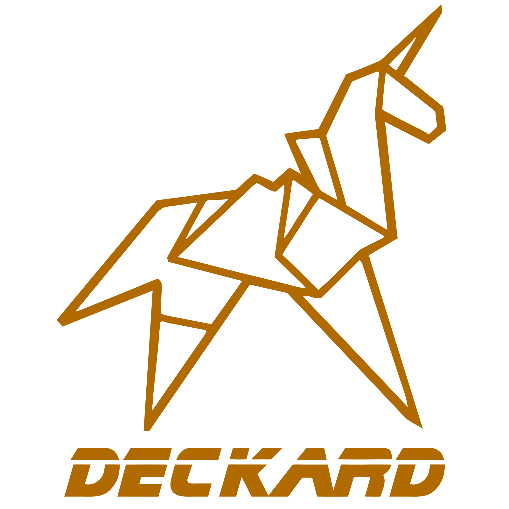
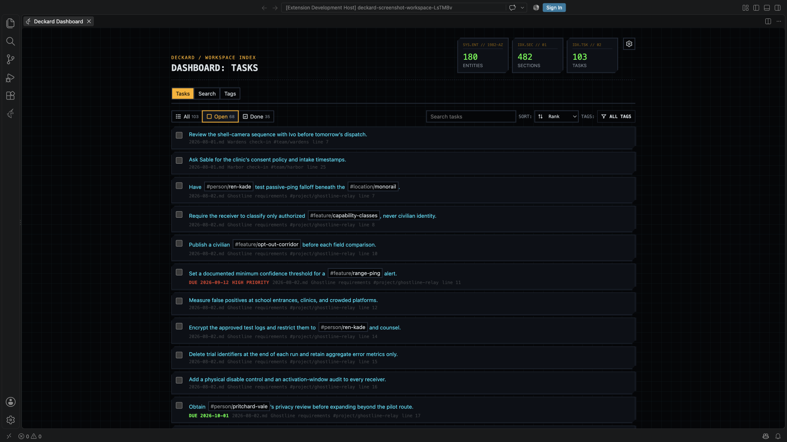
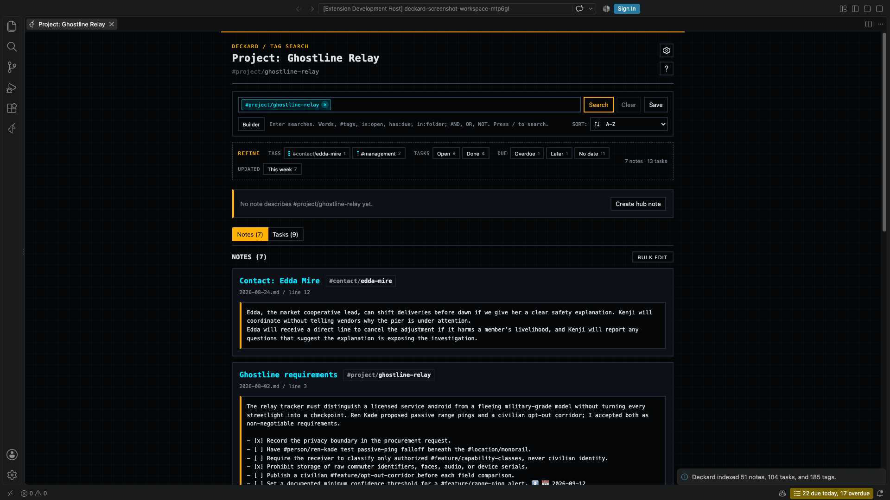

<p align="center">
	
</p>

# Deckard

**A local-first second brain for the Markdown notes already in your VS Code workspace.** Write `#tags`, `@people`, `[[links]]`, and `- [ ] tasks` the way you always have; Deckard connects them into one index and gives you a Dashboard, a Task board, search pages, a notes graph, and a sidebar of related notes — without changing how your notes are written or sending them anywhere.

**[Read the guide](https://deckard.esperinnovations.com)** · [Getting started](https://deckard.esperinnovations.com/getting-started.html) · [Changelog](CHANGELOG.md)

<p align="center">
	
</p>

## Why Deckard

- **Your notes stay yours.** Plain Markdown is the source of truth. Deckard writes to a note only when you ask it to, shows a change that reaches several notes before making it, and can take the last one back.
- **Everything is connected.** A tag, a person, or a project gathers every note section and task that mentions it, wherever it was written.
- **Tasks where you wrote them.** Checklist items become a Tasks view, a Kanban board, and a status bar count; completing one ticks the box in its note.
- **Fast on big workspaces.** The first scan says what it read, later starts check only what changed, and editing never waits on indexing.
- **Designed to be used, not just to work.** Deckard's pages are laid out to be read at a glance and to feel at home in VS Code: the default look takes its colors and fonts from your VS Code theme, a Task board card moves by drag, menu, or key, dates can be typed in plain words, and a Zen mode turns the chrome down when you want to write.
- **Accessible by default.** Every text pair in every theme meets WCAG AA contrast, and every theme gives way to a high contrast editor theme. Every right-click menu opens from the keyboard, the Task board and Notes Graph work from it too, and focus stays put through a redraw. A screen reader hears what changed, and pages hold still when your system asks for reduced motion.

## Features

| | |
| --- | --- |
| [**Tags, people, and entities**](docs/guide/notes-and-links.md) | `#tags`, `@people`, and namespaced tags such as `#project/atlas`, on headings, lines, tasks, and front matter, become one index. |
| [**Links and embeds**](docs/guide/notes-and-links.md#markdown-format) | `[[Note]]`, `[[Note#Heading]]`, and `[[Note#^line]]` complete and open; `![[Note#Heading]]` shows a section in place; **Copy as Plain Markdown** writes them out for a chat, an email, or a pull request. |
| [**The / menu**](docs/guide/notes-and-links.md#editor-assistance) | A `/` at the start of a line offers a task, a heading, a link or an embed, a query block, a table of notes or tasks, or one of your templates. |
| [**Tasks**](docs/guide/tasks.md) | Due, scheduled, and start dates, priorities, repeats, dependencies, steps, and who a task is for, in either Obsidian Tasks format — with a task editor that takes dates in plain words. |
| [**Task board**](docs/guide/task-board.md) | Open tasks as columns by status, priority, due date, person, or any tag namespace; drag a card to rewrite the task. Or a ranked list, or a table. |
| [**Search**](docs/guide/search.md) | Find in Notes searches notes, tasks, and tags as you type, and a small [query language](docs/guide/search.md#query-language) — `#project/atlas AND is:open AND due < 7d` — runs everywhere. |
| [**Search pages**](docs/guide/search-pages.md) | A tag's page collects everything that uses it; any search opens the same page, and one edit can change everything it found. |
| [**Query blocks**](docs/guide/query-blocks.md) | A `deckard` code fence keeps a live list or table of a search's notes and tasks inside a note; tick a task right in the preview. |
| [**Home and Stats**](docs/guide/home-and-stats.md) | What is overdue, due today, and open; a Home of widgets you arrange, with how far along each project is; the notes nothing links to and tags spelled two ways. |
| [**Hubs**](docs/guide/search-pages.md#the-hubs-view) | Notes under the hub notes of the tags they are about, with breadcrumbs on each note's first line. |
| [**Related notes and the graph**](docs/guide/connections.md) | A sidebar ranks the notes most related to the one you are editing, and says why; the Notes Graph maps every connection. |
| [**Daily notes and reviews**](docs/guide/daily-notes.md) | Today's note from your template, yesterday's unfinished tasks carried in, weekly and monthly reviews written for you, a calendar page where you drag a task to another day, and your dated tasks in your own calendar app. |
| [**Renaming and tidying**](docs/guide/organizing.md) | Rename a tag, note, or heading everywhere it is written; merge lookalike tags; park what you are not working on. |
| [**AI assistants**](docs/guide/ai-assistants.md) | Copilot, Claude Code, and other MCP clients can search your notes and tasks with Deckard's queries. |
| [**Themes and Zen**](docs/guide/themes-and-zen.md) | Eight looks for Deckard's pages, and a Zen mode that turns the chrome down in any of them. |

<table>
<tr>
<td width="50%"><br><b>Task board.</b> Drag a card between columns, or use its ⋯ menu or a key.</td>
<td width="50%"><br><b>A tag's page.</b> Every note section and task that uses it, and the tags it travels with.</td>
</tr>
<tr>
<td><br><b>Related Notes.</b> What else you wrote about this, ranked, with each score explained.</td>
<td><br><b>Notes Graph.</b> Every note, task, and tag connection, or one note's neighborhood.</td>
</tr>
<tr>
<td><br><b>Find in Notes.</b> Notes, tasks, and tags as you type.</td>
<td><br><b>Query blocks.</b> A search's results, live, inside a note.</td>
</tr>
</table>

## Themes

Pick one with `Deckard: Choose Theme…` or **Theme** in any page's gear; moving through the list previews it on the open pages. The default, **Corpo**, takes its colors and fonts from your VS Code theme, light or dark. [More on themes and Zen mode](docs/guide/themes-and-zen.md).

| **Corpo** | **Corpo, in a light VS Code theme** | **Cooper** |
| --- | --- | --- |
|  |  |  |
| **Replicant** | **Oblivion** | **LCARS** |
|  |  |  |
| **Tomcat** | **Fellowship** | **Synthwave** |
|  |  |  |

## Quick start

1. Install the VSIX from the [latest release](https://github.com/doctorallen/deckard/releases/latest) with `Extensions: Install from VSIX...`. Deckard needs VS Code 1.134.0 or newer.
2. Run **`Deckard: Create a Sample Workspace`** for a ten-note tour you read and do — or open a folder of your own Markdown notes.
3. Run **`Deckard: Open Dashboard`**, and select the Deckard icon in the Activity Bar for Context (related notes and more), the Tasks view, the Outline, and the calendar.
4. Press the **?** on any Deckard page, or run `Deckard: Open Help`, for the quick glance; each section's **Read more** opens the full [guide](docs/guide/README.md).

A note is written the way you already write:

```markdown
# Launch plan #project/atlas

Talked with @dana about the vendor shortlist. See [[Vendor review]].

- [ ] Send the proposal 📅 2026-10-09 ⏫ #status/doing
- [ ] Book the review room 🔁 every week
```

## Private by design

Deckard reads the Markdown in your workspace and keeps its index on your machine. It sends nothing to a server; the one exception is a task's own words, sent to a language model only when you choose **Suggest steps**. See [privacy and source safety](docs/guide/privacy-and-troubleshooting.md).

## License

Deckard is released under the [MIT License](LICENSE).

## Esper Themes

Deckard is made by Esper Innovations. For film-inspired, high-contrast VS Code color themes, including Cooper, Replicant, LCARS, and an accessibility-aware generated theme, try [Esper Themes](https://marketplace.visualstudio.com/items?itemName=esperinnovations.esper-themes).
