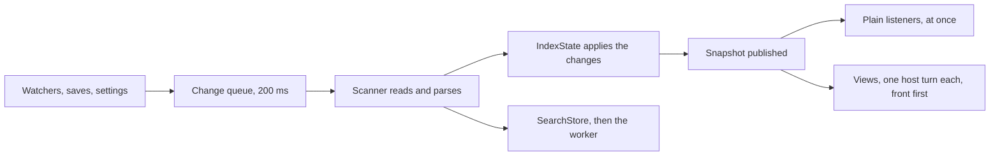

# Indexing

**Status: current and target.** The first part of this page describes the index as it works now, which behaves as it did at v1.23.1. The last part describes what [the refactor plan](../implementation/19-refactor.md) changes; each phase rewrites this page to describe what then exists.

The index is what every Deckard surface reads: tags, tasks, sections, entities, backlinks, and parking. The Markdown files are always the source of truth. Everything below is a cache of them.

## Where it lives today

| File | What it does |
| --- | --- |
| [`src/core/workspace/indexer.ts`](../../src/core/workspace/indexer.ts) | `WorkspaceIndexer`: lifecycle, warm start, change queue, and publishing |
| [`src/core/workspace/scanner.ts`](../../src/core/workspace/scanner.ts) | `WorkspaceScanner`: finds, reads, and parses notes, and builds the parse fingerprint |
| [`src/core/workspace/indexState.ts`](../../src/core/workspace/indexState.ts) | `IndexState`: the index as a fold over each note's contribution |
| [`src/core/storage/searchStore.ts`](../../src/core/storage/searchStore.ts) | `SearchStore`: the full-text cache, searched on the extension host |
| [`src/core/storage/searchDatabase.ts`](../../src/core/storage/searchDatabase.ts) | The SQLite layout and writer, shared by the host and the worker |
| [`src/core/storage/searchStoreWorker.ts`](../../src/core/storage/searchStoreWorker.ts) | The worker thread that writes large batches |
| [`src/core/workspace/publishing.ts`](../../src/core/workspace/publishing.ts) | View priorities and the in-turn publishing helpers |
| [`src/ports/`](../../src/ports/) | The interfaces the index reads VS Code through: `uri.ts`, `workspace.ts`, `fileSystem.ts`, `configuration.ts`, `workspaceEvents.ts`, `progress.ts`, and `events.ts` |
| [`src/platform/`](../../src/platform/) | Their VS Code implementations: `vscodeWorkspace.ts`, `vscodeWorkspaceEvents.ts`, and `vscodeProgress.ts`, which `extension.ts` builds and passes in |

None of the modules in `src/core` imports `vscode`. The scanner reads folders, files, and settings through one `WorkspaceFileAccess` made of the workspace, file-system, and configuration ports. The indexer hears about changes through the `WorkspaceEvents` port, shows a scan's progress through the `Progress` port, and announces updates with core's own `Emitter`. `SearchStore` takes the storage folder as a path, and `PreferenceSnapshots` writes through the file-system port. Each port call goes to the same VS Code API with the same arguments as before, so nothing a reader sees changed.

Both the scanner and the indexer are generic in the URI type they are given, `WorkspaceScanner<U>` and `WorkspaceIndexer<U>`. The extension gives them `vscode.Uri`, so every URI they hand back, such as `getUri` or `getNotesFolderUri`, is a `vscode.Uri` the UI passes to VS Code as it is. A UI function that does so names its parameter `WorkspaceIndexer<vscode.Uri>`. A test gives them plain objects from `src/test/fakeWorkspace.ts`, so the scanner, indexer, and cache suites run under `test:unit`.

## Scan and parse

`WorkspaceScanner.scan` walks each workspace folder in four steps.

1. It calls `findFiles` with the notes pattern and an exclude glob built from `deckard.exclude`. Excluding in the search itself means a repository's `node_modules` is never walked.
2. It drops files in the templates folder and files the exclude matcher rejects, counting each, so the setup check can say why a Dashboard looks empty.
3. It reads eight notes at a time. One at a time left the disk idle: at 5,000 notes, eight in flight cut reading from 300 ms to 86 ms.
4. For each note it reads the stat first. When the saved time, created time, and byte size match the note already parsed, it reuses that note and skips the read.

A note that cannot be read is recorded in `failures` with the reason, and the scan continues. One bad note must not hide the rest of the workspace. Stats and the setup check show the list.

Parsing uses each folder's parse options: `deckard.noteBoundaries`, `deckard.parseInlineTags`, `deckard.personMarker`, and `deckard.entityNamespaceAliases`. The result is one `ParsedFile` per note.

## IndexState: one fold for builds and updates

Everything the index holds about a tag is the sum of what each note says about it, in note order. So `IndexState` computes each note's part on its own and folds the parts together. A full build computes every part. An update recomputes only the changed notes' parts and folds again. The same code does both, and `index-equivalence.test.ts` holds an update equal to a full build, map order included.

One thing a note's part cannot know is whether another note repeats one of its ids. Ids are hashed from path, line, and text, so a repeat means a hash collision. When one happens, the index is built the direct way, note by note, until the repeat goes away.

`getSnapshot()` builds the derived `WorkspaceIndex` once per change and shares it until the next. Editor features ask for it on every keystroke, and rebuilding it per call was the main cost of typing in a large workspace. Parking is applied to the snapshot afterwards, because `deckard.parked` is a setting, not part of a note, and changing it should not reread any note.

## Changes after the first scan

The indexer registers its listeners before the first scan, so an edit during startup is queued rather than lost. Its listeners come through the `WorkspaceEvents` port, whose VS Code implementation forwards each to the same `vscode.workspace` event and makes each watcher over a `RelativePattern` on the notes glob of each folder. A scan's progress shows in the status bar as "Deckard: Indexing workspace", or "Deckard: Checking notes for changes" on a warm start.

| Source | Reaction |
| --- | --- |
| A file watcher's create or change | Queue the note for a read |
| A file watcher's delete | Queue a removal |
| Saving a note | Queue a read; a write Deckard just made skips the debounce |
| A parse setting: `noteBoundaries`, `parseInlineTags`, `personMarker`, or `entityNamespaceAliases` | Rescan and reparse every note, since the fingerprint changed |
| `deckard.exclude`, `files.exclude`, `search.exclude`, or `deckard.templatesFolder` | Rescan, reusing each note whose stat is unchanged |
| `deckard.notesFolder` or the workspace folders | Replace the watchers, then rescan |
| `deckard.parked` | Recompute parking and republish, with no reads |

The queue is keyed by URI and keeps only the newest change for each. It flushes 200 ms after the last change, and applies the whole batch at once, so no listener sees half a batch.

## The cache and its fingerprint

The parsed notes are stored in a SQLite database at `deckard-search.sqlite` in the workspace's storage. On a warm start the indexer reads them back in pages of 500, with a host turn between pages, and publishes them at once. The index is marked stale while a scan checks the notes against the files, and that check applies only the differences. The warm start is off in the Development and Test extension modes, where the parser can change without the version changing.

The cache is trusted only when it was written under the same fingerprint. The fingerprint joins these parts:

| Part | Why it is included |
| --- | --- |
| `PARSE_FORMAT` in `parser.ts` | It names the parser's output format |
| Each workspace folder's URI | Parse options are per folder |
| The four parse settings above | A settings change alters parsing, but leaves every file untouched, so no scan would notice |
| Deckard's version | A new version may parse differently |
| The time zone | The parser reads a written date as a local date |

A mismatch means the cached notes are not shown and the text index is rebuilt. Separately, `SCHEMA_VERSION` in `searchDatabase.ts` is the table layout. A database with another layout is dropped and rebuilt from the next scan. `parsedFileCodec.ts`, which encodes each note, has no version constant of its own. [inventories/persisted-formats.md](inventories/persisted-formats.md) lists every such format.

## The search store and its worker

Each section, task, and front-matter-only file is its own row in an FTS5 table, so a search ranks the entry that matched rather than its whole file. Title, headings, tags, and body carry weights of 10, 4, 6, and 1. Searching runs on the extension host, because it is small and every caller wants the answer at once.

Writing is different. The first build of a workspace writes every note, which took 155 ms at 940 notes and 1.4 s at 5,000 on the host. So `SearchStore.replace` compares the scan against what it holds, using only a path, a time, and a size per note. It hands a batch of 25 or more notes to the worker, and writes smaller batches itself. The worker commits every 200 notes, so a save that lands mid-rebuild waits for one commit, not the whole rebuild.

The worker is its own esbuild entry, `dist/searchStoreWorker.js`, because a worker thread starts from a file path. It opens only when a build first needs it. If it cannot start or dies, the store writes on the host instead, which is slower and never wrong. Nothing the worker imports may reach `vscode`: a worker has no VS Code, and that mistake fails only at runtime. The `search-worker-never-reaches-vscode` rule in `npm run lint` catches it first; see [layers.md](layers.md).

## Publishing to views

A publish first resolves `published`, then fires `onDidUpdate` for plain listeners that only keep the index or fire a cheap event. Views that register with `onDidUpdateView` then redraw one per host turn. They go in priority order, read at publish time: the active panel first, then visible views, then hidden ones, then housekeeping. A save used to redraw every open view in one turn, so the view in front waited on the ones behind it, and so did every other extension. A publish while views are still waiting starts the order again, and each waiting view still runs once.

A surface that only displays notes waits for `published`, which a warm start reaches at once. A surface that writes, or answers for the whole workspace, waits for `ready`, which follows the check against the files.

## What the plan changes

The mechanism above stays. The cache format and the fingerprint do not change, since a code move must not force every user to rebuild. What changes is where the code lives and what it can reach.

| Phase | Change |
| --- | --- |
| 1 | `buildWorkspaceIndex` moves to `domain/index`, and `panelPriority` and `viewPriority` move to the webview host. |
| 2 | Done: the scanner and indexer take the workspace, `FileSystem`, `Configuration`, `WorkspaceEvents`, and `Progress` ports; their `EventEmitter`s and `withProgress` left core. `SearchStore` takes a path instead of a `Uri`. The workspace, warm-start, index-publishing, search-store, and preference-snapshots suites run under `test:unit`. |
| 3 | `WorkspaceIndexer` splits into an `IndexService`, a `ChangeWatcher` in `platform/`, and a `ViewPublisher`. |

The `ChangeWatcher` owns the VS Code watchers and events. Its decision about what a change requires becomes a pure `reactionsTo(affects)` table, the reaction table above written as data, so it can be tested without VS Code. The `ViewPublisher` owns the in-turn, priority-ordered redraw. The `IndexService` owns the lifecycle, the warm start, and the fold.

Phase 3 also merges the two association walks in `indexState.ts` into one `collectAssociationEvidence`. The two copies must stay identical for the hash-collision fallback to equal the fold, and one copy cannot drift from itself. Facades keep the old surfaces working for one phase, and the index-equivalence suite gates the change.
