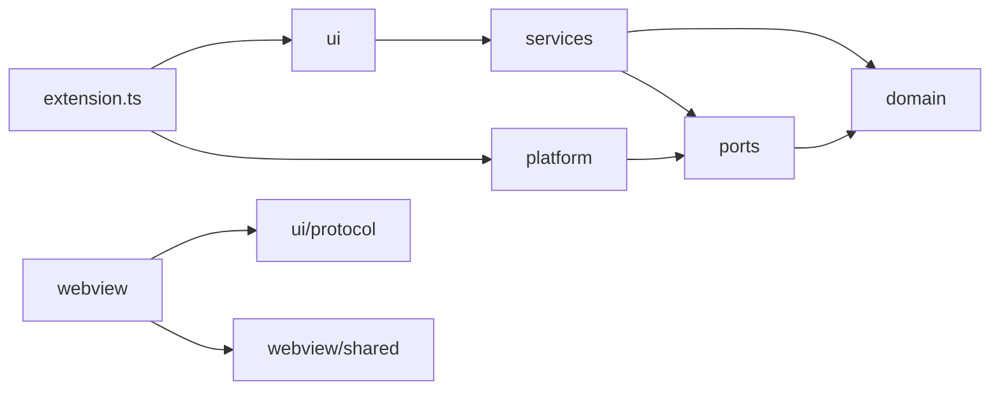

# Layers and the dependency rule

**Status: current.** This page describes the layers as they stand after the last phase of [the refactor plan](../implementation/19-refactor.md).

## Why layers

A function that can reach `vscode` can only be tested inside the extension host. A rule about notes that sits in a view can only be reused by importing the view. At v1.23.1 both happened: 101 of the 171 non-test source files imported `vscode`, and `src/core` imported from `src/ui`. Now 134 of 467 do, all of them in `ui`, `platform`, `composition`, and `extension.ts`, and `core` imports neither. The layers below put each kind of code where its dependencies are the fewest it needs.

## The layers

```
src/
  domain/          Pure model and rules. No vscode, no I/O, no ui.
    model/         notes, tasks, tags, links, index
    markdown/      parser, taskFields, taskLineEdits, recurrence, dates, lineShapes
    query/         parser, evaluator, dates, format, edit
    index/         IndexState, associations, backlinks
    ranking/       related notes, similarity, frecency, recency, tag hygiene, entry labels
    tasks/         agenda placement, board moves, reschedule, columns
    graph/         notes graph construction, local graphs, change detection
    search/        search facets, unlinked mentions
  core/            The index (workspace/) and the stores (storage/): vscode-free.
  shared/          Small helpers every layer may use: text, paths, html, timing.
  services/        Application logic: one class per capability, vscode-free.
  ports/           Interfaces the services need.
  platform/        vscode implementations of the ports.
  ui/
    commands/<feature>/  Thin handlers; each feature exports register(context, services).
    providers/     Completion, CodeLens, hover, decoration, diagnostic providers.
    views/         Tree views and status bars, display only.
    state/         View models built from the index, vscode-free.
    preview/       The Markdown preview's query blocks and embeds.
    webview/
      host/        WebviewHost, PageController, sharedHandlers, the page shell and chrome.
      pages/<page>/ Host controller and snapshot builder for each page.
    protocol/      Message and snapshot types shared by host and page.
  webview/         Browser code, bundled by esbuild.
    shared/        The Preact core, the parts pages share, the calendars', and the sheets.
    <page>/        main.tsx, the page's own components, and page.css
  composition/     createServices, the features list, and runFeatures: the
                   composition root's other half.
  extension.ts     Composition root only.
```

| Layer | Holds | May import |
| --- | --- | --- |
| `domain` | Pure types and rules: parsing, querying, ranking, task placement, graph building | `domain` and `shared` |
| `core` | The index (`IndexService`, the scanner, the watcher, the publisher) and the stores (preferences, the search store and its worker) | `domain`, `ports`, and `shared`; never `ui` or `vscode` (`core-not-to-ui`, `core-not-to-vscode`) |
| `services` | One class per capability, such as `TagService` or `TaskService` | `domain`, `ports`, `core`, and `shared` |
| `ports` | Interfaces: `FileSystem`, `Configuration`, `KeyValueStore`, `Clock`, `EditApplier`, `Log`, `Progress`, `WorkspaceFiles`, `WorkspaceEvents`, and the `Event` and `ResourceUri` shapes they use | `domain` types and other ports only |
| `platform` | The VS Code implementations of the ports | `ports`, `domain`, and `vscode`, never what uses it |
| `ui` | Adapters: command handlers, providers, tree views, webview hosts, view models, and the protocol | `services`, `core`, `domain`, `shared`, and `vscode`. `ui/protocol` may import only `domain/model`, and `ui/state` never `vscode` or a command, view, or page host |
| `webview` | Page code that runs in the sandbox | Its own folder, `webview/shared`, `ui/protocol`, the domain modules D1 names, and Preact |
| `extension.ts`, `composition` | The composition root: `createServices` builds the ports and services, each feature registers against them, and `startServices` starts the index | Every layer. `extension.ts` and `composition/services.ts` are the only modules that may import `platform` |

### D1: the domain modules a page may import

A page computes some things for itself, from rules the host also applies or that only the page needs at the speed of a keystroke. Those rules stay in `domain`, and a page imports them by name: decision D1 of [the webviews plan](../implementation/20-webviews.md). The list is `PAGE_DOMAIN_MODULES` in [`.dependency-cruiser.cjs`](../../.dependency-cruiser.cjs), which `pages-import-protocol-and-shared` reads, and the same five files are in `src/webview/tsconfig.json`, so each is type-checked against the browser's types before a page imports it. As Phase 6 left it:

| Module | What a page computes with it | Imported by |
| --- | --- | --- |
| `domain/graph/communities.ts` | The graph's groups and the links it draws: `buildCommunities`, `choosePrimaryTags`, and `selectSalientEdges` | The Notes Graph (`view.ts`, `model.ts`) |
| `domain/markdown/calendar.ts` | The date steps both calendars take: `stepDate`, `sameShownDayIn`, `isWeekend`, `chooseFocusDay`, and `stepCalendar` | The calendars' shared parts (`shared/calendar/`) and the calendar page |
| `domain/markdown/tagKeys.ts` | A tag key's namespace and its words, read as the parser reads them: `readTagNamespace` and `formatKeyWords` | The Dashboard's Tags tab |
| `domain/tasks/taskColumns.ts` | Whether a status column or a board namespace the reader typed can be taken: `checkNewStatusColumn` and `checkStatusNamespace` | The Task Board's settings |
| `domain/dashboard/widgetCatalog.ts` | Which Home widgets there are, and what each can do: `WIDGET_KINDS` and `isWidgetKind` | The Dashboard |

Each imports nothing but types from `domain/model`, and `domain-is-pure` keeps it free of `vscode` and I/O, so what a page bundles from it is the rule and nothing more. A module joins the list in the change whose page first needs it, in both places.

`ui/commands/<feature>` exists now. Nineteen feature modules, from `setup` to `undo`, each export `register(context, services)`, which registers its commands through `registerCommand` and takes what they use from the `Services` object `createServices` builds; [services.md](services.md#composition) lists them. A feature imports the `Services` type from `composition/services.ts`, type-only, and reaches the page hosts through it, since a command may not import a page host's module. The commands whose handlers were not already in `ui/commands` moved into their feature's module.

`ui/providers` exists now. Each completion, CodeLens, hover, decoration, and diagnostic provider takes only its collaborators in its constructor and subscribes to VS Code in `register()`, which returns the provider, so `createServices` builds and registers each in one expression at the point in activation where it always registered. What a provider draws with, its decoration types or its diagnostic collection, is still made with it, so a test can call its draw and check methods without registering anything. The rules the providers apply are in `domain`, where `test:unit` runs their tests: `markdown/completionContext`, `markdown/taggedEntries`, `markdown/repeatRuleProblems`, and `index/wikiLinkTargets`. `ui/providers/codeLenses` holds the lazy lens and the `locate` lookup the two lens providers share. No provider is reached through its old path under `ui/commands`; Phase 7 deleted those re-exports with the rest.

## The rule



Every arrow points from the importer to what it imports. Nothing points back up. Only the composition root, `extension.ts` and `composition/services.ts`, imports `platform`, because it builds the implementations and hands them to everything else. `services` never sees `vscode`; it sees a port, and `platform` supplies the VS Code version of it. That is why a service can be tested under plain mocha with a fake port. `webview` is separate from the host entirely: it runs in the sandbox and shares only the protocol types with the host, so a page cannot import host code by accident.

## What goes where

Ask these questions in order, and stop at the first yes.

1. Does it run in the page? It belongs in `src/webview`.
2. Is it a rule about notes, tasks, or tags with no I/O and no clock read? It belongs in `domain`.
3. Does it carry out a user action, reading and writing through ports? It belongs in a service.
4. Does it call a VS Code API to satisfy a port? It belongs in `platform`.
5. Does it ask the reader something or show them something? It belongs in `ui`.

Some examples from the audit:

| Today | Target | Why |
| --- | --- | --- |
| `rankRelatedNotes` in `ui/state/relatedNotesRanking.ts` | `domain/ranking/relatedNotes.ts` (done in Phase 4) | It is a pure ranking engine wearing a view-model name. `createSidebarSnapshot`, which shapes its result for the sidebar, stays in `ui/state`. |
| `createNotesGraphSnapshot` in `ui/state/notesGraphState.ts` | `domain/graph/notesGraph.ts` (done in Phase 4) | It builds a graph from the index. `toWire`, which trims it for the page, stays in `ui/state`. |
| `buildWorkspaceIndex` in `core/workspace/indexer.ts` | `domain/index/indexState.ts` (done in Phase 1) | It is pure, and 54 test files imported it through a module that imported `vscode`. |
| `listOverdueTasks` in `ui/views/agendaTree.ts` | `AgendaService.listOverdue`, over `selectOverdueTasks` in `ui/state/agendaState.ts` (done in Phase 4; the status bar still takes `listOverdueTasks` from `ui/commands/agendaActions.ts`, which reads the settings itself) | The status bar and `extension.ts` imported a domain query from a tree view. |
| `panelPriority` and `viewPriority` in `core/workspace/publishing.ts` | `ui/webview/host/panelPriority.ts` (done in Phase 6 step 2.1) | They map a panel's visibility to a redraw priority, which is a UI concern. |
| `core/types.ts` | `domain/model` and `ui/protocol` (done in Phase 1; the file, a re-export shim since then, is deleted in Phase 7, and every importer names the module that declares what it imports) | 45% of it was webview view models and 34% webview messages. |

## How the rule is enforced

<!-- layer-graph -->

`dependency-cruiser` runs in `npm run lint` from Phase 0, so a wrong-way import fails CI rather than waiting for a review. Its rules live in [`.dependency-cruiser.cjs`](../../.dependency-cruiser.cjs). Every rule is at `severity: error`, because the exit code counts only errors.

| Rule | What it stops |
| --- | --- |
| `domain-is-pure` | `domain` importing `vscode`, a Node I/O module, or any layer above it |
| `services-use-ports` | A service importing `vscode`, a Node I/O module, `platform`, or `ui`, so it reaches all of them only through ports |
| `ports-are-interfaces` | A port importing anything but `domain` and other ports |
| `platform-implements-ports` | `platform` importing what uses it |
| `only-the-composition-root-imports-platform` | Any module but `extension.ts` and `composition/services.ts` importing `platform` |
| `protocol-is-shared-types` | `ui/protocol` importing anything but `domain/model` |
| `pages-import-protocol-and-shared`, `pages-not-to-other-pages` | Page code importing host code, or another page's folder. Besides its own folder, `webview/shared`, and `ui/protocol`, a page may import the five pure domain modules D1 names ([above](#d1-the-domain-modules-a-page-may-import)). |
| `pages-ship-only-preact` | Page code importing any package but Preact, since whatever a page imports is bundled into it and ships |
| `host-not-to-page-code` | Host code importing page code, which it reaches only by URI |
| `search-worker-never-reaches-vscode` | The worker's closure reaching `vscode`, which fails only at runtime |
| `no-circular`, `no-unresolvable`, `shipped-code-uses-no-dev-dependency` | Cycles, imports that resolve to nothing, and shipped code importing a dev dependency |

A second set holds the older folders to the directions the plan calls wrong: `core-not-to-ui`, `core-not-to-vscode`, `state-not-to-vscode`, `state-not-to-commands-views-or-webview`, `commands-not-to-webview`, `query-parser-not-to-evaluator`, and `query-format-not-to-parser`. Type-only imports count, because a type imported the wrong way is a dependency a later value import would follow.

The violations the code had when the rules arrived are recorded in [`.dependency-cruiser-known-violations.json`](../../.dependency-cruiser-known-violations.json), and `--ignore-known` lets them through. Any new violation fails, whether a new file in a target layer or a new wrong-way import in an old one. Each phase that removed a known violation regenerated the file with `npm run lint:deps:baseline`, so the list only shrank. Two remain, both `commands-not-to-webview`: `ui/commands/chooseTheme.ts` imports `ui/webview/themes.ts` and `ui/webview/themeNames.ts`. The second is the theme names it once took through `themes.ts`, recorded again when Phase 7 deleted that re-export. The first run is the baseline in [inventories/import-graph.md](inventories/import-graph.md).

The same rules also choose which test suites can run under plain mocha: a suite qualifies when none of its modules reaches `vscode`. See [testing.md](testing.md).
