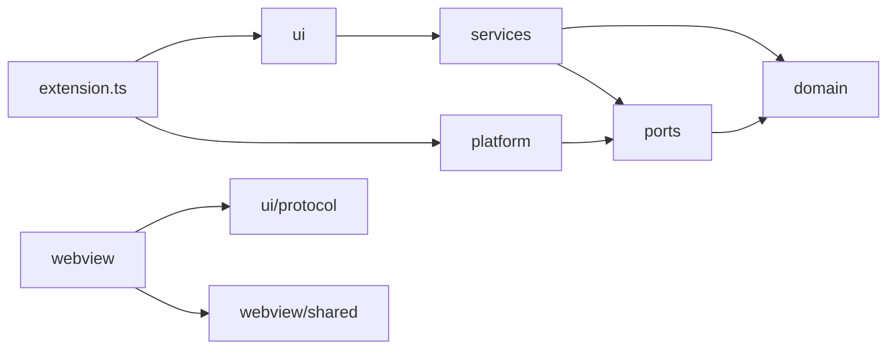

# Layers and the dependency rule

**Status: target.** This page describes the design of [the refactor plan](../implementation/19-refactor.md), not the code as it stands; each phase rewrites it to describe what then exists.

## Why layers

A function that can reach `vscode` can only be tested inside the extension host. A rule about notes that sits in a view can only be reused by importing the view. Today both happen. 101 of the 171 non-test source files import `vscode`, and `src/core` imports from `src/ui`. The layers below put each kind of code where its dependencies are the fewest it needs.

## The layers

```
src/
  domain/          Pure model and rules. No vscode, no I/O, no ui.
    model/         notes, tasks, tags, links, index
    markdown/      parser, taskMetadata, dates, lineShapes
    query/         parser, evaluator, dates, format, edit
    index/         IndexState, associations, backlinks
    ranking/       related notes, similarity, quick find, frecency, tag hygiene
    tasks/         agenda placement, board moves, reschedule, columns
    graph/         notes graph construction, local graphs, change detection
    search/        search facets, unlinked mentions
  services/        Application logic: one class per capability, vscode-free.
  ports/           Interfaces the services need.
  platform/        vscode implementations of the ports.
  ui/
    commands/<feature>/  Thin handlers; each feature exports register(context, services).
    providers/     Completion, CodeLens, hover, decoration, diagnostic providers.
    views/         Tree views and status bars, display only.
    webview/
      host/        WebviewHost base, PageController, sharedHandlers, navigation.
      pages/<page>/ Host controller and snapshot builder for each page.
    protocol/      Message and snapshot types shared by host and page.
  webview/         Browser code, bundled by esbuild.
    shared/        components, query editor, calendar day, html escaping, CSS.
    <page>/        main.ts and page.css
  extension.ts     Composition root only.
```

| Layer | Holds | May import |
| --- | --- | --- |
| `domain` | Pure types and rules: parsing, querying, ranking, task placement, graph building | Nothing outside `domain` |
| `services` | One class per capability, such as `TagService` or `TaskService` | `domain` and `ports` |
| `ports` | Interfaces: `FileSystem`, `Configuration`, `KeyValueStore`, `Clock`, `EditApplier`, `Log`, `Emitter` | `domain` types only |
| `platform` | The VS Code implementations of the ports | `ports`, `domain`, and `vscode`, never what uses it |
| `ui` | Adapters: command handlers, providers, tree views, webview hosts, and the protocol | `services`, `domain`, and `vscode`. `ui/protocol` may import only `domain/model` |
| `webview` | Page code that runs in the sandbox | Its own folder, `webview/shared`, `ui/protocol`, and Preact |
| `extension.ts` | The composition root: builds the ports and services, then registers each feature | Every layer. It is the only module that may import `platform` |

`ui/providers` exists now. Each completion, CodeLens, hover, decoration, and diagnostic provider takes only its collaborators in its constructor and subscribes to VS Code in `register()`, which returns the provider, so `extension.ts` builds and registers each in one expression at the point in activation where it always registered. What a provider draws with, its decoration types or its diagnostic collection, is still made with it, so a test can call its draw and check methods without registering anything. The rules the providers apply are in `domain`, where `test:unit` runs their tests: `markdown/completionContext`, `markdown/taggedEntries`, `markdown/repeatRuleProblems`, and `index/wikiLinkTargets`. `ui/providers/codeLenses` holds the lazy lens and the `locate` lookup the two lens providers share. Each provider's old path under `ui/commands` re-exports it until Phase 7.

## The rule



Every arrow points from the importer to what it imports. Nothing points back up. Only `extension.ts` imports `platform`, because it builds the implementations and hands them to everything else. `services` never sees `vscode`; it sees a port, and `platform` supplies the VS Code version of it. That is why a service can be tested under plain mocha with a fake port. `webview` is separate from the host entirely: it runs in the sandbox and shares only the protocol types with the host, so a page cannot import host code by accident.

## What goes where

Ask these questions in order, and stop at the first yes.

1. Does it run in the page? It belongs in `src/webview`.
2. Is it a rule about notes, tasks, or tags with no I/O and no clock read? It belongs in `domain`.
3. Does it carry out a user action, reading and writing through ports? It belongs in a service.
4. Does it call a VS Code API to satisfy a port? It belongs in `platform`.
5. Does it ask the reader something or show them something? It belongs in `ui`.

Some examples from the audit:

| Today | Target | Why |
| --- | --- | --- |
| `rankRelatedNotes` in `ui/state/relatedNotesRanking.ts` | `domain/ranking/relatedNotes.ts` (done in Phase 4) | It is a pure ranking engine wearing a view-model name. `createSidebarSnapshot`, which shapes its result for the sidebar, stays in `ui/state`. |
| `createNotesGraphSnapshot` in `ui/state/notesGraphState.ts` | `domain/graph/notesGraph.ts` (done in Phase 4) | It builds a graph from the index. `toWire`, which trims it for the page, stays in `ui/state`. |
| `buildWorkspaceIndex` in `core/workspace/indexer.ts` | `domain/index` | It is pure, and 54 test files import it through a module that imports `vscode`. |
| `listOverdueTasks` in `ui/views/agendaTree.ts` | `AgendaService` | The status bar and `extension.ts` import a domain query from a tree view. |
| `panelPriority` and `viewPriority` in `core/workspace/publishing.ts` | `ui/webview/host` | They map a panel's visibility to a redraw priority, which is a UI concern. |
| `core/types.ts` | `domain/model` and `ui/protocol` | 45% of it is webview view models and 34% is webview messages. |

## How the rule is enforced

<!-- layer-graph -->

`dependency-cruiser` runs in `npm run lint` from Phase 0, so a wrong-way import fails CI rather than waiting for a review. Its rules live in [`.dependency-cruiser.cjs`](../../.dependency-cruiser.cjs). Every rule is at `severity: error`, because the exit code counts only errors.

| Rule | What it stops |
| --- | --- |
| `domain-is-pure` | `domain` importing `vscode`, a Node I/O module, or any layer above it |
| `services-use-ports` | A service importing `vscode`, a Node I/O module, `platform`, or `ui`, so it reaches all of them only through ports |
| `ports-are-interfaces` | A port importing anything but `domain` and other ports |
| `platform-implements-ports` | `platform` importing what uses it |
| `only-the-composition-root-imports-platform` | Any module but `extension.ts` importing `platform` |
| `protocol-is-shared-types` | `ui/protocol` importing anything but `domain/model` |
| `pages-import-protocol-and-shared`, `pages-not-to-other-pages` | Page code importing host code, or another page's folder |
| `host-not-to-page-code` | Host code importing page code, which it reaches only by URI |
| `search-worker-never-reaches-vscode` | The worker's closure reaching `vscode`, which fails only at runtime |
| `no-circular`, `no-unresolvable`, `shipped-code-uses-no-dev-dependency` | Cycles, imports that resolve to nothing, and shipped code importing a dev dependency |

A second set holds today's folders to the directions the plan calls wrong, such as `core-not-to-ui` and `core-not-to-vscode`. Type-only imports count, because a type imported the wrong way is a dependency a later value import would follow.

Today's code breaks the rule in many places. Those violations are recorded in [`.dependency-cruiser-known-violations.json`](../../.dependency-cruiser-known-violations.json), and `--ignore-known` lets them through. Any new violation fails, whether a new file in a target layer or a new wrong-way import in an old one. Each phase that removes a known violation regenerates the file with `npm run lint:deps:baseline`, so the list only shrinks. The first run is the baseline in [inventories/import-graph.md](inventories/import-graph.md).

The same rules also choose which test suites can run under plain mocha: a suite qualifies when none of its modules reaches `vscode`. See [testing.md](testing.md).
