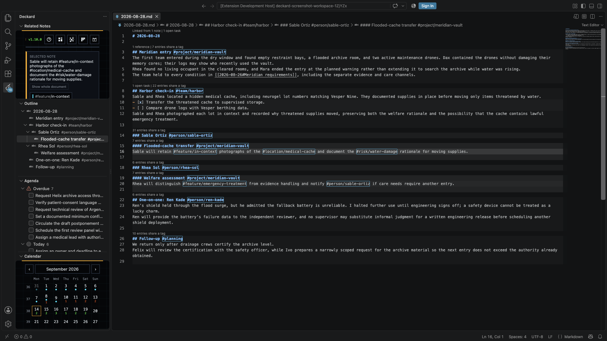
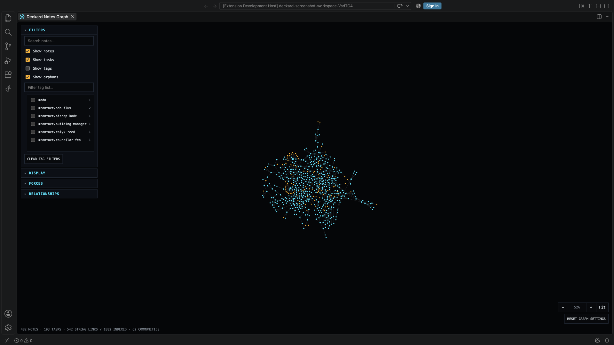
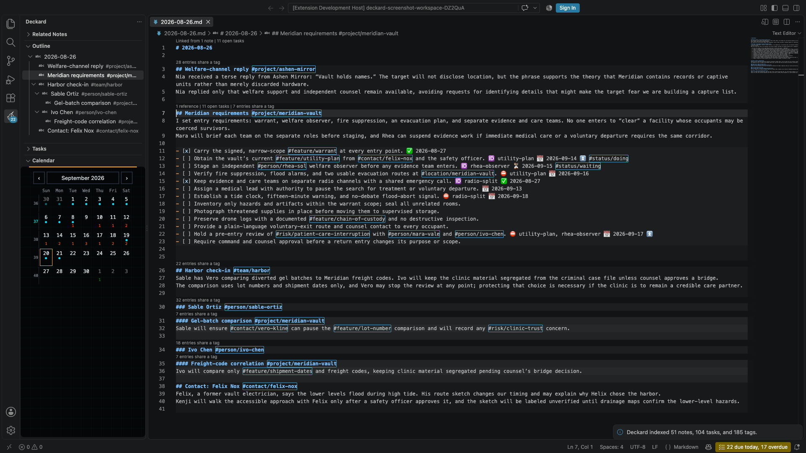

# Related notes, the graph, and the outline

## Related Notes

Related notes are listed in the **Context** view in the Deckard sidebar, under Deckard's pages, which lead the view in every state as a row of icons. The same view shows a search's Refine, a graph node's connections, or the calendar page's chosen day while one of those is in front. With Home or another page in front, it keeps its row of pages and says *Open a Markdown note to see related entries.*; to add a widget to Home, customize Home and use its own **+ Add widget**.

Open the **Context** view from the Deckard Activity Bar while editing a saved Markdown note; its **Related notes** list suggests note entries that may concern the same work, each showing its first line with shared words marked.

- **Sort**, at the Related notes heading: **Relevance**, **Newest**, **Oldest**, or **Most accessed**. The gear beside it sets **Preview** (None, 1 line, or 2 lines) and **Daily notes** (Show or Hide).
- Select a result to open its matching line, or a tag to open its page.
- Each result shows its heading path and main reason for matching; daily notes also show their date, as in `2026-09-10 > Project Atlas > Check-in`. A nested child heading with the same tags as its parent comes first. Results show 50 at a time; **Show more** adds 50.
- **Link button.** Beside each score, it writes a `[[Note#Heading]]` link to that entry at your cursor, replacing any selection. It names the heading without its tags, or the note alone when the heading repeats the note's title. A tagged line or task is linked through the heading above it. When two notes share the name, Deckard writes the link and says which notes it could mean.
- **Parked notes** are not suggested unless the current note is parked; then they come last.
- Home, the Task board, the Notes Graph, and Help are at the top of the view, and in **Go to…**; see [Getting started](getting-started.md#finding-your-way).

**Untagged notes.** A note with no tags lists up to ten entries with similar wording, under **Similar wording (no tags yet)**, marked weak, and above them **Tags used by similar notes**. Select **Add** beside a tag to write it on the heading or line at the cursor and save the note; the message offers **Undo**, as does **Undo Last Change**. A tagged note never gets this list.

**Linked from** lists notes that link to this one, newest updated first, each with its update time, link count, and linking lines under their headings. The count is the number of notes. **›** on a line unfolds up to fifteen more lines of its section.

- **Open as search** opens `link = [[This note]]` as a search page. Over fifty lines, it reads *12 more not listed.* **Open all as a search**.
- **Daily notes: Hide** leaves daily, weekly, and monthly notes out of related notes and Linked from, which then says *Hiding 8 daily notes.* with **Show them**; Open as search adds `-is:periodic`. The choice is remembered.
- A parked note that links here is listed last, marked **Parked**.

**Mentioned without a link** lists lines that write the note's name as plain text. Select one to open it, or Cmd/Ctrl-click to open it beside the note. **Link** makes one mention a `[[link]]`; **Link all** links every one as a single change that **Undo Last Change** takes back.

### What makes a note related?

| Signal | Example | Importance |
|---|---|---|
| Shared tag | Both entries contain `#project/atlas` | Strongest |
| Parent or child-heading context | Your selected entry sits under a `#project/atlas` parent heading, or a selected heading contains one | Useful, but lighter |
| Associated tag | `#project/atlas` and `#risk/vendor` are often written together | Supporting evidence |
| Entry Wiki link | An entry links to `[[Launch plan#Decision]]` | Small supporting evidence |
| Shared wording | Both entries use distinctive section wording | Adjusts an entry that qualifies another way; never enough alone, unless your note has no tags |

A note with both `#project/atlas` and `#follow-up` ranks ahead of one with only an associated `#risk/vendor` tag. Associations are normalized for support and tag prevalence, so common tags cannot dominate.

Terms on the **Related Notes Ranking** page:

- **Source unit**: one tagged heading, tagged line, task, or heading relationship where a tag is observed; not necessarily a whole file.
- **Raw evidence**: an association's starting strength.
- **Normalized relevance**: raw evidence adjusted for repeated support and how common each tag is.
- **BM25 lexical similarity** (also **BM-25**): a capped text match that weights distinctive shared words over common ones.

The full model is in the [Related Notes association and ranking reference](https://github.com/doctorallen/deckard/blob/master/docs/related-notes-associations.md).

### Focus one note entry

Tagged headings highlight their section; tagged lines and tasks highlight their line. Hover one and choose **Show related notes for [entry]**. The sidebar shows **Selected entry** and the source note, and ranks by the entry's tags first, then tagged parent headings, and for a heading, tagged child headings and child items, as lighter context that decays with distance. Each active tag is listed with a **Rail** marker for its contribution and a count of notes and tasks; hover it for its exact weight. **Show whole document** returns to the normal view.

### Understand a score

Each result has a three-step rail for a strong, moderate, or weak relation. Select it, or use the keyboard, to see the exact score, signals, and weights. For the full calculation there is **Open Related Notes Ranking**, a page for tuning Related Notes that the palette leaves out: bind a key to it in Keyboard Shortcuts and press it with the cursor in a tagged entry. It shows where each tag came from, heading paths, daily-note context, association support and prevalence, link evidence, lexical terms, recency, and specificity.

### Refine a search from the sidebar

While a [search page](search-pages.md#search-pages) or the Task board is active, the Context sidebar shows that search's [Refine](search.md#refine) options instead. The page keeps its search, terms, and counts, and draws no Refine of its own; remove terms in its search box. Related tags are listed by how many results carry them, each with a three-step rail; hover for **In 6 of 13 results.** and how often the tags were written together or shared a heading.

- Select a value to add it to the search.
- <kbd>Alt</kbd>-select it to leave those results out.
- <kbd>Shift</kbd>-select it to allow it beside the value of the same kind already chosen.
- Select the open icon beside a related tag to open its page in a new tab.

The page shows one Refine line while the sidebar holds the options, and its full Refine box when the sidebar closes. A Markdown editor brings related notes back.

## Notes Graph

Run `Deckard: Open Notes Graph`, or select **Notes Graph** in the row of page icons at the top of the Context view. **DECKARD ▾** at its top left goes to any other page, and **⋯** at its top right holds **Theme…**, **Zen** and **Help on this page**. Notes and tasks are dots sized by everything each is joined to, grouped into communities by links, headings, and tags. The graph is read-only, and control choices persist per panel.

- **Navigate.** Scroll to zoom, drag empty space to pan, and drag a dot to rearrange its cluster. **Fit** reframes the graph.
- **Select.** Hover a dot to highlight its neighbors and see what joins it, such as `atlas.md:12 · 4 wiki links · 2 headings · 7 tags` or `Tag · on 42 notes and tasks · 5 related tags`. Select a dot to list its connected nodes in the sidebar (**Connected nodes**, shown only while the graph is active). Select the top sidebar item to open it; select another to move the selection, or Cmd/Ctrl-click to open it. Cmd/Ctrl-click a dot to open it, or Alt-click to open it beside the graph. Selecting empty space clears the selection. From the keyboard, Tab to the graph and use the arrow keys to select a dot; Enter or Space opens it, Alt+Enter beside the graph, and Escape clears the selection.
- **Focus.** With a note open, the graph starts around it, one hop out, and follows the editor. Clear **Around this note** for the whole graph. **Hops out** sets the reach, one to three hops: one hop is the note, its tags, and the notes it links to; two adds what those touch, including tags usually written with yours. The line beneath names the note and counts the nodes on screen. **Pass through daily notes**, on by default, hides daily, weekly, and monthly notes but still counts them as a hop. The tag checklist narrows to the neighborhood's tags.
- **Labels.** At rest, the best-connected notes are named; zooming in names the rest. Groups of four or more are named after their most distinctive tags (`atlas · design`), or their best-connected note. Click a group name, or choose it from **Group**, to pick it out; the rest dim.
- **Lines**: solid for a wiki link you wrote, dashed for a heading and its sub-heading, dotted for a shared tag, dash-dot for a path through a daily note in a focused graph. The status line has a legend. **Only links I wrote** draws every wiki link and nothing else, and counts links and notes with none.
- **Filters** search titles and paths, restrict to selected tags, and toggle notes, tasks, tag nodes (off by default), and orphans. Parked notes and tasks, and tags only they carry, stay hidden until **Show parked** is on. **Clear filters**, shown while a tag or a group is picked, clears the tag filters and the picked group.
- **Display** sets **Node size** and **Links per note**, which runs from **Fewer** to **More**. **Headings**: **By zoom** (default) draws a multi-heading file as one dot until you zoom in far enough that every note is named; **Always** draws every heading; **Never** every file. **Reset graph** restores controls, clears filters, and reframes; **Undo** beside it reverses that for a few seconds.

**How the graph groups notes.** The graph uses prevalence-aware groups: direct wiki links and headings seed strong groups, while tag membership is discounted when a tag is too rare or too widespread. Hidden tags act as virtual anchors rather than high-mass particles, and each node keeps only its strongest local connections. The layout's forces are fixed, so every graph is laid out alike.

Each group is named after the tags its notes carry more than the rest of the workspace does.

**Links per note** sets that local budget. The status line reports the strong links kept against all indexed links; **Connected nodes** in the sidebar still uses the complete graph.

Selecting a node highlights its direct neighbors and lists those same note, task, and tag nodes in the sidebar. Related notes are ranked for Markdown notes only.

## Outline

Open **Outline** from the Deckard Activity Bar to see the active Markdown file's headings as a tree. Drag it into either sidebar.

- Each heading shows its title, without markers or tags, and its own tags beside it. A heading of only tags shows those tags as its title.
- Untagged headings are kept for structure. Headings in fenced code blocks are ignored, and `Sprint #3` stays in the title. Underlined `Title`/`===` headings are not shown.
- **2/5** means two of five tasks under the heading are done, sub-headings included; **↩3** means links in other notes name it three times.
- The tree follows the file as you type.
- Select a heading to jump to it. Right-click a tagged heading for **Open the Tag's Search Page** and **Rename Tag**.
- The eye control sets whether the Outline follows the cursor; **Collapse all** is beside it.
- **Focus Section**, the target button on a heading (also in the editor's **Deckard** submenu and Note Actions), folds the rest of the note away. **Unfold All Sections** or moving to another note ends it. It needs `editor.folding` on.
- **Filter Outline by Tag…**, in the view title or a tagged heading's context menu, shows only headings with that tag or a tag under it (`#project` keeps `#project/atlas`), plus their parents. It stays until **Clear Outline Tag Filter**.

---

← [Home and Stats](home-and-stats.md) · [All topics](README.md) · [Daily notes, reviews, and the calendar](daily-notes.md) →
