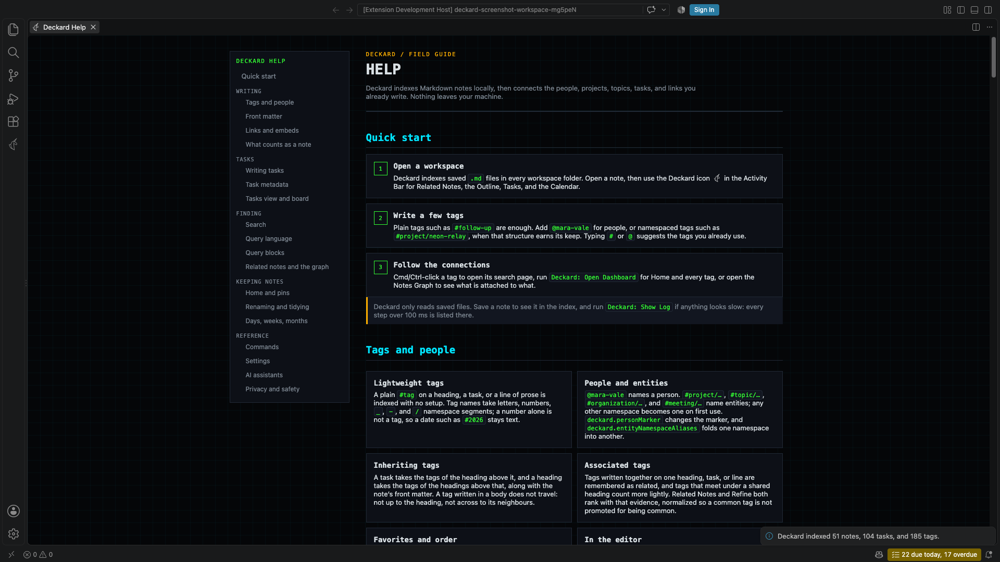

# Getting started

## Requirements

- VS Code 1.134.0 or newer.
- An open folder or workspace containing Markdown notes.

Deckard scans every `*.md` file in each workspace folder by default. Set a notes folder to restrict the index.

## Install

Search for **Deckard** in the Extensions view and select **Install**, or install it from its [Visual Studio Marketplace page](https://marketplace.visualstudio.com/items?itemName=esperinnovations.deckard-notes). VS Code keeps it up to date from there.

Each [GitHub release](https://github.com/doctorallen/deckard/releases) also carries the VSIX, for `Extensions: Install from VSIX...` where the Marketplace is out of reach.

## Get started

**Samples:** `Deckard: Create a Work Sample` writes a week of a team lead's notes: standups, two 1:1s, a project hub, and two decision records, with **Try it** in its README. `Deckard: Create the Story Tour` writes a longer tour, ten notes, one per part of Deckard, each ending with **Try it**: the commands, keys, and searches to run. Each opens in this window when no folder is open, and otherwise in a new window or this one, as you choose; its notes are dated from the day you make it, and running the command again offers a fresh copy.

**Walkthrough:** `Deckard: Get Started`, or **Walkthrough** in Home's gear, opens six steps: write a note, tag it and mention a person, link two notes, find anything, capture a task, and see the workspace. Each is checked off as you do it. It is the place to start: the work sample is offered from its first step.

**In your own notes:**

1. Open a folder or workspace in VS Code.
2. Open any Markdown note in the workspace, or [restrict indexing to a folder](settings.md#settings).
3. Run `Deckard: Open Dashboard` from the Command Palette.
4. Select the Deckard icon in the Activity Bar to open the **Context** view, with what links to the note and its related notes, while editing a Markdown note.

Deckard refreshes when saved notes are added, edited, or deleted. The first time, it says what it found, such as *Deckard read 412 notes: 1,204 open tasks (17 overdue) and 185 tags.* A workspace of 3,000 notes or more is also told how the "Exclude" setting leaves folders out.

In a code repository, Deckard's editor features apply only to notes: a README outside `deckard.notesFolder`, or under `node_modules`, is left alone.

**A code repository with no notes folder.** With `deckard.notesFolder` empty, Deckard reads every Markdown file in the workspace and writes today's note at its top level. When the folder looks like a code repository (it has `.git`, `package.json`, `go.mod`, or the like at its top):

- The status bar says **Deckard: whole workspace**. Select it to choose a notes folder, leave folders out, pause Deckard here, or keep reading everything, which hides it.
- Before the first note Deckard makes there, it asks once: **Write Here**, **Choose a Folder…**, which sets the notes folder, or **Pause Deckard Here**. Dismissing it writes nothing.
- The first scan's summary offers **Not a Notes Workspace**, which pauses Deckard.
- Capture says where it wrote, such as *Added it to notes/2026-10-07.md in deckard-work.*

**Paused**, Deckard reads and writes nothing in the workspace, and the status bar says **Deckard paused**; select it, or run `Deckard: Resume in This Workspace`, to start again. `Deckard: Pause in This Workspace` pauses any workspace. Both answers are kept in VS Code's storage for the workspace, not in a file in the repository.

`Deckard: Reindex Workspace` reads and parses every note again. A rescan after a settings change rereads only the notes whose size or saved time changed.

## Help

Run `Deckard: Open Help`, or select the question-mark button in the Context view's title bar. A command Help names, such as `Deckard: Find in Notes`, is a button that runs it, with its shortcut beside it. One that acts on the note in the editor, such as `Deckard: Edit Task`, is named for you to run from a note.

---

[All topics](README.md) · [Writing notes: tags, people, and links](notes-and-links.md) →
