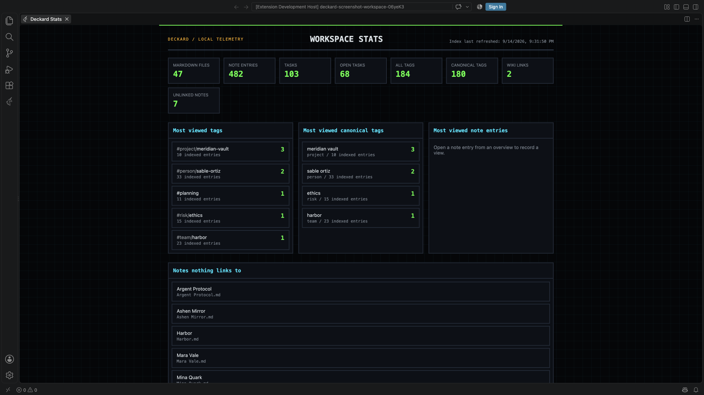

# Home and Stats

## Dashboard

Run `Deckard: Open Dashboard` to open the **Home** and **Tags** tabs. Left/Right Arrow switches tabs. Searches open [search pages](search-pages.md#search-pages), and tasks have the [Task board](task-board.md#task-board).

### Home

Three figures sit above Home: **Due today** and **Overdue**, as the [Tasks view](tasks.md#tasks-view) counts them, and **Done this week**, every task finished since the week began. Each opens a search for what it counts; the first two are scoped by `deckard.agenda.query` when that is set. Open tasks and the other workspace totals are on [Stats](#stats).

**What's new:** after an update that adds features, Home shows *Updated to Deckard 1.23.* once, with **What's new** and **Dismiss**.

**Widgets.** A new Home starts with Try next, the search box, the Tasks view, recently opened notes, favorite tags, and saved searches. In the Tasks view widget, the **Overdue** heading is red, and each row under it says so as a task row does anywhere, such as *Overdue 20 days · 2026-09-01*, in red. **Customize Home**, beside the Home and Tags tabs, adds, removes, resizes, and reorders widgets.

| Widget | Shows | Leads to |
|---|---|---|
| **Try next** | One suggestion, such as a weekly review after five daily notes. **Not now** snoozes it a week; **Do not suggest this** ends it | What it suggests |
| **Search** | The [search box](search.md#the-search-box); <kbd>Enter</kbd> opens a search page | The search page |
| **Tasks** | The first tasks a search finds, `is:open` by default | The Task board, on that search |
| **Tasks view** | Overdue, today's, and upcoming tasks | The Tasks view |
| **Favorite tags** | Your favorite tags | The Tags tab |
| **Frequent tags** | The tags you open most, lately | The Tags tab |
| **Saved searches** | Your saved searches, each removable, and **Show results** on one until Home lists what it finds | Where each was saved |
| **Saved search results** | What one saved search finds | Its search page, or the Task board |
| **Recent searches** | The searches you ran lately | Their search pages |
| **Recently opened** | Notes you opened from Deckard lately | The notes |
| **Workspace** | Note, file, task, tag, and entity totals | The Stats page |
| **Today** | Today's daily note and its open tasks, or **Create today's note** | Today's note |
| **Quick add** | A field that adds an open task to today's daily note, creating the note if needed | — |
| **Stale tasks** | Open tasks in notes unchanged for 7, 14, 30, or 90 days, oldest first | The Task board |
| **Related notes** | [Related notes](connections.md#related-notes) for the last note you had open | That note |
| **Tags written together** | The tag pairs carried together most; a pair searches for both | The Tags tab |
| **Tags without a hub** | Tags used at least three times with no [hub note](search-pages.md#hub-notes), each with **Create hub** | The Tags tab |
| **New tags** | Tags first seen in the last 7, 14, 30, or 90 days, newest first, each with **Rename** | The Tags tab |
| **Gone quiet** | People, or another namespace, not written about for 30, 60, 90, or 180 days, with what is still open. **Only those with no open tasks** adds **Add next action**, which adds a task with the tag to today's note | The Tags tab |
| **Progress** | Each project tag with tasks, or another namespace's, with a bar and how far along it is: *2/6 done (33%) · 1 overdue · next due in 3 days*. Unfinished first, overdue ones first among them, then by the next due date | The Tags tab |
| **Pinned notes** | The notes you pinned, each with **×** to unpin | The note, at the heading you pinned |

**Pinning** pins the entry (a heading and what is under it), not the file:

- `Deckard: Pin Note to Home` pins the entry the cursor is in; `Deckard: Unpin Note from Home` unpins it.
- **Hover a tagged entry** in the editor for **Pin … to Home** or **Unpin**.
- **Right-click a result** on a search page for the same.

Each offers **Undo**. If the heading is gone, the pin stays on its note and says so. A note with no heading above the cursor is pinned whole.

**Gone quiet** watches people by default; its gear's **Namespace** chooses another your tags use, such as `project`. It offers each namespace that starts with a letter, so `#2026/q1` adds no `2026`. It reads `@` and `#person/…` tags, so one person written both ways counts as two tags ([Stats](#tags-that-look-alike) flags this). A name's date is its newest note's `updated:` field, daily note day, or file date.

**Progress** lists `project` tags by default; its gear's **Namespace** chooses another, as Gone quiet's does. A tag's tasks are those a search for it finds: the tasks that carry it, and those under a heading or in a note that does. A [step](tasks.md) counts as part of its task, not as a task of its own. Selecting a row opens the tag's page, which shows the same bar.

**Paging**, in a widget's gear, shows all entries a page at a time, 3, 5, 10, or 20 to a page. The Agenda widget and a saved search's results are not paged.

**Customize:** choose **Customize Home** beside the Home and Tags tabs, or **Customize** in the View options gear. Then:

- Drag a widget, or right-click to move it first or last. Switch it between half and full width.
- Open its gear for entry count, paging, its search or saved search, or days to look back.
- Remove it with **×**, or add more from **+ Add widget**. A new widget goes at the top, and is outlined for a moment. Home holds 30 widgets at most; once full, it says so and adds none until one is removed.
- <kbd>Escape</kbd> closes a widget's gear.
- **Reset widgets…** asks, then restores the starting widgets; **Finish** ends customizing.

While Home is the active editor, the Context sidebar lists every widget Home can add. Click one to show Home, start customizing, and add it. **Reset widgets…** is there too.

The arrangement is kept in VS Code's preferences, not your notes.

### Tags

- **Tags** lists namespaced and unnamespaced tags together, each named by what follows its namespace, so `#project/alpha/notes` reads *alpha/notes*. Search them, by the tag as written or as its row shows it, narrow with **Namespace** (a person's `@` tag counts as **Person**) or to tags without one, and sort alphabetically, by entry count, by most accessed, or by custom rank. The heart on a tag makes it a favorite, and favorites come first whatever the sort. In Rank mode, drag a row, use its context menu's **Move to top** and **Move to bottom**, or press <kbd>Alt</kbd>+<kbd>Up</kbd> or <kbd>Alt</kbd>+<kbd>Down</kbd>, which move a tag within favorites or the rest; drag it across to favorite or unfavorite it. Display order does not change your files.
- **Searches are kept** between visits. While one narrows the list, a line such as *Showing 3 of 42 tags matching “vendor”* offers **Clear search**, which also clears **Namespace**.
- **Saved searches** are listed below the tags. Select one to reopen it where it was saved, or use **Remove**.
- The View options gear sets one through four tag columns.
- Select a tag to open its [page](search-pages.md#search-pages).
- Right-click a tag or entity row, or press <kbd>Shift</kbd>+<kbd>F10</kbd> or the menu key, for **Rename tag**. Every right-click menu in Deckard opens from the keyboard this way.

## Stats

Run `Deckard: Open Stats` to see what needs attention, then totals, then what you open most. A **note** is a headed entry, and a **file** holds one or more of them.

**Needs attention** shows only non-empty lists, each with a count, or one line saying the workspace is in order:

- **Notes Deckard could not read:** notes left out of the index, such as by a permissions or encoding error, with the reason. Fix the cause, then reindex.
- **Links that open no note:** each `[[link]]` name no note carries, most linked first. **Create** makes that note, empty, in the notes folder; **Create all** makes every one after asking.
- **Tags that look alike:** see [below](#tags-that-look-alike).
- **Notes nothing links to:** excludes daily, weekly, and monthly notes and parked notes. Shows ten, with **Show 40 more**.

**Totals:** every total but Files opens what it counts. **Notes** counts what Deckard's search calls a note: a heading with tags of its own, with the untagged headings under it; a note tagged in its front matter, as a whole; each heading where no tag reaches; and each tagged line outside a heading (see [What is a note](notes-and-links.md#what-is-a-note) and `deckard.noteBoundaries`), so it is usually more than **Files**. **Notes**, **Tasks**, and **Open tasks** open `is:note`, `is:task`, and `is:open`; **Tags** and **Namespaced tags** offer their tags; **Links**, `[[links]]` and `[text](note.md)` links alike, opens the [Notes Graph](connections.md#notes-graph) with **Only links I wrote** on; **Unlinked notes** moves to the list of notes nothing links to. Notes, Tasks, and Open tasks also show a twelve-week line and a change such as **+9 in the last 7 days**. A task stops being open on its ✅ or ❌ date, or its note's last change without one. When anything is parked, a line such as **Parked: 312 notes, 41 open tasks** opens the `is:parked` search. When any task is cancelled, a **Cancelled tasks** tile opens `is:cancelled`. When tasks use a character no status names, such as `[?]`, a line says how many and opens `status:unknown`; name the character in `deckard.tasks.statuses` (see [Task statuses](tasks.md#task-statuses)). Checkbox lines whose status is not a task, such as a pro and con list's, are counted on a line of their own.

**Most viewed** lists the tags, namespaced entities, and note entries you open most, counted locally in VS Code preferences.

**How often tags are used** draws six bars: used once, twice, 3–5, 6–10, 11–25, and 26 or more times, such as **Used once: 41 tags**. **Used once** lists its tags with **Merge** or **Merge into…**. Other bars offer their tags to open.

**Tags written together** pairs your twelve most-used tags in a triangle. Each cell counts the notes and tasks carrying both and opens that search (`#project/atlas #design`). **Show as a table** lists the pairs by count.

### Tags that look alike

Stats lists pairs of tags that look like one idea spelled twice, clearest first, from the rarer spelling to the one your notes already use. **Merge** runs the usual [merge](search-pages.md#merging-tags), with its preview and [Undo](search-pages.md#previewing-and-undoing-a-write).

A tag's own page shows the same at the top of **Refine**, such as *Also written as #proj/atlas (6 entries).*, for up to three spellings, with **Include in search** (searches both) and **Merge** (reopens on the kept tag if this one is merged away).

| A pair reads | Because |
| --- | --- |
| `@ren-kade → #person/ren-kade` | the same name written two ways |
| `#org/acme → #organization/acme` | the same name in two namespaces |
| `#vendorrisk → #vendor-risk` | the same name punctuated two ways |
| `#topic/reports → #topic/report` | one is the plural of the other |
| `#project/atals → #project/atlas` | one or two letters apart, counting two letters written the wrong way round as one |

Spelling pairs are compared only inside one namespace, so `#project/relay` and `#risk/relay` are not a pair. `deckard.entityNamespaceAliases` collapses one namespace into another permanently, without touching your notes.

---

← [Query blocks](query-blocks.md) · [All topics](README.md) · [Related notes, the graph, and the outline](connections.md) →
