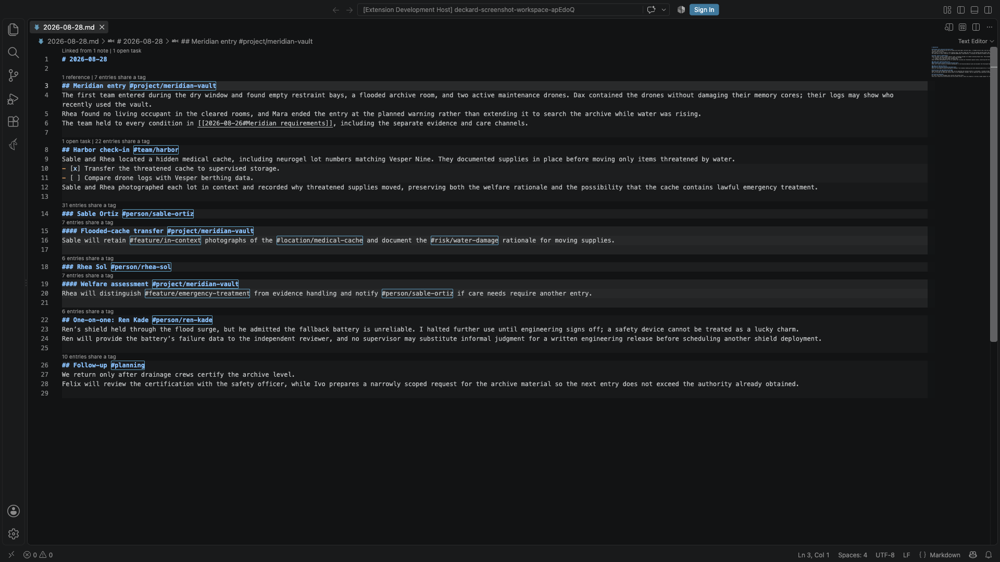

# Writing notes: tags, people, and links

## Markdown format

Deckard recognizes ATX headings, unordered checklist items, `#` tags, `@` people, and `[[Wiki links]]`. Tag matching is case-insensitive.

**Note boundaries.** `deckard.noteBoundaries` sets where one note ends and the next begins:

| Setting | A tagged line is | A search for a tag written in prose returns |
| --- | --- | --- |
| `line` *(default)* | a note of its own | that line |
| `heading` | part of the heading above it | the heading holding the line |
| `marked` | part of the heading above it, unless it carries a `^marker` | the heading, or the marked line itself |

- Under `heading`, a prose tag stays on its line; it is not added to the heading. A tag on a heading is inherited by everything nested under it.
- A tagged line with no heading above it stays a note under every setting.
- Consecutive tagged prose lines are grouped; under `marked`, one marker marks the group.
- A task is its own entry under every setting.
- Changing the setting reindexes the workspace automatically, and writes nothing to your notes.

**Citations.** A Pandoc citation in brackets, such as `[@smith2020; @lee2019, p. 33]` or `[see @kim2021]`, names no person, so citation keys never become people or offer to merge as tags that look alike. A Dataview field such as `[assignee:: @dana]` and link text such as `[@sam](…)` still name their person.

**Links.** A `[[link]]` names a note by its file name without `.md`, or by any name in its `aliases:` front matter, such as `aliases: [Atlas Program, AP]`. `[[Atlas.md]]` works too, and opens `Atlas`. A name two notes share opens neither. A link in fenced code or inline code, such as `` `[[Atlas]]` ``, is an example: it links nothing. A link to an image or other attachment, such as `![[diagram.png]]`, is not a note, so it is never a missing one.

**Markdown links count too.** A relative link such as `[the decision](../adr/0042.md#decision-record)`, the kind GitHub and MkDocs render, links its note just as `[[0042]]` would: it shows in Linked from, the Notes Graph, Related Notes, and Stats, and a `#fragment` written as a heading's slug finds that heading. A link to a web page, to a path from the root, or to a file outside your notes links no note, and is never reported as a missing one. Deckard writes `[[links]]` when it makes one, such as from a mention; `deckard.links.style` set to `markdown` writes `[Atlas](projects/Atlas.md)` instead. Renaming a note rewrites its `[[links]]`; VS Code's own `markdown.updateLinksOnFileMove.enabled` rewrites Markdown links.

After `#`, a link can name a heading, as `[[Check-in#Vendor review]]` does, or one line, as `[[Check-in#^lift-slip]]` does. A line is named by the `^marker` at its end ([Obsidian](https://obsidian.md) block-reference style):

```markdown
## Vendor review
The lift survey slipped because the contractor never confirmed. ^lift-slip
- [ ] Chase the contract @dana ^chase
```

- A marker is the last thing on its line, separated from the text. Markers in fenced code are ignored; when a note repeats one, the first wins.
- Typing `[[Check-in#^` completes that note's markers, each shown with its line.
- Following the link opens the note at that line; hovering previews it.
- Deckard reads markers but never writes them.

### Embeds

Write `![[Note]]` on a line of its own and VS Code's Markdown preview draws that note there:

| Written | Draws |
| --- | --- |
| `![[Check-in]]` | the whole note, without its front matter |
| `![[Check-in#Vendor review]]` | that heading, and everything nested under it |
| `![[Check-in#^lift-slip]]` | the one line that marker names, without the marker |
| `![[#Vendor review]]` | a heading of the note the embed is written in |

- An embed names its note as a link does. A name two notes share reads neither; a name no note has says so.
- `![[…]]` inside a sentence stays as typed. `![[diagram.png]]` is drawn as an image on the [note page](#reading-a-note-as-a-page); the preview leaves it and other attachments alone.
- Embeds nest up to three deep.
- An embed inside fenced code is left as code.

### Reading a note as a page

`Deckard: Open Note as Page`, also the unicorn button in a note's title bar and in the editor's **Deckard** right-click menu, opens the note on a page of its own, drawn in Deckard's theme with the parts only Deckard understands working:

- **Tags** open their page, and **`[[links]]`** open the note they name on the same page. **‹** and **›**, or the mouse's back and forward buttons, step through the notes it has shown.
- **Tasks** have working boxes, with **Undo** in the message, and steps sit under their task.
- **Query blocks** draw their results live, a list or a table, and each row opens what it lists. **Embeds** draw what they name, with a title that opens it.
- **Images**, `` or `![[flow.png]]`, are drawn at the page's width; select one to see it at full size. Deckard reads each from beside the note, or from the workspace folder's top, and draws nothing from the web or from outside the workspace folder; an image it cannot draw says why, such as one larger than 4 MB.
- **Front matter** names what Deckard reads as a reader would: **About** for `describes`, **Filed under** for `up`, **Also called** for `aliases`.
- **Front matter** is a row of properties under the title, a tag among the values a button. A note under a [hub](search-pages.md#the-hubs-view) shows where it sits.
- **Progress.** A note with tasks shows a **Tasks** bar under its title: how many of its own tasks are done, how many are overdue, and when the next is due, steps aside. A hub note shows a bar above it too, for every task its tag finds in any note, labeled by what the tag names, such as **Project**, **Team**, or **Person**, with a button to the tag's page.
- **Linked from** lists the notes that link here, each with the lines that do.
- **The header** is laid out as every Deckard page's: **DECKARD ▾**, the note's folder, and its title at the left; **‹** **›**, **Open in Editor**, Help, and the gear, with its theme and Zen, at the right.
- **Open in Editor** opens the note at the line in view, and a double-click on a paragraph, a task, or a block opens the editor at its line. Shift-click a link to open its note in the editor instead.

A [hub note](search-pages.md#the-hubs-view) opens as its tag's search page instead, which draws the note at its top with the tag's progress, notes, and tasks under it; the editor still opens its Markdown. The page is one tab, reused for each note as VS Code's preview tab is, and it is reopened on the note it showed after a reload. It follows each save. The unicorn button opens it in the note's own editor group, in front of the note's editor, as Markdown's **Open Preview** does; **Open in Editor** switches back. While the page is in front, the Context view's Related Notes follows the note it shows, as it follows a note in the editor, and picks the entry at the line the page was opened at.

**Opening every note there.** Set `deckard.openNotesIn` to `page` and a note or task opened from any Deckard page opens on the note page, scrolled to its line, which is marked for a moment: a search page's cards and tasks, Related Notes, Home, the Task Board, the calendars, Stats, the Notes Graph, Find, the Hubs view, and the breadcrumb lens. The default, `editor`, opens them in the editor as before.

**The other way, one key away.** Whichever the setting says, **Shift**-click a note or a task to open it the other way, and **Shift+Enter** from the keyboard, Find included. **Cmd/Ctrl+Shift**-click opens it the other way beside the page. A tree row and a lens cannot tell which keys were held, so the Hubs view's notes, hub notes included, offer the other way on their right-click menu, **Open in Editor** or **Open as Page**. A link followed in the editor, the Tasks view, and the Outline always stay in the editor.

### Copying a note for elsewhere

Embeds, query blocks, and `[[links]]` mean something only to Deckard. `Deckard: Copy as Plain Markdown`, also in the editor's **Deckard** right-click menu, copies the note, or what is selected in it, written out for a chat, an email, or a pull request:

- an embed becomes the text it names, three deep;
- a query block becomes its results as they stand: a list of notes and tasks, or Markdown tables for `view=table`;
- a `[[link]]` becomes its words, `[[Atlas#Decision]]` as *Atlas › Decision* and `[[Atlas|the plan]]` as *the plan*;
- front matter and `^markers` are left out, and other code is left as written.

### Tags and people

By default, use `@` for people and namespaced `#` tags for workspace entities:

```markdown
# Project Atlas #project/atlas
Met with @alex-smith about [[Q3 planning]].

- [ ] Send the proposal by 2026-09-12 #project/atlas
```

- `#project/atlas`, `#topic/leadership`, `#org/acme`, and `#meeting/q3-planning` appear as entity hubs.
- Any other namespaced tag, such as `#management/performance`, creates a namespace and appears as `Management: Performance`.
- Unnamespaced tags such as `#follow-up` work too. All tags appear in the Dashboard's **Tags** catalog.
- A tag's name is letters and digits of any language, `_`, and `-`, so `#café` and `#日本` are tags. A tag starts a word: the `#` in `café#latte` or in a web address such as `https://example.com/#install` is not one.
- `@alex` and `#alex` are different tags.
- Namespace aliases map a custom namespace to any built-in or custom namespace. You can change the people marker; `@name` then becomes a lightweight tag.

Front matter adds entity context to every heading and task in a note:

```yaml
---
project: atlas
people: [alex-smith]
topics:
  - leadership
---
```

`people`/`person` maps to `@person`; `projects`, `topics`, `organizations`, and `meetings` map to their typed `#` tags. These are Cmd/Ctrl-clickable like inline tags.

`Deckard: Move Inline Tags to Front Matter` moves the note's explicit tags into plural front-matter fields, merging existing values and keeping other YAML. Use it only for tags that belong to the whole note.

**Renaming tags.** Run `Deckard: Rename Tag`, right-click a tag on the Dashboard, a search page, or Related Notes and choose **Rename tag**, or hover a tag in the editor and choose **Rename**. It renames the tag everywhere it is written, leaving ordinary words and fenced code alone. Renaming to an existing tag merges the two; see [Merging tags](search-pages.md#merging-tags). Enter a complete tag such as `#management/new-name`, or only a name to keep the marker and namespace. The box previews the result, such as *Merges into #project/atlas (42 entries).*

**Syntax rules:**

- Headings use the ATX form `# Heading` through `###### Heading`. Optional closing hashes are removed from the title.
- Tasks use `-`, `*`, or `+` followed by `[ ]` for open or `[x]`/`[X]` for completed.
- A task inherits tags from its nearest heading and adds tags on its own line.
- Tag names start with a letter or number and can contain letters, numbers, `_`, `-`, and `/` namespace segments.
- A `#` in fenced code, inline code such as `` `#not-a-tag` ``, or links such as `[[#Heading]]` or `[text](#anchor)` is never a tag.
- Numeric-only hash tokens such as `#2026` are not tags. Numeric `@` tags such as `@2026` are.
- **Associated tags:** tags written together on one heading, task, or tagged line are suggested in Related Notes as belonging together, Front-matter and inherited tags never create associations alone.

```markdown
# Launch plan #project/atlas

## Next steps #topic/planning

- [ ] Review the brief #topic/writing
- [x] Send the update @alex-smith
```

## Editor assistance

**Presets.** `Deckard: Choose Editor Preset…` sets how much of what follows Deckard draws: **Full**, all of it; **Tasks**, the task hints and problem reports, without link counts, mention lenses, or breadcrumbs; **Writing**, the / menu, hover previews, and problem reports only. Each `deckard.editor.*` setting below still turns its own part on or off, and one you set wins over the preset.

- **Title bar:** Deckard's button opens **Deckard: Note Actions…**, and the unicorn beside it opens the note as a page. A daily note also has **‹** and **›** for the previous and next daily notes. Right-click the title bar to hide any of them.
- **Right-click in a note** for a **Deckard** submenu: the task on the line (Toggle Task Done, Edit Task, Break into Steps…, or Add Task), the heading (Rename Heading, Extract Heading), Move to…, and Pin or Unpin.
- **Theme colors:** in any Markdown file, wiki links, an embed's `!`, task dates (`📅 2026-10-02`, `[due:: 2026-10-02]`), repeat rules, priorities, Dataview keys, and a trailing `^block-id` use your theme's colors. To change one, add a rule to `editor.tokenColorCustomizations`, for example `{ "textMateRules": [{ "scope": "constant.numeric.date.deckard", "settings": { "foreground": "#7aa2f7" } }] }`. Scopes end in `.deckard`, such as `constant.numeric.date.due.deckard`, `string.other.repeat.deckard`, and `meta.link.wiki.deckard`.
- **Task metadata** (dates, priority, repeat rule, ids, person) and any `^block-id` are dimmed (`deckard.editor.dimTaskMetadata`). An overdue task shows its due date in the overdue color and **overdue 5 days** at the line's end; one due today says **due today**; one more than 30 days overdue (`deckard.tasks.needsNewDateAfterDays`) says **needs a new date** (`deckard.editor.taskDueHints`). Change the colors in `workbench.colorCustomizations` as `deckard.overdueForeground` and `deckard.taskHintForeground`.
- **Unreadable repeat rules** are marked on open tasks. The lightbulb offers up to three readable rules. `deckard.editor.repeatDiagnostics` turns this off.
- **Word count** is in the status bar: see [Status bar and reminders](tasks.md#status-bar-and-reminders).
- **Tags** are clickable: Cmd/Ctrl-click opens its page, and the hover has **Rename**. Heading tags are always handled; tags on other lines follow `deckard.parseInlineTags`.
- **Tag completion:** typing `#` or `@` offers indexed tags with entry counts, ignoring fenced code except a `deckard` [query block](query-blocks.md#query-blocks).
- **The / menu:** type `/` alone at the start of a line for what to write there: **Task**, **Heading 1** to **3**, lists, **Quote**, **Divider**, **Link to a note** and **Embed a note** (which open the note suggestions), **Today’s note**, **Today’s date**, a **Query block**, a **Notes table** or a **Tasks table**, and each template in your [templates folder](#templates). A template is written with the note's title, today's date, and the time filled in, and each `{ask:Question}` it holds is a tab stop that reads the question until you type over it. Keep typing to narrow the list: `/tab` finds the tables. `deckard.editor.slashMenu` turns it off.
- **Task metadata completion:** typing `/` after a space in a task offers due dates, priorities, repeat rules, and dependencies. See [Typing metadata](tasks.md#typing-metadata).
- **Link completion:** inside `[[`, notes are offered as [Find](search.md#find) ranks them. After `[[Note#`, that note's headings are offered; `[[#` offers this note's; `[[##words` searches every note's headings. A day in words, such as `[[next fri`, offers that day's note, `[[2026-09-26]]`.
- **Reference counts** sit above a note's lines. The first line shows **Linked from N notes**. Each heading shows **N references** and **N open tasks**, and a tagged heading **N entries share a tag**, which opens [Related Notes](connections.md#related-notes). Other counts list in the references peek. `deckard.editor.referenceCounts` set to `false` hides them.
- **Hovering a `[[Wiki link]]`** previews the note or section and says how many notes link to it.
- **Link problems:** a `[[link]]` to a missing note gets a **Create note** quick fix, and a name several notes share is a warning (`deckard.editor.linkDiagnostics`). The first line shows **N links open no note** and **Create N missing notes**, which creates a note in your notes folder for each unclaimed name; shared names are not created (`deckard.editor.linkProblems`).
- **Task dependencies** for a task using `⛔` or `🆔`: **Waiting on N open tasks** and **Blocks N open tasks**. A `⛔` name no task carries reads **No task has 🆔 name**. `deckard.editor.taskDependencies` turns these off.
- **Daily notes** show **‹ 2026-09-21** and **2026-09-23 ›** on their first line. Today's note also offers **Carry in N unfinished tasks**, which runs **Deckard: Roll Unfinished Tasks Forward**. See [Daily notes](daily-notes.md#daily-notes). `deckard.editor.dailyNoteActions` turns these off.
- **Broken [embeds](#embeds)** say why above their line, such as **Embed: Atlas has no heading "Decision"** or **Embed: Nothing in Atlas is marked ^choice**. `deckard.editor.embedProblems` turns these off.
- **Unlinked mentions:** the first line shows **Mentioned in N notes without a link** when other notes write its title or an alias as plain text. **Link N mentions** turns each into a `[[link]]`, [previewed and undoable](search-pages.md#previewing-and-undoing-a-write). Names under three characters, and names another note also uses, are skipped. A note that cannot be opened is left as it is, and the message says how many there were. `deckard.editor.unlinkedMentions` turns these off.
- **Step progress:** a task with [steps](tasks.md#breaking-a-task-into-steps) has a lens above it with a bar of how many are done and the next one, **███░░░░░░░ 1 of 3 steps done · next: Pack the rain shells**, which goes to that step. `deckard.editor.stepProgress` turns it off.
- **Breadcrumbs:** a note under a hub says where it sits on its first line, such as **Projects › Atlas › Vendor review**, which opens the note above it; see [the Hubs view](search-pages.md#the-hubs-view). `deckard.editor.breadcrumbs` turns them off.
- **Hub progress:** a [hub note](search-pages.md#hub-notes)'s first line says how far along the tasks of the tag it describes are, such as **Progress: 2 of 6 done · 1 overdue · next due in 3 days**, which opens the tag's page. `deckard.editor.hubProgress` turns this off.
- **Hovering a tag** shows its note and task counts, its [hub note](search-pages.md#hub-notes), its five most recently updated entries, **Open overview**, and **Rename**. `deckard.editor.hoverPreviews` set to `false` turns previews off.



## Templates

Put Markdown files in a `templates` folder at the workspace root, or the folder `deckard.templatesFolder` names, and run `Deckard: New Note from Template`. Choose a template and a title; Deckard creates the note in your notes folder and opens it. The templates folder is never indexed. With no templates yet, it offers **Create Starter Templates**: a meeting, a 1:1, and a decision record, which you can change or delete like any other file.

To write into a specific folder, right-click it in the Explorer and choose **Deckard → New Note from Template Here…**. **Deckard: Create Daily Note** and **Deckard: New Note from Template** are also in **File → New File…** and on the Welcome page.

| Placeholder | Becomes |
| --- | --- |
| `{title}` | The title you enter, which is also the file name. |
| `{date}` | Today's date, such as `2026-09-13`. |
| `{time}` | The current time, such as `09:05`. |
| `{ask:Question}` | Your answer when Deckard asks the question. A question used twice is asked once. |

Anything else in braces is left as written.

A template named after a tag namespace, such as `person.md` or `project.md`, starts every new [hub note](search-pages.md#hub-notes) for that namespace. It can use `{tag}`, and Deckard adds `describes:` front matter unless the template has its own.

---

← [Getting started](getting-started.md) · [All topics](README.md) · [Tasks](tasks.md) →
