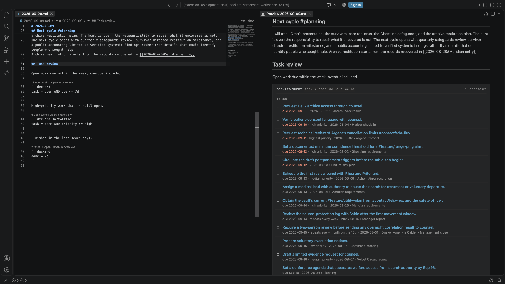

# Query blocks

Put a Deckard query in a `deckard` code fence to keep a live list inside a note. `Deckard: Insert Query Block…` writes one at the cursor from a saved or recent search, and **Copy as live query block** in a search page's or the Task Board's **Export** copies the page's search as one:

````markdown
```deckard sort=updated limit=10
tag = #project/atlas AND task = open
```
````

Or as a table of the tasks, with the columns you name:

````markdown
```deckard view=table columns=due,priority,for sort=due
tag = #project/atlas AND is:open
```
````



- The Markdown preview replaces the fence with what the query matches, notes first and then tasks. Each result is its own row: a title that links to its source line, and beneath it the headings above it and its file name. The file name is left out when the first heading already names it, as a daily note's date heading does. Tags written after a title are removed from it, while tags inside the sentence, such as the people in a task, are kept. Following a link behaves like any other link to a note, so `markdown.preview.openMarkdownLinks` decides whether it opens in the preview or the editor.
- Notes are listed alphabetically. Tasks are listed open first, soonest due date first, then in source order; completed tasks are struck through and overdue due dates are highlighted.
- After `deckard`, `sort=` reorders the results by any column a task has — `title`, `due`, `scheduled`, `start`, `done`, `priority`, `for`, `status`, `note`, `created`, or `updated` — with `dir=asc` or `dir=desc` to say which way; dates sort newest first unless told otherwise, and a task with nothing in the column comes last either way. Notes know only `title`, `created`, and `updated`. `limit=10` shows at most ten notes and ten tasks, while the header still reports the full totals.
- `view=table` draws the tasks as a table instead of a list, with `columns=due,priority,for,note` choosing the columns in order; the title is always first. The columns are the ones `sort=` accepts, plus `tags`, `blocked` (what a task waits for), and `id`. Without `columns=`, a table shows the title, due date, priority, who it is for, and its note. Notes stay a list above the table.
- In the editor, the line above the fence shows the totals and **Open search page**, which opens the same query on a search page, where you can refine it.
- Results refresh when any note in the workspace changes, not only the note that holds the block.
- A query that does not parse shows its error in place of results. An unknown option is reported as a warning, and the rest of the block still runs.

The fence is ordinary Markdown, so other editors and Git show the query text itself. Like any fenced code, a query block is not indexed, so tags written in a query are not counted as tag uses. Tag completion does run inside a query block, so typing `#` or `@` there suggests indexed tags.

---

← [Search pages and tag overviews](search-pages.md) · [All topics](README.md) · [Home and Stats](home-and-stats.md) →
