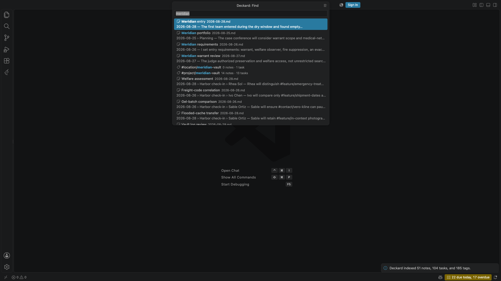
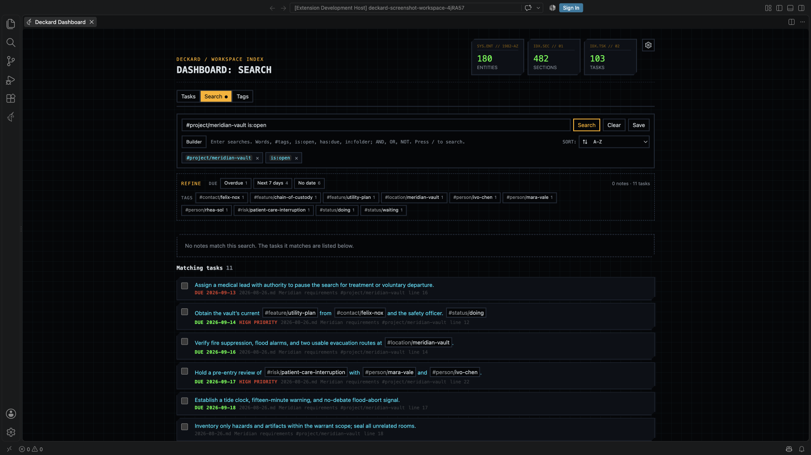

# Search

One search language works everywhere: in `Deckard: Find in Notes`, and in the search box on [search pages](search-pages.md#search-pages), Home, and the Task board.

### Find

Run `Deckard: Find in Notes`, or press <kbd>Cmd</kbd>+<kbd>Shift</kbd>+<kbd>Alt</kbd>+<kbd>F</kbd> (<kbd>Ctrl</kbd>+<kbd>Shift</kbd>+<kbd>Alt</kbd>+<kbd>F</kbd> on Windows and Linux), and type.



- **Words** search every note section, task, and front-matter-only note. Titles with your words come first, then loose title matches (`vcon` for *Vendor contract*), then entries that mention them. The last word matches as you type it.
- **Query terms** such as `#tags`, `@people`, `is:open`, or `in:notes/work` narrow results as in the [query language](#query-language). A word also offers tags by their last part (`atlas` offers `#project/atlas`) and conditions by value (`overd` offers `is:overdue`); <kbd>Tab</kbd> or a tag's **+** adds it.
- <kbd>Enter</kbd> opens the note or task at its line (in the editor, or on the [note page](notes-and-links.md#reading-a-note-as-a-page) when `deckard.openNotesIn` says `page`), a tag's page, or a saved search. <kbd>Shift</kbd>+<kbd>Enter</kbd> opens a note or task the other way. **Show all results**, or the title bar's list button, opens a search page.
- With no full match, Find shows partial matches, and a misspelled word gets **Search for … instead**.
- With nothing typed, Find lists pinned notes, the five last opened notes, five recent searches (with **Save search**), saved searches, and favorite and recent tags.
- <kbd>Cmd</kbd>+<kbd>Enter</kbd>, or the row's button, opens a result to the side and keeps Find open. <kbd>Alt</kbd>+<kbd>Enter</kbd> inserts a link at the cursor (for a task, to its heading). <kbd>Cmd</kbd>+<kbd>.</kbd> lists every action for the row with its key: open, link, copy a link, pin; complete, reopen, date, or edit a task; favorite or rename a tag; save or forget a recent search. Use <kbd>Ctrl</kbd> for <kbd>Cmd</kbd> on Windows and Linux.
- Task rows have **Complete** (or **Reopen**), which redraws in place with **Undo**, and **Set due**: Today, Tomorrow, Next Monday, a date, or none.
- **Create note “…”** appears for words that read as a name no note has.
- **Add “…” to today's note** appears when nothing has every word and you typed only words, tags, and people. It reads the line as [Add Task's quick add](tasks.md#adding-a-task) does: `Call Ren friday p2` becomes `- [ ] Call Ren ⏫ 📅 2026-10-02`.
- A day such as `friday`, `oct 3`, or `last friday` offers that day's note, creating it if needed. A short weekday alone, such as `fri`, is a word.
- Opened with words selected on one line, Find starts with them as its search.

Ties go to what you open most and most recently: a note counts once per heading the cursor is in, at most every ten minutes, however it was opened. Find also ranks higher a result you chose before for the same text, never above an exact title. This is kept in VS Code's preferences, never in your notes.

### The search box

Search pages, Home's search widget, and the Task board (tasks only) share one search box. Press <kbd>/</kbd> to type in it, and <kbd>Enter</kbd> or the **→** at its end to run the search. The **×** beside it clears the search, and shows only when there is something to clear: on a tag's page, more than the tag. **Builder** is joined to the start of the box.



- Each term is a chip with a **×**, joined by **AND** or **OR**; words show as their `text ~` condition. Parenthesized groups nest as frames with their own **×**. Tags are blue; terms negated with `NOT` or `-` are red.
- Typed words narrow all results, not only the visible page. <kbd>Enter</kbd> makes them chips and remembers the search; otherwise they are dropped when the box loses focus.
- Completions offer field names, values, tags, conditions, and, in an empty box, recent searches. After `[[` they offer notes, most linked first. Nothing is preselected: <kbd>Enter</kbd> runs what you typed, <kbd>Tab</kbd> completes, <kbd>Escape</kbd> abandons the edit.
- Pressing a chip removes its term. <kbd>Backspace</kbd> in an empty field removes the last chip.
- Two tags side by side are joined with AND.
- A parse error shows under the box; the results keep the last search that ran.
- When nothing matches, **Nothing matched. Search for … instead?** corrects misspelled words, never tags or folders.
- **Save search…**, in a search page's or the Task board's **⋯**, stores the search by name. Saved searches appear on Home and the Tags tab and survive tag renames.

**Builder** opens under the box, and stays pressed while it is open. It edits the same search as nested rows and groups. Each group matches **all of** or **any of** its rows, and **not** negates a group.

- **Add condition**: type a tag, word, or value such as `open`, then choose a completion or press <kbd>Enter</kbd>; the row fills in its field and operator.
- <kbd>Enter</kbd> opens the next row, <kbd>Backspace</kbd> in an empty row removes it, and <kbd>Ctrl</kbd>+<kbd>Enter</kbd> (<kbd>Cmd</kbd>+<kbd>Enter</kbd> on macOS) adds a group joined the other way.
- The **Status** field lists the workspace's [task statuses](tasks.md#task-statuses).
- Operators are `=`, `!=`, `~`, `!~`, `>`, `>=`, `<`, `<=`. `NOT tag = #a` opens as `tag != #a`; negated groups are written as `NOT (…)`.

### Refine

**Refine**, under the search box, counts what the results could be narrowed by: open, done, and cancelled tasks, each open status found (such as In progress, Blocked, Waiting, or Unknown), due dates (overdue, next seven days, later, none), tags, **Links to** (up to eight notes), last update, creation month, and folders. Values that keep all or none of the results are hidden.

- Select a value to add it with **AND**.
- <kbd>Alt</kbd>-select to add it with **AND NOT**.
- <kbd>Shift</kbd>-select to add it with **OR** to the value before it, such as open *or* done tasks.
- <kbd>Enter</kbd>, <kbd>Alt</kbd>+<kbd>Enter</kbd>, and <kbd>Shift</kbd>+<kbd>Enter</kbd> do the same from the keyboard. Hover a value to see what each writes.

Refine writes ordinary query text, so the result can be saved, copied into a query block, or edited in the builder. A search of one tag, or tags joined by AND, lists related **Tags** instead, each with a three-step rail for its share of results (**in 6 of 13 results**). While the Context sidebar is open, Refine is [shown there](connections.md#refine-a-search-from-the-sidebar), and the page draws none of its own. A tag page's lines about its other spellings and untagged mentions stay under the search box, as do **Drop** and **Clear** when a search matched nothing.

### Query language

A Deckard query is what you type into Find, the search box, a [query block](query-blocks.md#query-blocks), or an [AI assistant](ai-assistants.md#ai-assistants):

```
(tag = #project/atlas AND tag = @ren-kade) OR (tag = #risk/vendor AND text ~ "elevator")
```

Terms combine with `AND`, `OR`, `NOT`, and parentheses. `AND` binds tighter than `OR`, adjacent terms are joined by an implicit `AND`, and `-` or `!` before a term negates it. A bare `#tag` or `@person` is a tag condition, a bare `[[Note]]` a link condition, and a bare or quoted word a text condition, so `#project/atlas "vendor risk"` is a complete query.

Shorthands, written the way GitHub writes them:

| Shorthand | Finds |
| --- | --- |
| `is:open`, `is:done` | Open tasks (to do, in progress, or on hold), or done tasks. |
| `is:in-progress` | Tasks in progress, such as `[/]`. |
| `is:cancelled`, `is:closed` | Cancelled tasks, such as `[-]`, and tasks done or cancelled. |
| `is:overdue` | Open tasks past their due date. |
| `is:today` | Open tasks due today, or scheduled for today or earlier and started: the Tasks view's **Today**. |
| `is:needs-date` | Open tasks more than `deckard.tasks.needsNewDateAfterDays` (30) days past due: the Tasks view's **Needs a new date**. |
| `is:due` | Open tasks due within seven days, overdue included. |
| `is:task`, `is:note` | Every task, or note sections without tasks. |
| `is:blocked`, `is:blocking` | Open tasks waiting for a still-open task or with the Blocked status (`[=]`), and the open tasks they wait for. |
| `is:waiting` | Open tasks with an on-hold status (Waiting `[w]`, Someday `[s]`, Blocked `[=]`, or one of your own), or assigned with 👤 to someone other than you. With `deckard.me` empty, every assigned task counts. |
| `is:available` | Open tasks that are not blocked, started (no 🛫 date, or one today or earlier), and not on hold. |
| `is:mine` | Tasks for the person `deckard.me` names, and tasks for nobody. Without that setting, only the latter. |
| `is:assigned`, `is:unassigned` | Tasks that name a person, and tasks that name nobody. |
| `has:due`, `no:due` | Tasks with or without a due date. `scheduled`, `start`, `done`, `cancelled`, `priority`, `id`, and `dependsOn` work the same way. |
| `in:notes/work` | Everything in a folder and its subfolders. `*` and `?` are wildcards. |
| `is:daily` | Anything in a daily note (named for a day, such as `2026-09-25.md`, or with a day in its top heading), tasks included. `is:journal` is the same. |
| `is:periodic` | Daily, weekly, and monthly notes. `is:dated` is the same. |
| `is:parked` | [Parked](organizing.md#parking-notes) notes, entries, and tasks: in a folder `deckard.parked.folders` names, or found by a search for a tag `deckard.parked.tags` names. |
| `is:step`, `has:steps`, `no:steps` | Steps (checkboxes under another task), tasks with steps, and tasks with none. `-is:step` leaves steps out. |

Put `-` before a shorthand to negate it, as in `-is:done`. Deckard keeps a shorthand as written when it saves or formats a query.

`is:blocked` and `is:blocking` read ⛔ and 🆔 markers between two open tasks: a task is blocked while a task its ⛔ names is open, and blocking while an open task names its 🆔. Completing the blocker frees both, and a ⛔ naming nothing in the workspace blocks nothing. An open task with the Blocked status is blocked too, whatever its ⛔ markers say. `has:dependsOn` and `has:id` read the markers whatever state the tasks are in.

Fields:

| Field | Matches | Example |
| --- | --- | --- |
| `tag` | A tag, including tags inherited from a tagged heading above and front-matter tags, and the tags written in a note's untagged headings. `*` and `?` are wildcards. | `tag = #project/atlas`, `tag = #risk/*` |
| `link` | Entries that link to a note, by its name or any `aliases:` name. `[[Atlas#Decision]]` narrows to a heading, `[[Atlas#^q3]]` to a marked line; text after `\|` is ignored. Only `=` and `!=`; brackets are optional after `link`. | `[[Atlas]]`, `link = [[Atlas#Decision]]`, `-[[Atlas]]` |
| `text` | Words in a note body, task line, or front-matter-only file. `:` and `~` match a substring; `=` and `!=` a whole word. | `text ~ elevator`, `text = plan` |
| `task` | `open`, `done`, or `any`. Returns only tasks. | `task = open` |
| `status` | A [task status](tasks.md#task-statuses) by name, ignoring case, with a hyphen or quotes for a space; by its character in brackets; or `unknown` for a character no status names. `open`, `done`, and `any` mean what they do for `task`. `-status:` leaves a status out. A status is the character in a task's box; a `#status/…` tag is searched as a tag. Only tasks. | `status:in-progress`, `status:"in progress"`, `status:[=]`, `-status:waiting` |
| `due`, `scheduled`, `start` | A task's 📅, ⏳, or 🛫 date: a date, `today`, `tomorrow`, a weekday such as `friday` (the next one), any other [day in plain words](tasks.md#dates-in-plain-words) quoted or with `-` for spaces, a week or month (`this-week`, `next-week`, `this-month`, `next-month`, `2026-10`), a window such as `7d` counted forward, or `none`. Only tasks. | `due < today`, `due <= friday`, `due <= "oct 3"`, `due = this-week`, `due = none` |
| `done`, `cancelled` | A task's ✅ or ❌ date. Windows count back from today; a weekday means the last one. | `done = 7d`, `done >= "last friday"`, `cancelled = 30d` |
| `priority` | `highest`, `high`, `medium`, `none`, `low`, or `lowest`. No priority counts as `none`, between `medium` and `low`. | `priority >= high` |
| `assignee` | The person a task's `👤` field names, or `none`. `@ren-kade`, `#person/ren-kade`, and `ren-kade` are the same person. Only tasks. | `assignee = @ren-kade` |
| `kind` | An entity namespace, including `person` for `@` tags. | `kind = project` |
| `file` | A file name, with `*` and `?` wildcards. | `file = 2026-09-*.md` |
| `path` | A workspace-relative path, with wildcards. | `path = notes/*` |
| `created`, `updated` | A date such as `2026-09-13`, a window such as `30d`, `today`, a weekday such as `friday` (the last one), or a week or month (`this-week`, `last-week`, `this-month`, `last-month`, or `2026-08`). A bare date means that whole day. | `updated > 7d`, `created = 2026-09-13`, `created = last-month` |

**Links.** A link belongs to the entry whose lines hold it: the task on its line, the tagged line, or else the heading it is under (not that heading's parents). A link in front matter or above the first heading belongs to the note itself. Links count as in Linked from: front matter included, code blocks excluded, and self-links excluded unless they name a heading. A link to a note that does not exist yet still counts, so `[[Q4 offsite]]` finds everything waiting on it.

**Weeks and months** cover the whole span: `due = this-week` is any day this week, `due < next-week` is before next week starts, and `created >= last-month` is from the 1st of last month on. Weeks start on `deckard.calendar.weekStart`, Sunday by default. `friday` is the next one for `due`, `scheduled`, and `start`, and the last one for `created`, `updated`, and `done`. Values are read when the search runs, so a saved `this-week` moves with the week. Numeric dates such as `10/3` are not read.

**Created and updated.** A note's created date is its `created:` or `date:` front matter; otherwise a daily note's day (or its file's age, if older), or the file's creation time. Its updated date is its `updated:` front matter, or the file's modified time.

**Operators:** `=` is, `!=` is not, `~` contains, `!~` does not contain, and `>`, `>=`, `<`, `<=` for dates and priorities. A window such as `7d` compares by its far end: `updated > 7d` means within the last seven days, and `due < 7d` means due within the next seven, overdue included. `:` reads as `=` for every field but `text` (`tag:#atlas`), where it matches a substring as `~` does (`text:plan` finds "planning"); Deckard writes `=` or `~` when formatting. A comparison can follow it: `updated:>2026-01-01` equals `updated > 2026-01-01`. Every operator has an opposite, so any one condition can be negated without `NOT`; use `NOT` to negate a parenthesized group.

---

← [Task board](task-board.md) · [All topics](README.md) · [Search pages](search-pages.md) →
