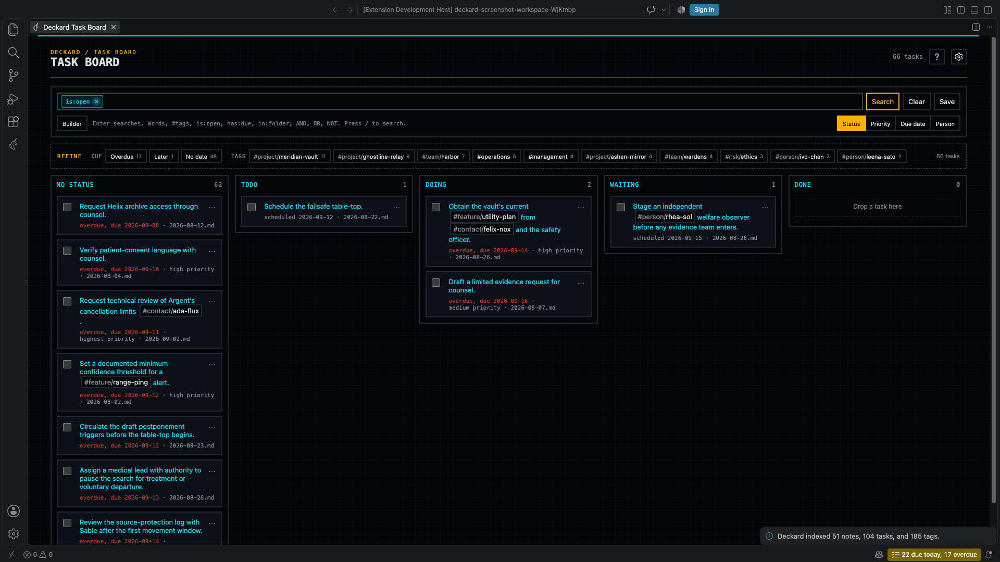

# Task board

Run `Deckard: Open Task Board`, or select **Task Board** in the Pages view or the board icon in the Tasks view's title bar. Drag a card to another column, or choose one from its **⋯** menu, to change the task in its note. The menu's **Move to…** moves the task and its steps under another heading. A card with steps shows **Steps 2/5 done (40%) · next: Draft the email**. The **View options** gear switches views and edits status columns. Parked tasks are left off unless the search says `is:parked`.

## Groupings

- **Status**: a column per [task status](tasks.md#task-statuses), named as the status is, such as **In progress**. `[/]` and `#status/doing` share **In progress**, and `[=]` has a **Blocked** column. `deckard.board.statuses` sets the first columns (`todo`, `doing`, `waiting` by default), each by its status's tag, or by its name with hyphens for spaces when it has no tag; other statuses follow, and tasks without one are in **No status**. A character no status names stays in **No status**, and its card names it, such as **Unknown [?]**. `deckard.board.statusNamespace` uses another namespace for the tags, such as `#stage/…`. A status inherited from a heading does not count.
- Dropping on a status column writes the status as `deckard.tasks.writeStatusAs` says: by default, a line with a status tag gets the tag changed, and a plain line gets the character, so `- [ ] Draft` dropped on **In progress** becomes `- [/] Draft`. A status with no character, such as Waiting, is written as its tag. Dropping on **No status** writes a plain `[ ]` and removes the tag.
- **Priority**: a column per priority. Dropping writes it in the task's format, such as ⏫ or `[priority:: high]`.
- **Due date**: **Needs a new date** (more than 30 days overdue, titled in red), Overdue, Today, Tomorrow, Within a week, Later, and No due date. Drop on **Today** or **Tomorrow** to set the date, or **No due date** to remove it; other columns take no drops.
- **Tag…**: one namespace's tags, alphabetical, then **No context**. A task with two such tags is in both columns. Dropping replaces the tag on the line, or removes it in **No context**; an inherited tag stays. See [Contexts, areas, and projects](#contexts-areas-and-projects).
- Every grouping ends with **Done**, showing the 20 most recently completed tasks. Drop a card there to complete it, with its done date and next occurrence; drag it out to reopen it.
- **Show a Cancelled column after Done**, in the gear's **Status columns**, draws **Cancelled** after Done (`deckard.board.showCancelled`). Dropping a card there cancels it, with its ❌ date.
- A card shows its status when its column doesn't, such as **In progress** on a card grouped by priority.

## Searching and filtering

- Search with the same [search box](search.md#the-search-box) as search pages, such as `#project/atlas`, `priority >= high`, or plain words. **Refine** counts only tasks. The board opens on `is:open`; clear the box for every task, or search `is:done`.
- **Can start now** narrows to `is:available`, leaving out tasks that are blocked, not started, or on hold (Waiting, Someday, Blocked). Press it again for `is:open`.
- **Save** keeps the search in the box, whether or not Enter has run it, as a saved search that reopens on the board. **List in Tasks view**, in the gear, makes the [Tasks view](tasks.md#tasks-view) list it; select it again to list every open task.

## Editing what the Tasks view lists

The search icon in the [Tasks view](tasks.md#tasks-view)'s title opens the board on the view's search, with **Editing what the Tasks view lists** and **Cancel** above the search box.

- Change the search, then select **Save to Tasks view**. The view lists what the box shows, whether or not Enter has run it, and the board runs it too. A notice says what the view lists now, such as **The Tasks view lists "#project/atlas" now.**
- The board's own `is:open` is left out, as the view lists only open tasks; `is:open` alone lists every open task. The search is written to `deckard.agenda.query` in the workspace's settings when the workspace sets it, and in your user settings otherwise, as **List in Tasks view** writes it.
- A search that does not parse is not saved: the box shows its error.
- While the view lists the search in the box, **Save to Tasks view** is held and says so; change the search to save again. The board stays open, so you can go on refining.
- **Save as search** keeps the search as a named saved search, as **Save** does on any board.
- **Cancel** makes it a plain board again and leaves the Tasks view as it is. Opened any other way, such as with `Deckard: Open Task Board`, from Home, or from a saved search, the board is a plain one.

## Cards and columns

- Due dates read by distance, such as **Overdue 15 days · 2026-09-08** or **Due tomorrow · 2026-09-24**; beyond a month only the date shows. A task more than `deckard.tasks.needsNewDateAfterDays` (30) days overdue reads **was due 2026-07-01** in muted text.
- Column headers count cards and overdue ones: **40 · 38 overdue**.
- `deckard.board.limits` sets work-in-progress limits by status, keyed as `deckard.board.statuses` is, such as `{ "doing": 3 }` for **In progress**. The header reads **5 / 3**, and a column over its limit gets a dashed outline. Drops are never refused.
- A column over 100 cards shows **Show N more**.
- **+ Add task** under a column's title captures a task into today's note with that column's status, priority, date, or person. A card's **⋯** menu offers **Due on a date…** for any day.
- Select a card to open its line, or a tag to open its overview.
- **Show the tag each task is under**, in the gear's **Cards**, puts the task's nearest parent tag above its title on cards and list rows (`deckard.board.parentTag`): the first tag on the nearest tagged heading above it, else its note's front-matter tag. A tag the task's own line writes, a status tag, and a tag of the namespace the board is grouped by are skipped, since the card already says them. A task under `## Launch #project/atlas` shows `#project/atlas`. Select the tag to add it to the board's search, as **Refine** does: Shift-click adds it with OR, beside a tag of the same namespace the search already has, and Alt-click leaves it out. Cmd/Ctrl-click opens the tag's page in a new tab.
- Every move is checked against the indexed line first, so a newer edit is never overwritten.

## Table and list

- **Table** shows tasks as rows: title, due date, priority, person, and note by default. Add other fields in the gear's **Columns**. Select a header to sort, again to reverse; **Rank order** restores your ranking. A [query block](query-blocks.md#query-blocks) draws the same table with `view=table`.
- **List** shows tasks as rows with **Sort**: **Rank**, **Newest created**, **Oldest created**, **Recently updated**, **Least recently updated**, **A-Z**, or **Z-A**. In Rank, drag a row, right-click it to move it, or press **Alt+↑** and **Alt+↓**.
- **Status columns**, in the gear, lists the status columns in order. Drag a row to reorder, add a column, remove an empty one with **×**, set the status namespace, or show a Cancelled column. These save to `deckard.board.statuses`, `deckard.board.statusNamespace`, and `deckard.board.showCancelled`.

## Keyboard

The board is one Tab stop. Arrow keys move between cards and columns. On a focused card:

- **x** completes it; **t** and **m** make it due today or tomorrow; **d** asks for a date in plain words; **f** asks who it is for.
- **1** to **5** set priority; **0** clears it.
- **[** and **]** move it to the adjacent column.
- **e** opens the task editor; **s** [breaks it into steps](tasks.md#breaking-a-task-into-steps); **Enter** opens its line, and **Cmd+Enter** (Ctrl+Enter on Windows and Linux) opens it beside the board.
- **?** lists the keys.

### Contexts, areas, and projects

Group by a tag namespace for GTD and PARA lists:

- **Contexts**, where a task can be done: `#context/phone`, `#context/computer`, `#context/errands`. Not `@phone`, which Deckard reads as a person.
- **Areas**, what you keep up: `tags: [area/health]` in front matter puts every task in the note in the area.
- **Projects**, what you finish: a heading tag, `## Launch #project/atlas`, puts every task under the heading in the project.

Then choose **Group Tasks By…** in the Tasks view's title, **Tag namespace…**, and `#context`; or **Tag…** on the Task board. A task with two contexts is in both lists. Dragging a task to another context rewrites the tag on its line; an inherited project or area stays.

---

← [Tasks](tasks.md) · [All topics](README.md) · [Search](search.md) →
