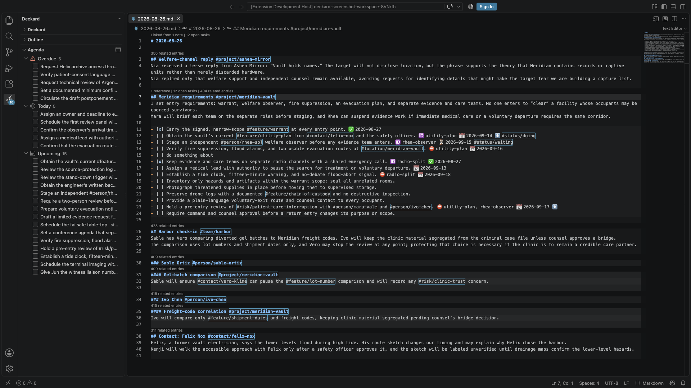

# Tasks

## Task metadata

Deckard reads both formats of the [Obsidian Tasks](https://publish.obsidian.md/tasks/) plugin. The emoji format looks like this; the [Dataview format](#dataview-format) spells the same fields out in brackets:

```markdown
- [ ] Send the proposal 📅 2026-09-20 ⏳ 2026-09-18 ⏫ 🔁 every week
```

| Marker | Meaning |
| --- | --- |
| 📅 | Due date. 📆 and 🗓 also work. |
| ⏳ | Scheduled date: the day you plan to work on the task. ⌛ also works. |
| 🛫 | Start date: the task is not actionable before this day. |
| ✅ | Completion date. |
| ➕ ❌ | Created and cancelled dates. Removed from titles and kept in the note. Cancelling a task writes ❌ with today's date. |
| 🔺 ⏫ 🔼 🔽 ⏬ | Priority, from highest to lowest. |
| 🔁 | Repeat rule, such as `every week`. |
| 🆔 ⛔ | A task's id, and the ids of the tasks it waits for. |

- Markers and a trailing block id such as `^a1b2` are left out of titles and shown as details. A marker can be anywhere on the line.
- Without a 📅 date, Deckard reads `2026-09-12`, `Sep 12`, or `next Friday` from the text, counting from the note's date (a daily note's name or top heading, else a `date:`, `created:`, or `updated:` front-matter date, else the last save). `Sep 12` is in that date's year, unless the same day in the year before or after is nearer and within two months: `Jan 5` in the note for December 28 is the coming January.
- Completing a task adds ✅ with today's date; reopening removes it.
- Completing a 🔁 task anywhere writes its next occurrence on the line above. The due date (else scheduled or start) moves by the rule and the other dates keep their distance; `when done` counts from today. The new task drops ✅, 🆔, and any block id, and its [steps](#breaking-a-task-into-steps) return unchecked. A bulk edit writes the next occurrence alone.
- Repeat rules:
  - Obsidian Tasks rules: `every day`, `every 3 weeks`, `every month`, `every year`, `every weekday`, `every Monday`, `every week on Tuesday, Friday`, `every month on the 15th`, `every month on the last`, `every other week` (or day, month, year), `every other Tuesday`, `every 2 weeks on Monday, Thursday` (weeks start on Monday), `every month on the second Tuesday` or `on the last Friday`.
  - Deckard's own, which Tasks does not read: `every quarter`, `every 2 quarters`, `every weekend`.
  - `on the fifth Friday` skips months without one. Any rule can end in `when done`. Any other rule completes the task with no next occurrence, and Deckard tells you so.
- The character in a task's box is its status: `[ ]` to do, `[/]` in progress, `[x]` done, `[-]` cancelled, and any other character a status of its own. See [Task statuses](#task-statuses).

### Who a task is for

A `👤` field says who a task is for. Mentioning someone does not make the task theirs:

```markdown
- [ ] Chase the contractor @ren-kade 👤 @dana     <!-- Dana's task; Ren is mentioned -->
- [ ] Send the proposal [assignee:: #person/ren-kade]  <!-- Ren's task -->
- [ ] Write up what @dana said                    <!-- about Dana, nobody's task -->
- [ ] Book the room                               <!-- nobody's yet -->
```

- `👤` and `[assignee:: …]` are the same field in the two [task metadata](#task-metadata) formats. `🧑` is read too.
- `@dana` and `#person/dana` are the same person, as in the [people](notes-and-links.md) views.
- Search with `assignee = @dana`, `assignee = none`, `is:assigned`, or `is:unassigned`. `is:mine` finds tasks for you (set `deckard.me`, such as `@ren-kade`) plus tasks for nobody.
- On the [Task board](task-board.md#task-board), group by **Person**. Drop a card on a person to set the field, or on **Nobody named** to clear it. In any grouping, a card's **⋯** menu has **For someone…** (key **f**), which lists the people you write about.
- [Add Task](#adding-a-task) reads `for @dana` at the end, or `@dana to …` at the start, as who the task is for.
- The first search in a window that uses `is:mine` or `is:waiting` while `deckard.me` is empty says so, with the setting a click away.

### Dataview format

```markdown
- [ ] Send the proposal [due:: 2026-09-20] [scheduled:: 2026-09-18] [priority:: high] [repeat:: every week]
```

The fields are `due`, `scheduled`, `start`, `created`, `completion`, `cancelled`, `priority`, `repeat`, `id`, `dependsOn`, and Deckard's own `assignee`, in square or round brackets. Other fields, such as `[owner:: Ren]`, stay part of the title. Deckard writes dates in the format the task already uses; for a task with no metadata yet, `deckard.tasks.metadataFormat` chooses.

### Editing a whole task

**Deckard: Edit Task** (on a task line) or **Deckard: Add Task** (elsewhere), on the same shortcut, opens the line's fields, headed by the line as it will be written. A non-task line's text becomes the description. Edit Task is also **Edit task…** on the lightbulb, in a note. Add Task works from anywhere, and writes a new task where its **Note** row says; see [Adding a task](#adding-a-task).

| Field | What it takes |
| --- | --- |
| **Note** | Add Task only: where the task goes, this note, today's, another, or under a heading |
| **Description** | The words, tags and people included. For a new task, a day, priority, repeat rule, or person at the end fills its field |
| **Status** | Any of your [task statuses](#task-statuses). Completing writes the ✅ date, or `[completion:: …]` on a Dataview-format line; reopening removes it |
| **Due**, **Scheduled**, **Start** | A date in plain words |
| **Priority** | Highest to lowest, or none |
| **Repeats** | A common rule, or any rule you write |
| **Assignee** | Its `👤` field; see [Who a task is for](#who-a-task-is-for) |
| **Blocked by** | The `🆔` ids of the tasks that come first |
| **Add a tag** | A tag from your workspace, or a new one, written at the end of the description |

- Dates take [plain words](#dates-in-plain-words). An empty answer clears the date; unreadable words are refused.
- **Assignee** offers people your notes name or takes a new one (`dana` or `@dana`). **Nobody** removes it.
- **Nothing is written until you choose Write the task.** Escape leaves the line as it was.
- The line keeps its format (or `deckard.tasks.metadataFormat`), in the order [Tasks](https://publish.obsidian.md/tasks) writes it. A `^block-id`, `🏁`, and `➕` are kept.

### Breaking a task into steps

A checkbox indented under a task is one of its **steps**:

```markdown
- [ ] Plan the offsite 📅 2026-10-09
  - [x] Book the venue
  - [ ] Draft the email
  - [ ] Send the invite
```

Run **Deckard: Break into Steps…** from the lightbulb, the palette, or the editor's **Deckard** submenu on a task line; a task's right-click menu in the Tasks view; or a board card's **⋯** menu (or **s**). Type a step and press Enter for each. **Write** adds them as `- [ ]` lines under the task, after any it already has, in one change, undone by the message's **Undo** or **Deckard: Undo Last Change**. Escape writes nothing. With a VS Code language model, **Suggest steps** drafts a list; see [Suggest steps](ai-assistants.md#suggest-steps).

- A heading, code block, or unindented paragraph ends the steps; a blank line does not. A checkbox under a plain bullet is its own task.
- `is:step` finds steps; `has:steps` finds tasks with them; `-is:step` leaves steps out of search pages.
- A task with steps shows **Steps 2/5 done (40%) · next: Draft the email**. In the editor, a lens above it draws the same with a bar, **███░░░░░░░ Steps 1/3 done (33%) · next: Draft the email**; select it to go to the next open step. `deckard.editor.stepProgress` turns it off. On the Task board and in the Tasks view, steps ride on their task unless they have their own date, priority, person, or tag, or the task is done or not listed. In the Tasks view, a task with steps opens to them.
- Checking a task's last open step offers **Complete Task**. Completing a task with open steps offers **Complete Steps**, with its own **Undo**. Toggle Task Done, bulk edits, and the assistant complete only what they are given.

### Typing metadata

Type `/` after a space in a task to pick metadata:

- **due today**, **due tomorrow**, **due in a week**, and **due on a date**, with the same choices for scheduled and start dates;
- the five priorities, from **highest priority** to **lowest priority**;
- common repeat rules, or **repeats on a rule** to write your own;
- **for @dana** for each person your notes name often, and **for a person** to write one;
- **task id**, and **depends on** each open task's id.

Keep typing to narrow the list, as in `/prio` or `/every`.

### Dates in plain words

Every date box, including `[[` day links and the last words of a [new task](#adding-a-task), reads these words and shows the day it read, such as *Monday 2026-09-28 · in 3 days*. On Friday 2026-09-25:

| Written | Means |
| --- | --- |
| `2026-10-02`, `2026/10/02` | that day |
| `today`, `tomorrow`, `yesterday` | as named |
| `in 3 days`, `+2w`, `3 weeks`, `1 month` | that far ahead; a month is a calendar month, so Jan 31 plus a month is Feb 28 |
| `3 days ago`, `2 weeks ago` | that far back |
| `friday`, `fri`, `next friday`, `this friday` | the next Friday to come, never today: 2026-10-02 |
| `last friday` | the Friday before today: 2026-09-18 |
| `oct 3`, `3 Oct`, `October 3rd`, `Oct 3, 2027` | that day; with no year, the next one on or after today |
| `next week` | next week's Monday: 2026-09-28, with weeks as `deckard.calendar.weekStart` draws them |
| `end of week`, `eow` | the last day of this week: Saturday 2026-09-26, or Sunday with a Monday week start |
| `end of month`, `eom` | the last day of this month: 2026-09-30 |
| `next month` | the 1st of next month |
| `weekend`, `this weekend` | the coming Saturday, or today on a weekend |

- A numeric date such as `10/3` follows VS Code's display language (month first in English, day first in German or French), unless only the other order is a real day, as `25/9`. Numeric dates work only in a box, not in a search.
- In a search, a week or month is the whole span: `due = next-week` is every day of next week.

## Task statuses

The character between a task's brackets is its status, as in [Obsidian Tasks](https://publish.obsidian.md/tasks/):

```markdown
- [ ] Draft the brief
- [/] Write the proposal
- [w] Hear back from legal
- [=] Sign the lease
- [x] Book the venue ✅ 2026-10-02
- [-] Print the flyers ❌ 2026-10-03
```

`deckard.tasks.statuses` lists them. Each status has a character, a name, a type, and, if you like, an icon. The list starts as:

| Box | Name | Type |
| --- | --- | --- |
| `[ ]` | Todo | To do |
| `[/]` | In progress | In progress |
| `[x]`, `[X]` | Done | Done |
| `[-]` | Cancelled | Cancelled |
| `[w]` | Waiting | On hold |
| `[s]` | Someday | On hold |
| `[=]` | Blocked, with ⊘ beside its box | On hold |

- `[ ]` and `[x]` are always Todo and Done.
- Any other character in a box is a task, as in Obsidian Tasks. One that no status names is a task to do called **Unknown**. The first scan that finds one says how many, once, with the setting a click away, and [Stats](home-and-stats.md#stats) keeps saying it. **Add characters found in notes**, on the page [Edit Task Statuses…](#editing-the-statuses) opens, names them.
- A status of the **Not a task** type leaves its lines as text, for a box that marks something other than a task, such as a pro or a con.
- `[>]` still marks a task [moved elsewhere](organizing.md#moving-lines-and-tasks), and is not a task.
- **A status is its character, and nothing else**, as in Obsidian Tasks. A `#status/doing` tag is a tag like any other: it sets no status, is searched as a tag, and shows as one, so `- [ ] Draft #status/doing` is to do. A status with no character in the list is left out. Notes written with status tags move over with [Move Status Tags into Checkboxes…](#moving-status-tags-into-checkboxes).
- Minimal and some other Obsidian themes draw `[w]` as something else, such as a win; a vault that uses it so imports its own list.

### What a status means

- **To do, in progress, and on hold are open.** They count as open tasks, can be overdue or due today, and are listed in the [Tasks view](#tasks-view). A task on hold (Waiting, Someday, Blocked) is left out of `is:available` and the board's **Can start now**.
- **Done** is completed, with its ✅ date.
- **Cancelled is closed but not done.** A cancelled task is left out of open counts, overdue, due today, the Tasks view, the calendar's due and scheduled days, and rolling tasks forward. It counts on neither side of progress: a task's steps, a tag's progress, and a hierarchy's bars. Stats shows a **Cancelled tasks** total when there are any, and **Export Tasks as Calendar…** marks a cancelled task's event as cancelled.
- Search by status with `is:in-progress`, `is:cancelled`, `is:closed`, or `status:` and a name or character; see [Query language](search.md#query-language).

### Setting a status

- **Checking a box** marks the task done from any status, with its ✅ date and next occurrence. Unchecking a done or cancelled task reopens it as `[ ]`. With `deckard.tasks.checkboxClick` set to `workflow`, a click moves a task to its status's next status instead, as Obsidian Tasks does.
- **Deckard: Toggle Task Done** always goes to done and back: an in-progress or cancelled task is completed too. It completes the tasks under every cursor, or reopens them when all are done, in one edit that one Undo takes back.
- **Deckard: Set Task Status…**, in the palette, the editor's right-click menu, and a task's right-click menu in the Tasks view, picks any status. The [task editor's](#editing-a-whole-task) **Status** row lists every status, and a bulk edit's **Set a status** sets one on many tasks. The assistant's tool for changing a task takes a status by name, or as its character, such as `[/]`.
- Typing `- [` in a note offers every status's character.
- Every status is written as its character. Done and cancelled add ✅ or ❌ with the date.
- **Done is a completion**, however it is set: a 🔁 task writes its next occurrence. Cancelling a 🔁 task writes none, and its message offers **Keep It Repeating**, which writes it.

### How statuses look

- On pages, an in-progress box is half filled, and a screen reader hears it as mixed. A cancelled box is checked and quiet, with its words struck through. An unknown character's box is outlined, and Blocked shows ⊘ beside its box. Each box's label names its status.
- Query blocks in the Markdown preview draw ◐ for in progress and ☒ for cancelled.
- In the editor, an in-progress box has its own color, the `deckard.inProgressForeground` theme color, and a cancelled task's words are struck through. An unknown character's box is underlined, and its hover says to name it in the **Tasks: Statuses** setting. The Markdown grammar marks a status character, so a color theme can color it.

### Moving status tags into checkboxes

Deckard used to read a `#status/…` tag on an empty box as a status. It no longer does. `Deckard: Move Status Tags into Checkboxes…` writes each such tag as the character of the status it meant: `- [ ] Draft #status/doing` becomes `- [/] Draft`, and `#status/waiting` becomes `[w]`.

- What each tag meant comes from your old settings, then Deckard's own: `todo` is `[ ]`, `doing` `[/]`, `waiting` `[w]`, `someday` `[s]`, `blocked` `[=]`.
- A tag the box already says, such as `- [x] Ship #status/doing`, is removed.
- Open tasks tagged `#status/done` are checked off only if you say so when it asks.
- A tag no status has a character for, such as `#status/review`, stays. **Give It a Character**, after the move, opens [Edit Task Statuses](#editing-the-statuses) on a new status of its name.
- Query blocks that name a status tag search by the status instead, `status:in-progress` for `#status/doing`, in the same preview. Saved searches and Home's widgets follow when you say so.
- Every change shows in groups in the [refactor preview](search-pages.md#previewing-and-undoing-a-write), and is one change Undo takes back.

While task lines still carry such tags, the Task board and the Tasks view say how many, and a scan says so once in each workspace, with **Preview the Move** and **Later**. The old board settings move once: `deckard.board.statuses`' order becomes the board's column order, `deckard.board.showCancelled` shows Cancelled, and `deckard.board.limits` keys such as `doing` become `in-progress`.

**Import from Obsidian Tasks**, on the page [Edit Task Statuses…](#editing-the-statuses) opens, reads `.obsidian/plugins/obsidian-tasks-plugin/data.json` and writes the vault's statuses to the workspace's `deckard.tasks.statuses`, with Waiting `[w]` and Someday `[s]` added when the vault has no status of either name or character. In an Obsidian vault with statuses of its own, when the workspace names none, the first scan offers it, once.

### Editing the statuses

`Deckard: Edit Task Statuses…` opens a page to edit the list.

- Each row has a character, a name, a type, and an icon. Todo and Done are locked.
- **Checking a box** chooses what a click does. With a click moving a task to its next status, each row has a **Next** too, and **Where a click leads** shows each step.
- **Add a status** adds a row, and **Add characters found in notes** adds one for each unknown character, with how many tasks use it. **Deckard's own** and **Obsidian's core** start from those lists, and **Import from Obsidian Tasks** from the vault's. **Revert** goes back to what is saved.
- The page checks as you type: a character given twice, a missing name or character, a status named Open or Any, and, with a click moving to the next status, a next character no status has, or Done not followed by to do or in progress.
- **Save** writes to the workspace's settings when they set the list, and to your user settings otherwise.
- Renaming a status offers to rename it in saved searches, Home widgets, and query blocks that search by it.

## Tasks view

Open **Tasks** from the Deckard Activity Bar to see open tasks grouped by when they are wanted. Parked tasks are left out unless `deckard.tasks.viewQuery` says `is:parked`.



- **Overdue**: past due, most recently slipped first, five at a time with **Show 12 more** for the rest.
- **Today**: due today, or scheduled for today or earlier and started, most important first.
- **Upcoming**: due, scheduled, or starting in the next seven days, one group per day. Drop a task on a day to make it due then.
- **Later** (dated tasks past that) and **No date** start folded.
- **Done today**: finished today, by ✅ date. Uncheck to reopen; drop a task here to complete it.
- **Needs a new date**: more than 30 days past due, left out of Overdue, the badge, and the status bar. Date them with the calendar button or **Reschedule All…**. `deckard.tasks.needsNewDateAfterDays` sets the days; `0` turns this off. `is:overdue` still finds them.

**What it lists.** Set `deckard.tasks.viewQuery` to any [query](search.md#query-language), such as `is:mine`, `#project/atlas`, or `has:due OR has:scheduled OR has:start`. Home's agenda widget and the [status bar](#status-bar-and-reminders) count the same list. The search icon in the title opens the search on the [Task board](task-board.md#editing-what-the-tasks-view-lists): change it there, then select **Save to Tasks view**, which keeps what the box shows. **List in Tasks view**, in the board's gear, makes the view list any board's search. **Show every open task** or **Clear the Tasks View's Search** (in the `…` menu and palette) clears it.

**Group by**, in the title, chooses **Due status** (the groups above), **Priority**, **Status**, **Person**, or **Tag namespace…**; the view keeps your choice. **Sort by**, beside it, orders each group: **Rank** (the default), **Newest created**, **Oldest created**, **Recently updated**, **Least recently updated**, **A-Z**, or **Z-A**; the view keeps that too. A tie keeps the group's own order, by date or priority.

- **Tag namespace** groups by tags in one namespace, such as `#project/…`, busiest first, **No project** last. Inherited tags count. The namespace is kept with the workspace.
- **Priority** runs highest to lowest, **No priority** last.
- **Status** groups by [status](#task-statuses), in the order of the [Task board's](task-board.md#groupings) status columns, hidden ones too, and a group per character no status names, such as **Unknown [?]**, after them. Dropping a task on a group writes its status the way the board does.
- **Person** groups by [who each task is for](#who-a-task-is-for), **Nobody named** last.

**Working with tasks:**

- Select a task to open its line. `blocked by …` shows while a ⛔ task is open.
- **Drag a task onto another** to rank it, as on the [Task board](task-board.md#task-board). Ranked tasks lead their group. This writes nothing to your notes, and works while the view is sorted by **Rank**; under another sort, Deckard offers to switch.
- **Drag a task onto a group** to write that priority, status, due date (**Today**), tag, or person into it. **Overdue**, **Later**, and **Needs a new date** take no drops.
- Check a task's box to complete it, with its ✅ date and next occurrence.
- **Right-click** to make it due today, tomorrow, next Monday, or a date [in plain words](#dates-in-plain-words); to edit it (also the pencil); to [break it into steps](#breaking-a-task-into-steps); or for **Move to…**, which moves it with its steps under another heading, into today's note, or into a new note, leaving a link; see [Moving lines and tasks](organizing.md#moving-lines-and-tasks). Select several to act on them together, as one write, [previewed and undone](search-pages.md#previewing-and-undoing-a-write).
- **Reschedule All…** on a group, the calendar button beside **Overdue**, or `Deckard: Reschedule Overdue Tasks…` dates many tasks at once. Each day shows how full it is, such as *Fri 2026-09-25 · 3 due · 1 scheduled*. For several tasks it also offers:
  - **Spread over the next 5 days**: the next five weekdays, oldest due first (17 tasks become 4, 4, 3, 3, 3).
  - **3 for today, the rest next week**, for four or more: the three most important stay today; the rest move to next Monday.
- The badge counts tasks overdue or due today.

## Status bar and reminders

The status bar shows **3 due today**, or **1 overdue, 3 due today** in the warning color, counting the Tasks view's Overdue and Today groups. It is hidden while nothing is due. Select it to open the view; hover for the first few overdue tasks, how many [need a new date](#tasks-view), and how many were done today. Tasks more than `deckard.tasks.needsNewDateAfterDays` (30) days overdue are not counted. Right-click the status bar to hide it, as any status bar item.

- **Reminder.** Set `deckard.taskReminderTime` to a time such as `09:00` to see what is due once a day, or when VS Code next opens that day. It offers **Open Tasks View**, **Reschedule Overdue…**, and **Turn Off Reminders**. Empty by default.
- **Word count.** While a note is open: **412 words · 2 min**, or **38 of 412 words** with a selection. Front matter, code, comments, link addresses, and task metadata are not counted; minutes are at 238 words a minute. Right-click the status bar to hide it.

## Adding a task

Run `Deckard: Add Task` from anywhere: <kbd>Cmd</kbd>+<kbd>Shift</kbd>+<kbd>Alt</kbd>+<kbd>N</kbd> on macOS, <kbd>Ctrl</kbd>+<kbd>Shift</kbd>+<kbd>Alt</kbd>+<kbd>N</kbd> elsewhere. It opens the [task editor](#editing-a-whole-task) on a new task, titled with where the task will go, such as *Add a task to 2026-10-06.md*. Nothing is written until you choose **Write the task**. Then a message says where it went, such as *Added it to notes/2026-10-06.md in deckard-work*, with **Open**; in the note you are in, the status bar says it.

- **Note**, the first row, is where the task goes. In a Markdown note, it is that note, at the cursor: a blank line becomes the task, a line of plain words becomes the task with those words, and on a task the new one goes on the line below. With no note open, or another kind of file, it is today's daily note, created from your template if needed, with the task after its last list item or text. Choose the row for **This note**, **Today's note**, **Another note…** (the notes changed last first), or **Under a heading…**, which picks a heading in any note, starting with the five used last, and writes the task under the heading's own lines, above any nested heading.
- **Quick add.** Words at the end of the **Description** fill the task's fields, in any order: a day (`today`, `friday`, `next monday`, `in 3 days`, `oct 3`; or after `on`, `by`, or `due`, a short day such as `fri`, `+2w`, a date, or `10/3`), a priority (`p1` to `p4`, or `!!!`, `!!`, `!`), a repeat rule (`every week`, `daily`), and who it is for (`for @dana`). `@dana to …` at the start hands the task to Dana too; a person mentioned anywhere else stays a mention. `Call Ren friday p2` becomes `- [ ] Call Ren ⏫ 📅 2026-10-02`, and the box says what it read as you type. **Keep the words as written**, the button in the box's title, reads nothing.
- **From a selection.** Select up to 120 characters on one line and Add Task starts from them. Written into another note, the task links back to the heading they were under: `- [ ] Call Ren [[2026-09-22#Weekly review]] 📅 2026-10-02`. In the note they were selected in, it goes on the line below them.
- On the [Task board](task-board.md#task-board), **Add task** in the search bar runs Add Task, and a column's **+** starts it with that column's status, priority, date, person, or tag.
- [Find](search.md) offers **Add “…” to today's note** for words that match nothing, read as Quick add reads it.
- Unsaved changes in an open note are kept. A task written into another note saves it; one written into the note you are in waits for you to save it, as your own typing does.

---

← [Writing notes: tags, people, and links](notes-and-links.md) · [All topics](README.md) · [Task board](task-board.md) →
