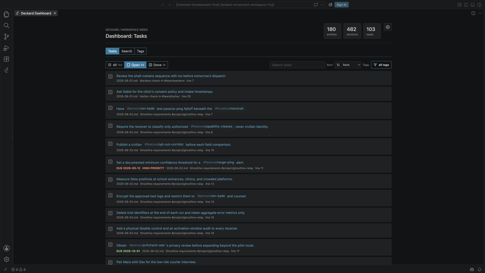
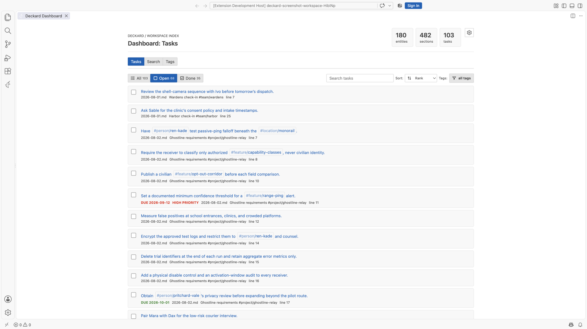
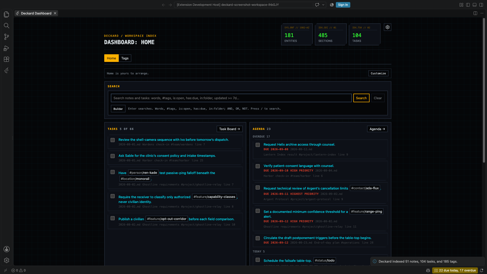
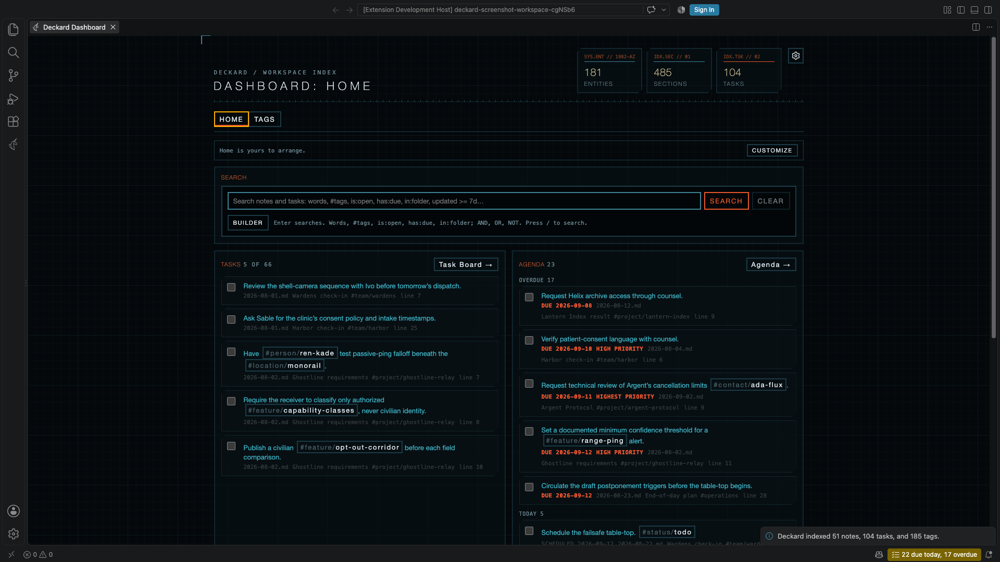
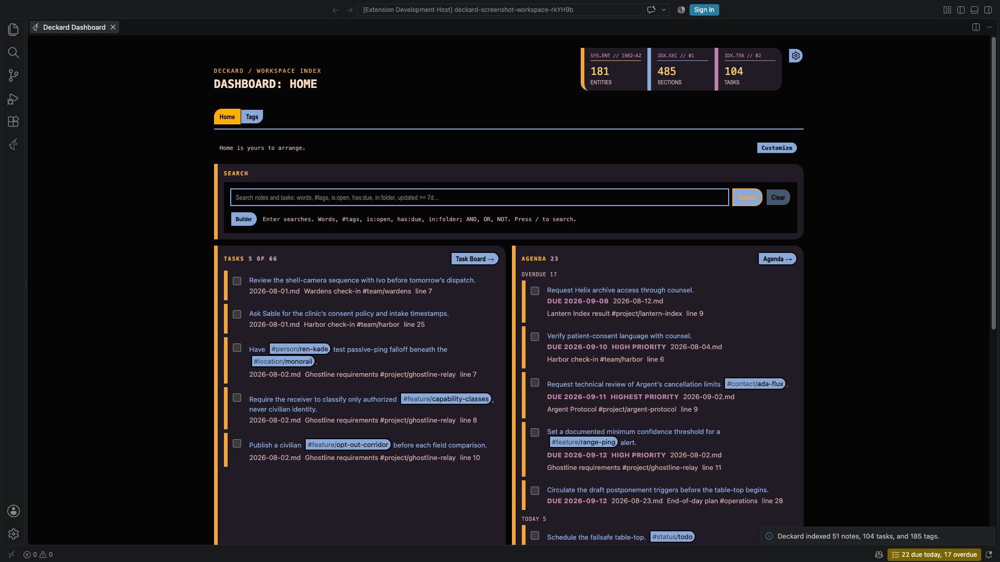
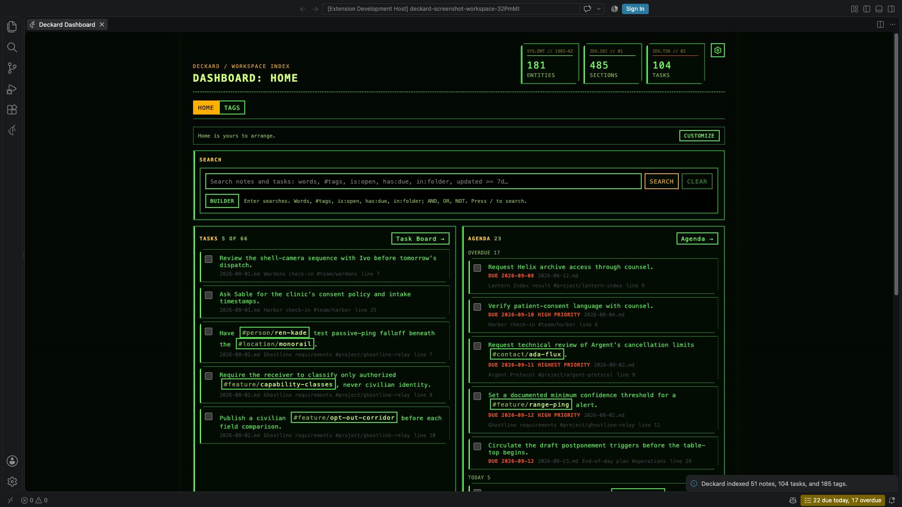
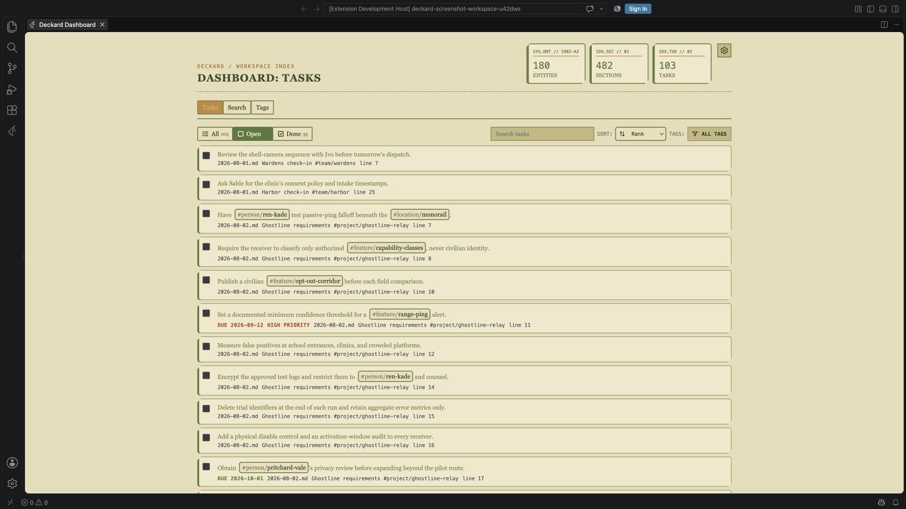
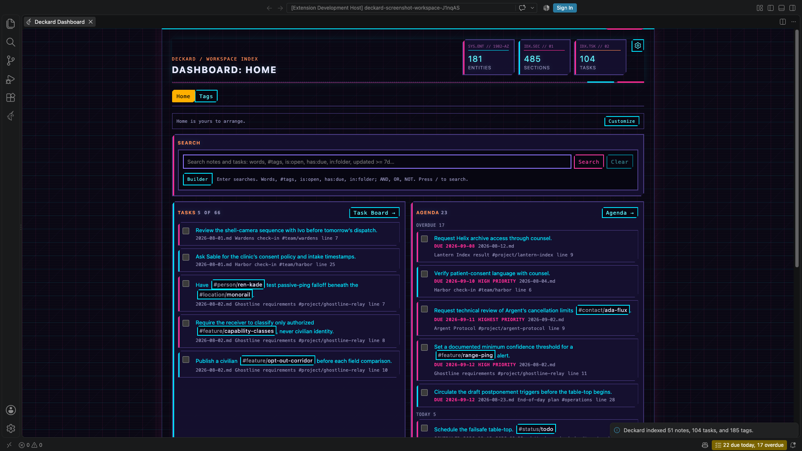
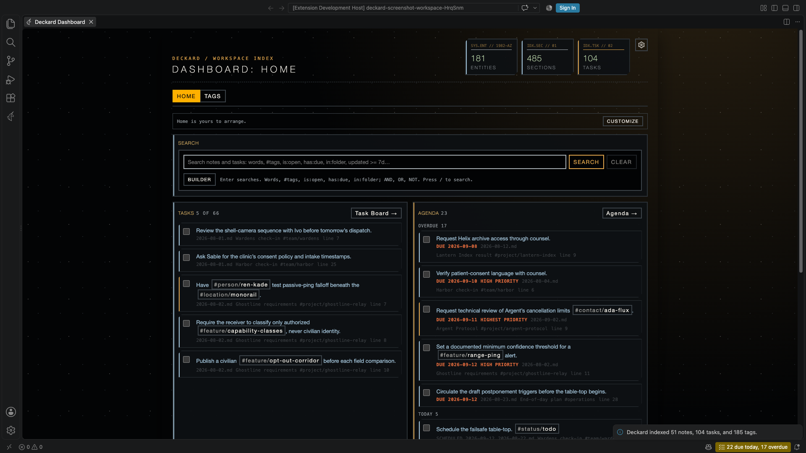

# Themes and Display

## Themes

Run `Deckard: Choose Theme…`, or choose **Theme** in any page's gear. Moving through the list previews each theme on the open pages; Enter keeps it, and Escape goes back. The setting is `deckard.theme`.

- **Corpo**, the default, takes its colors and fonts from your VS Code theme, light or dark.
- **Replicant**, **Oblivion**, **LCARS**, **Tomcat**, **Fellowship**, **Synthwave**, and **Cooper** are Deckard's film-inspired styles.

In every theme, red means overdue or high priority, and nothing else.

**Esper Themes** brings these looks to the whole editor, as VS Code color themes, from the same makers. Deckard suggests it once, after its first index, on a machine without it; the [Marketplace](https://marketplace.visualstudio.com/items?itemName=esperinnovations.esper-themes) has it any time.

| **Corpo** | **Corpo, in a light VS Code theme** | |
| --- | --- | --- |
|  |  | |
| **Replicant** | **Oblivion** | **LCARS** |
|  |  |  |
| **Tomcat** | **Fellowship** | **Synthwave** |
|  |  |  |
| **Cooper** | | |
|  | | |

## Display

How much a page draws is a scale of three steps. Pick one with **Display** in a page's gear, `Deckard: Choose Display…`, which shows each step on the open pages as you move through the list, or `deckard.display.level`. Each step keeps what the one before it took away:

| Setting (`deckard.display.…`) | Full (default) | Quiet | Zen |
| --- | --- | --- | --- |
| **Theme styling** (`themeStyling`) | Styled | Plain | Plain |
| **Help text** (`helpText`) | Shown | Hidden | Hidden |
| **Tags** (`tags`) | Chips | Text | Text |
| **Density** (`density`) | Comfortable | Comfortable | Compact |
| **Cards** (`cardFrames`) | Raised | Raised | Flat |
| **Counts** (`counts`) | Shown | Shown | Shown |
| **Dates** (`dates`) | Both | Both | Both |

- **Theme styling**: *styled* keeps each theme's grid, corners, glow, codes, and display headings; *plain* draws thin frames and sentence-case headings, two sizes kept. DECKARD ▾ stays either way.
- **Help text**: the lines that teach, such as the search box's line of syntax, the builder's paragraph, Refine's line on Alt- and Shift-click, the Graph's *Open a note to draw the graph around it.*, why Context lists a result, and an empty board column's line on dragging. What a line says is there stays: *No tasks.*, where Task Statuses saves, every count, and a search that fails to parse.
- **Tags**: where tags are listed on their own, such as a note card's tags and Refine, framed *chips* or plain *text* in the theme's tag color, its `#` or `@` kept. A tag inside a task's title is always text.
- **Density**: *comfortable* or *compact* spacing.
- **Cards**: *raised* cards, or *flat* rows parted by a divider, which lift onto the card surface under the pointer or keyboard focus.
- **Counts**: the number beside a name, such as a widget's total, a group's count, a board column's tasks, or a tab's results. Figures that are the point, such as Home's Due today and a calendar day's counts, always show.
- **Dates**: a due date written *both* ways, "Overdue 2 days · 2026-10-02", only how far off (*relative*), "Overdue 2 days", or only the *date* with its state, "Overdue · 2026-10-02". An overdue date always says Overdue, and a date over a month away keeps its date.

Each setting follows the step while it's *Auto*; set one and it stays as you set it at every step. The gear then says so, such as *2 changed · Reset · Customize…*: **Reset** puts the step's own values back, and **Customize…** opens Settings on Display, where each one you changed shows as Modified with its own Reset. None of them changes a color, and none removes a button or filter; whatever is out of sight stays in the page for a screen reader, which hears every count, file, and date in full. In every theme the flat cards' divider reaches 3:1 against the page and the tag color 4.5:1, which a test checks on each change.

**Page width**, its own row in the gear under Theme, keeps pages *Limited* to a column at most 1000px wide, or makes them *Full*, the panel's full width, for a wide monitor. The steps never change it, and every page keeps the width you chose last.

**Card details** (`deckard.display.cardDetails`) says which details an entry shows under it on hover and focus, at every step: where it is written, and its created and updated dates. Untick all three for none; a screen reader still reads where it is written. The Task Board and the Calendar always use the panel's full width, so their gears have no Page width row.

Every Display setting is yours alone: it's the same in every workspace, and a workspace's settings never change how your pages look.

### Dates

Deckard writes every date it shows you in one format, `YYYY-MM-DD` unless you set another: on pages, in the Tasks view and the editor's lenses, in Find, the task editor, the date box, completions, and every message that names a day. `Deckard: Choose Date Format…` shows today in a few formats, such as `DD/MM/YYYY`, `D MMM YYYY`, and `ddd, MMM D, YYYY`, and **Custom…** says today back in a format as you type it. The format is `deckard.display.dateFormat`; **Customize…** in the gear opens it in Settings.

A format is written with the tokens Obsidian's daily notes, Templater, and Periodic Notes use, so one copied from a vault works here unchanged:

| Token | Writes | Token | Writes |
| --- | --- | --- | --- |
| `YYYY` / `YY` | 2026 / 26 | `Q` | 4, the quarter |
| `M` / `MM` | 10, 01 padded | `MMM` / `MMMM` | Oct / October |
| `D` / `DD` | 2, 02 padded | `Do` | 2nd |
| `ddd` / `dddd` | Fri / Friday | `dd` | Fr |
| `W` / `WW` | the ISO week | `w` / `ww` | the week, from `deckard.calendar.weekStart` |
| `DDD` | 275, the day of the year | `E` | 5, Monday 1 |
| `L` | 10/02/2026, as your display language writes it | `LL` | October 2, 2026 |

The rest of Moment's tokens work too: `Qo`, `Mo`, `do`, `wo`, and `Wo` ordinals, `GGGG` and `gggg` week years, `DDDD`, `H`, `h`, `k`, `m`, `s`, `A`, `a`, `X`, `x`, and `l` to `llll`. A date in a note has no time, so a time reads 00:00; only a note's created and updated dates have one.

Text in `[brackets]` is written as it is, so `[Week] W` writes *Week 40*; any other character is written as it is too. Names are English, as the rest of Deckard is, and `L` and `LL` follow VS Code's display language. A format that is empty, or writes no part of a date, reads as `YYYY-MM-DD`.

Where a day has little room, as the Tasks view's day headings, the Pages view, the calendar's day title, search completions, and Linked from, it's written in `deckard.display.shortDateFormat`, `ddd, MMM D` unless you set another, such as `ddd D MMM`. A day in another year is written in the full format, so a short format needs no year. Where Deckard names the weekday beside a date, as the task editor's *Friday 2026-09-25*, it leaves the weekday out when your format writes one.

What Deckard writes into your notes stays `YYYY-MM-DD`: task dates such as `📅 2026-10-02`, daily note names, reviews, inserted links, searches such as `due = 2026-10-02`, exports, and what the AI assistant's tools give and take. A numeric date typed into a date box is read day first when your format writes the day first, as `DD/MM/YYYY` does.

## Zen

Zen is Display's last step, one click away from any page: the Zen button in a page's title bar, `Deckard: Toggle Zen`, or `Deckard: Enter Zen` and `Deckard: Leave Zen`. Leaving goes back to the step you were on, or to Full.

- **Hidden:** decorative labels, the grid backdrop, the eyebrow's trail, and every line that teaches, such as the search box's line of syntax; cards are flat and tags are text.
- **Kept:** every button, filter, checkbox, and tag, every count beside a name, and a task's due date written in full, with its priority and overdue marker. Zen never hides data; to leave counts out, or write dates only one way, set **Counts** or **Dates** yourself.

---

← [Renaming, moving, and parking](organizing.md) · [All topics](README.md) · [AI assistants](ai-assistants.md) →
